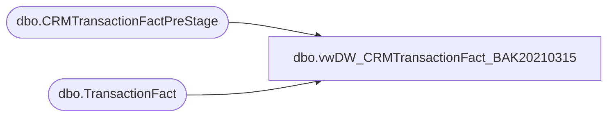

# dbo.vwDW_CRMTransactionFact_BAK20210315

**Database:** DWStaging  
**Server:** papamart  

## Architecture Diagram



## Table Dependencies

| Referenced Table |
|---|
| dbo.CRMTransactionFactPreStage |
| dbo.TransactionFact |

## View Code

```sql
CREATE view [dbo].[vwDW_CRMTransactionFact_BAK20210315]

as

--==================================================================================================
--	Author			Date			Details
--	Dan Tweedie		09/23/2016		Created view to serve as source view for papamart.dwstaging.dbo.CRMTransactionFactStage
--==================================================================================================


with 
DateKey as
	(
		select distinct DateKey 
		from dwstaging.dbo.CRMTransactionFactPreStage
	),
tf as 
	(
		select 
			tf.transaction_id, 
			tf.date_key, 
			tf.store_key, 
			tf.register_no, 
			tf.transaction_no,
			tf.gaap_sales_amount as GaapSales,
			tf.gaap_units as GaapUnits
		from dw.dbo.TransactionFact tf with (nolock) -- same as transaction_facts but only from 2018 to present
		join DateKey dk on tf.date_key = dk.DateKey
	),
TransID as 
	(
		select 
			crm.ID,
			max(tf.transaction_id) as TransactionID
		from 
			dwstaging.dbo.CRMTransactionFactPreStage crm
			join  tf on 
					crm.DateKey = tf.date_key
				and crm.StoreKey = tf.store_key
				and crm.POSRegisterNumber = tf.register_no
				and crm.POSTransactionNumber = tf.transaction_no
		group by crm.ID
	)
select
	ti.TransactionID,
	tf.GaapSales,
	tf.GaapUnits,
	crm.CRMTransactionID,
	crm.StoreKey,
	crm.TransactionDate,
	crm.TransactionPostedDate,
	crm.CRMTransactionType,
	crm.POSTransactionNumber,
	crm.POSRegisterNumber,
	crm.CustomerNumber,
	crm.PointsEarned,
	crm.InsertedDate,
	crm.ETLLogID,
	crm.ETLEventID
from dwstaging.dbo.CRMTransactionFactPreStage crm
join TransID ti on crm.ID = ti.ID
join tf on ti.TransactionID=tf.transaction_id
```

