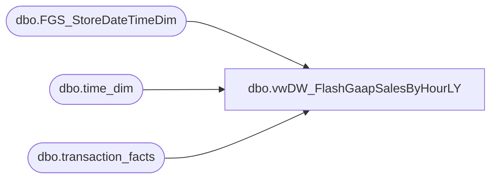

# dbo.vwDW_FlashGaapSalesByHourLY

**Database:** DWStaging  
**Server:** papamart  

## Architecture Diagram



## Table Dependencies

| Referenced Table |
|---|
| dbo.FGS_StoreDateTimeDim |
| dbo.time_dim |
| dbo.transaction_facts |

## View Code

```sql
CREATE view [dbo].[vwDW_FlashGaapSalesByHourLY]

as

--==================================================================================================
--	Author			Date			Details
--	Dan Tweedie		10/02/2016		Used with FlashGaap SSIS
--==================================================================================================

WITH
LYDateKey as
	(
		select distinct 
			date_key, BusinessDate
		from 
			dwstaging.dbo.FGS_StoreDateTimeDim
		where 
			BusinessDate = cast(getdate()-364 as date) OR BusinessDate = cast(getdate()-365 as date)
	),
TimeKey as
	(
		select
			hour,
			time_key
		from 
			dw.dbo.time_dim 
		where
			minute = 0
	),
LY as
	(
		select
			sd.StoreID,
			sd.StoreName,
			sd.store_key,
			sd.BusinessDate,

			--case when sd.BusinessHour between 0 and 2
			--	then dateadd(dd, -1, sd.BusinessDate)
			--	else sd.BusinessDate 
			--end as BusinessDate,

			sd.BusinessHour,
			sum(tf.store_sales_amount) LYGaapByHour,
			count(distinct tf.transaction_id) LYTransactionCount,
			sum(tf.store_units) LYNetUnits
		from 
			LYDateKey ly
			join dwstaging.dbo.FGS_StoreDateTimeDim sd on ly.date_key = sd.date_key 
			join dw.dbo.transaction_facts tf with (nolock) on sd.store_key = tf.store_key and sd.date_key = tf.date_key and sd.time_key = tf.time_key
		group by 
			sd.StoreID,
			sd.StoreName,
			sd.store_key,
			sd.BusinessDate,
			--case when sd.BusinessHour between 0 and 2
			--	then dateadd(dd, -1, sd.BusinessDate)
			--	else sd.BusinessDate 
			--end,
			sd.BusinessHour
	),
SDLeftLY as
	(
		select 
			sd.StoreID,
			sd.StoreName,
			sd.store_key,
			sd.BusinessDate,

			--case when sd.BusinessHour between 0 and 2
			--	then dateadd(dd, -1, sd.BusinessDate)
			--	else sd.BusinessDate 
			--end as BusinessDate,

			sd.BusinessHour,
			max(isnull(LYGaapByHour,0)) as LYGaapByHour,
			max(isnull(LYTransactionCount,0)) as LYTransCountByHour,
			max(isnull(LYNetUnits,0)) as LYNetUnitsByHour
		from 
			dwstaging.dbo.FGS_StoreDateTimeDim sd 
		left join LY 
			on sd.StoreID = LY.StoreID 
			and sd.BusinessDate = LY.BusinessDate 
			and sd.BusinessHour = LY.BusinessHour
		where sd.BusinessDate = cast(getdate()-364 as date) or sd.BusinessDate = cast(getdate()-365 as date)
		group by
			sd.StoreID,
			sd.StoreName,
			sd.store_key,
			sd.BusinessDate,
			--case when sd.BusinessHour between 0 and 2
			--	then dateadd(dd, -1, sd.BusinessDate)
			--	else sd.BusinessDate 
			--end,
			sd.BusinessHour
	)
select 
	rt.StoreID, 
	rt.StoreName,
	rt.BusinessDate, 
	rt.BusinessHour,  
	rt.LYGaapByHour,
	rt.LYTransCountByHour,
	rt.LYNetUnitsByHour,
	dk.date_key,
	tk.time_key,
	rt.store_key
from SDLeftLY rt
join LYDateKey dk on rt.BusinessDate = dk.BusinessDate
join TimeKey tk on rt.BusinessHour = tk.hour
```

