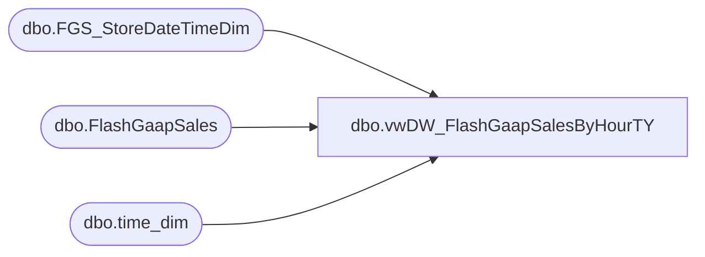

# dbo.vwDW_FlashGaapSalesByHourTY

**Database:** DWStaging  
**Server:** papamart  

## Architecture Diagram



## Table Dependencies

| Referenced Table |
|---|
| dbo.FGS_StoreDateTimeDim |
| dbo.FlashGaapSales |
| dbo.time_dim |

## View Code

```sql
CREATE view [dbo].[vwDW_FlashGaapSalesByHourTY] 

as


--==================================================================================================
--	Author			Date			Details
--	Dan Tweedie		10/02/2016		Used with FlashGaap SSIS
--==================================================================================================


WITH
StoreDim as
	(
		select distinct 
			StoreID, StoreName, date_key, BusinessDate, FiscalYear, FiscalMonth, CurrencyCode, TradingGroup
		from 
			dwstaging.dbo.FGS_StoreDateTimeDim
		where 
			BusinessDate = cast(getdate() as date) OR BusinessDate = cast(getdate()-1 as date)
	),
TimeKey as
	(
		select
			hour,
			time_key
		from 
			dw.dbo.time_dim 
		where
			minute = 0
	),
TY as
	(
		select
			sd.StoreID,
			sd1.StoreName,
			sd.store_key,
			sd.BusinessDate,
			sd.BusinessHour,
			sum(tf.flash_gaap_sales) TYGaapByHour,
			sum(tf.TransactionCount) TYTransactionCount,
			sum(tf.NetUnits) TYNetUnits,
			sd.CompStatus,
			sd.Jurisdiction
		from 
			StoreDim sd1
			join dwstaging.dbo.FGS_StoreDateTimeDim sd on sd1.date_key = sd.date_key and sd1.StoreID = sd.StoreID
			join dw.dbo.FlashGaapSales tf with (nolock) on sd.store_key = tf.store_key and sd.date_key = tf.business_date_key and sd.time_key = tf.local_time_key
		group by 
			sd.StoreID,
			sd1.StoreName,
			sd.store_key,
			sd.BusinessDate,
			sd.BusinessHour,
			sd.CompStatus,
			sd.Jurisdiction,
			sd1.TradingGroup
	)
	,
SDLeftTY as
	(
		select 
			sd.StoreID,
			sd.store_key,
			sd.BusinessDate,
			sd.BusinessHour,
			max(isnull(TYGaapByHour,0)) as TYGaapByHour,
			max(isnull(TYTransactionCount,0)) as TYTransCountByHour,
			max(isnull(TYNetUnits,0)) as TYNetUnitsByHour,
			sd.CompStatus,
			sd.Jurisdiction
		from 
			dwstaging.dbo.FGS_StoreDateTimeDim sd 
		left join TY 
			on sd.StoreID = TY.StoreID 
			and sd.BusinessDate = TY.BusinessDate 
			and sd.BusinessHour = TY.BusinessHour
		where sd.BusinessDate = cast(getdate() as date) or sd.BusinessDate = cast(getdate()-1 as date)
		group by
			sd.StoreID,
			sd.store_key,
			sd.BusinessDate,
			sd.BusinessHour,
			sd.CompStatus,
			sd.Jurisdiction
	)
select 
	rt.StoreID, 
	rt.BusinessDate, 
	rt.BusinessHour,  
	rt.TYGaapByHour,
	rt.TYTransCountByHour,
	rt.TYNetUnitsByHour,
	sd.date_key,
	tk.time_key,
	rt.store_key,
	rt.CompStatus,
	rt.Jurisdiction,
	sd.FiscalYear,
	sd.FiscalMonth,
	sd.CurrencyCode,
	sd.TradingGroup
from SDLeftTY rt
--from TY rt
join StoreDim sd on rt.BusinessDate = sd.BusinessDate and rt.StoreID = sd.StoreID
join TimeKey tk on rt.BusinessHour = tk.hour
```

