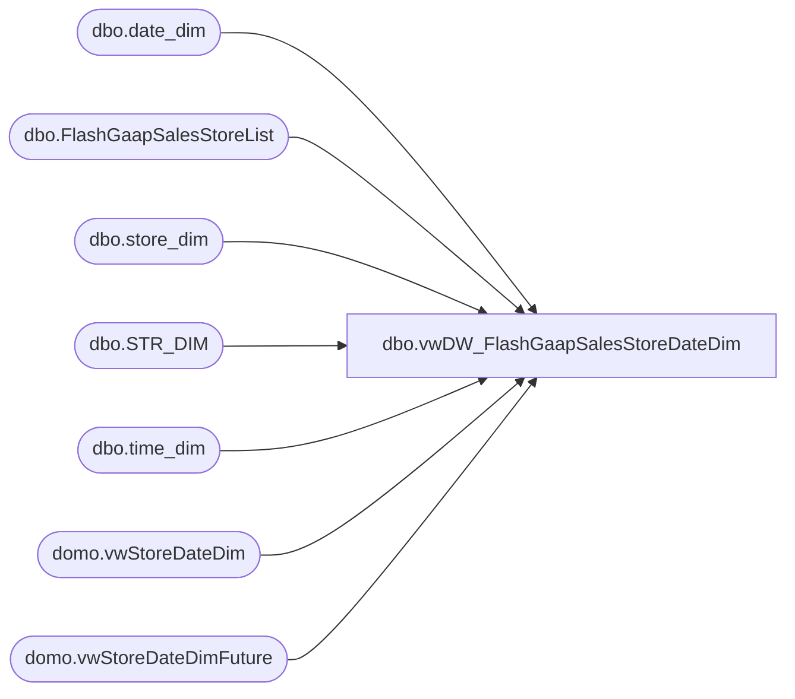

# dbo.vwDW_FlashGaapSalesStoreDateDim

**Database:** DWStaging  
**Server:** papamart  

## Architecture Diagram



## Table Dependencies

| Referenced Table |
|---|
| dbo.date_dim |
| dbo.FlashGaapSalesStoreList |
| dbo.store_dim |
| dbo.STR_DIM |
| dbo.time_dim |
| domo.vwStoreDateDim |
| domo.vwStoreDateDimFuture |

## View Code

```sql
CREATE view [dbo].[vwDW_FlashGaapSalesStoreDateDim] 

as 

--==================================================================================================
--	Author			Date			Details
--	Dan Tweedie		10/02/2016		Used with FlashGaap SSIS
--==================================================================================================

select
	sl.StoreID,
	convert(varchar(100), sd.store_name) as StoreName,
	dsd.CalendarDate as BusinessDate,
	cast(td.hour as int) as BusinessHour,
	dsd.CompStatus,
	dsd.FiscalYear,
	dsd.FiscalMonth,
	sd.store_key,
	dd.date_key,
	td.time_key,
	sl.CurrencyCode,
	sl.TradingGroup,
	sl.Jurisdiction
from 
	dwstaging.dbo.FlashGaapSalesStoreList sl 
	join KODIAK.BABWMstrData.dbo.STR_DIM ksd on sl.StoreId = cast(ksd.str_num as int)
	join dw.dbo.store_dim sd with (nolock) on sl.StoreID = sd.store_id
	join 
		(
			select 
				StoreKey,
				CalendarDate,
				CompStatus,
				FiscalYear,
				FiscalMonth
			from dw.domo.vwStoreDateDim with (nolock)
			where TradingGroup in ('Europe', 'North America')
			and (CalendarDate = cast(getdate()-364 as date) 
					OR CalendarDate = cast(getdate()-365 as date) 
					OR CalendarDate = cast(getdate()-1 as date))
			and isnumeric(StoreKey) = 1
			UNION
			select 
				StoreKey,
				CalendarDate,
				CompStatus,
				FiscalYear,
				FiscalMonth
			from dw.domo.vwStoreDateDimFuture with (nolock)
			where TradingGroup in ('Europe', 'North America')
			and CalendarDate = cast(getdate() as date) 
			and isnumeric(StoreKey) = 1
		) dsd on sd.store_id = dsd.StoreKey
	join dw.dbo.date_dim dd with (nolock) 
		on dsd.CalendarDate = cast(dd.actual_date as date) 
	cross join dw.dbo.time_dim td with (nolock)  
where 
	isnumeric(dsd.StoreKey) = 1 
	and td.time_key <> 0
```

