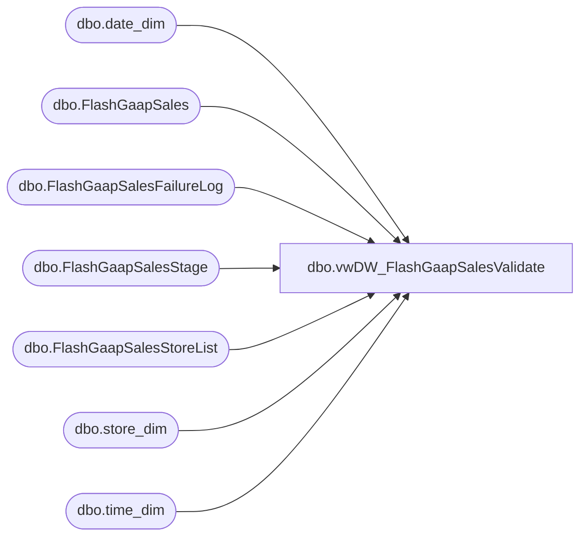

# dbo.vwDW_FlashGaapSalesValidate

**Database:** DWStaging  
**Server:** papamart  

## Architecture Diagram



## Table Dependencies

| Referenced Table |
|---|
| dbo.date_dim |
| dbo.FlashGaapSales |
| dbo.FlashGaapSalesFailureLog |
| dbo.FlashGaapSalesStage |
| dbo.FlashGaapSalesStoreList |
| dbo.store_dim |
| dbo.time_dim |

## View Code

```sql
create view vwDW_FlashGaapSalesValidate 

as

--==================================================================================================
--	Author			Date			Details
--	Dan Tweedie		09/30/2016		To be run at tail end of FlashGaapSales SSIS.
--									Purpose is to expose stores for which we attempted to post flash sales to our DW table, but did not post
--==================================================================================================

with 
Detail as
	(
		select 
			sl.StoreID,
			case when fl.StoreID is NULL then 'NO' else 'YES' end as ErrorLogged,
			case when td.hour between 0 and 5
						then cast(dd.actual_date -1 as date)
						else cast(dd.actual_date as date) 
					end as BusinessDate,
			td.hour BusinessHour,
			sum(s.flash_gaap_sales) SalesStaged,
			sum(fgs.flash_gaap_sales) SalesPosted,
			isnull(s.source, 'n/a') Source
		from 
			dwstaging.dbo.FlashGaapSalesStoreList sl 
			join dw.dbo.store_dim sd on sl.StoreID = sd.store_id
			left join dwstaging.dbo.FlashGaapSalesFailureLog fl on sl.StoreID = fl.StoreID
			left join dwstaging.dbo.FlashGaapSalesStage s on sd.store_key = s.store_key 
			left join dw.dbo.date_dim dd on s.local_date_key = dd.date_key
			left join dw.dbo.time_dim td on s.local_time_key = td.time_key
			left join dw.dbo.FlashGaapSales fgs 
					on sd.store_key = fgs.store_key 
					and dd.date_key =
							case when td.hour between 0 and 5 
								then  fgs.business_date_key +1
								else fgs.business_date_key 
							end
					and td.time_key = fgs.local_time_key
		group by 
			sl.StoreID,
			case when fl.StoreID is NULL then 'NO' else 'YES' end,
			case when td.hour between 0 and 5
						then cast(dd.actual_date -1 as date)
						else cast(dd.actual_date as date) 
					end,
			td.hour,
			s.source
	),
Summary as
	(
		select 
			StoreID,
			ErrorLogged,
			BusinessDate,
			BusinessHour,
			SalesStaged,
			SalesPosted,
			Source,
			case when 
				isnull(SalesStaged,1) <> isnull(SalesPosted,1)
				OR 
					(
						ErrorLogged = 'YES'
						AND
						SalesStaged is NULL			
					)
				then 'FAIL' else 'PASS'
			end as ValidationStatus
		from Detail 
	)
select *
from Summary
```

