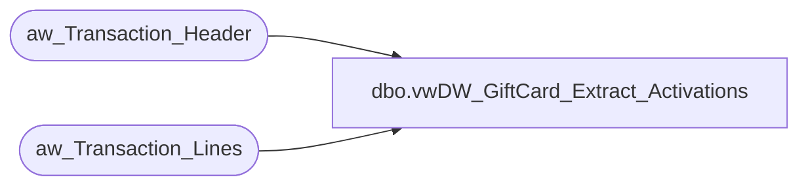

# dbo.vwDW_GiftCard_Extract_Activations

**Database:** DWStaging  
**Server:** papamart  

## Architecture Diagram



## Table Dependencies

| Referenced Table |
|---|
| aw_Transaction_Header |
| aw_Transaction_Lines |

## View Code

```sql
CREATE view [dbo].[vwDW_GiftCard_Extract_Activations]


--=====================================================================================
--	Dan Tweedie 2020-04-20 - Created view to replace spGiftCard_Extract_Activations
--=====================================================================================


as


SELECT
	base.transaction_id,
	MIN(base.date_key) AS date_key,
	SUM(base.gross_line_amount) AS gross_line_amount,
	SUM(base.pos_discount_amount) AS pos_discount_amount,
	base.reference_no,
	MIN(base.currency_key) AS currency_key,
	MIN(base.store_key) AS store_key,
	'AW' as Source
FROM
	(SELECT
			CAST(th.transaction_id AS integer) AS transaction_id,
			th.date_key,
			CAST((tl.gross_line_amount * tl.db_cr_none * -1) AS money) AS gross_line_amount,
			CAST((tl.pos_discount_amount * tl.db_cr_none * -1) AS money) AS pos_discount_amount,
			LTRIM(RTRIM(tl.reference_no)) COLLATE SQL_Latin1_General_CP1_CI_AS reference_no,
			th.currency_key,
			th.store_key
		FROM
			aw_Transaction_Header  th WITH (NOLOCK)
			INNER JOIN aw_Transaction_Lines tl WITH (NOLOCK)
				ON th.transaction_id = tl.transaction_id
		WHERE
			tl.reference_no IS NOT NULL
			AND tl.gross_line_amount <> 0
			AND LEFT(LTRIM(tl.reference_no), 1) = '6'
			AND ((tl.line_object = 403 -- E-Card Activations
			AND tl.line_action IN (1,2))
			OR (tl.line_object = 404 -- Gift Card Activations
			AND tl.line_action IN (1,2))
			OR (tl.line_object = 633 -- Gift Card Activations
			AND tl.line_action IN (12, 24, 23))) 
	)
	base
GROUP BY	base.transaction_id,
			base.reference_no
```

