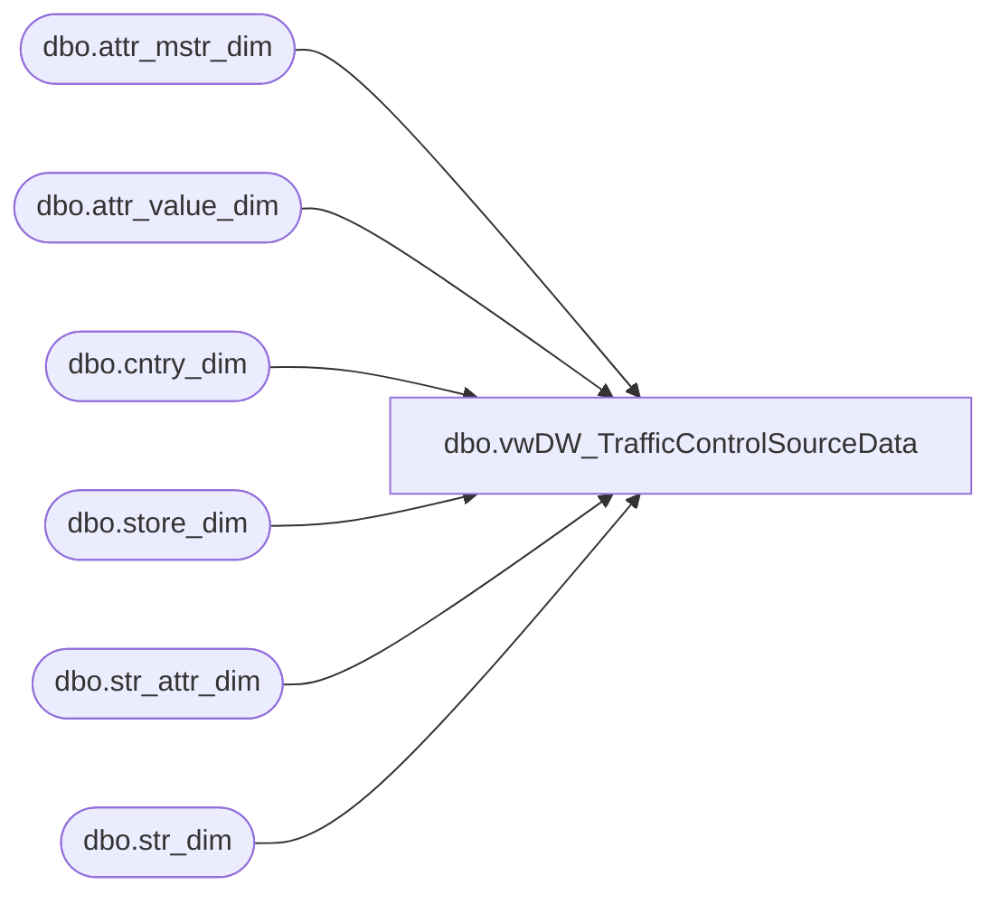

# dbo.vwDW_TrafficControlSourceData

**Database:** DWStaging  
**Server:** papamart  

## Architecture Diagram



## Table Dependencies

| Referenced Table |
|---|
| dbo.attr_mstr_dim |
| dbo.attr_value_dim |
| dbo.cntry_dim |
| dbo.store_dim |
| dbo.str_attr_dim |
| dbo.str_dim |

## View Code

```sql
create view [dbo].[vwDW_TrafficControlSourceData]

as

WITH 
TrafficStoreMDM as 
	(
		select  
			sd.str_num as store_id, 
			amd.title attribute_title,
			avd.title attribute_value,
			cd.nm_abbrv as country
		from 
			 kodiak.BABWMstrData.dbo.str_dim sd with (nolock)
		join kodiak.BABWMstrData.dbo.str_attr_dim sad with (nolock) on sd.str_id = sad.str_id
			and cast(sad.strt_dt as date) <= cast(getdate() as date)
			and cast(sad.end_dt as date) >= cast(getdate() as date)
		join kodiak.BABWMstrData.dbo.attr_mstr_dim amd with (nolock) on sad.attr_mstr_id = amd.attr_mstr_id
		join kodiak.BABWMstrData.dbo.attr_value_dim avd with (nolock) on amd.attr_mstr_id = avd.attr_mstr_id 
			and sad.attr_value_id = avd.attr_value_id
		join kodiak.BABWMstrData.dbo.cntry_dim cd on sd.cntry_id = cd.cntry_id
		where
			amd.attr_mstr_id = 23
	) 
--the unioned queries below are based on papamart.dwstaging.ExperianFootFall.spReload_CompanyHierarchyStoreMapping, which was used for truncating and rebuilding the control table 
--I believe the control table is also being used for exports to ShopperTrak, and that is where there significance of CompanyID and HierarchyID come in.
select 
	sd.store_key,
	s.store_id as SiteIdentity,
	max(case when s.attribute_value = 'ShopperTrak' then 1 else 0 end) as IsShopperTrak,
	max(case when s.attribute_value = 'FootFall' then 1 else 0 end) as IsFootFall,
	0 as IsCurrentlyOffline,
	1798 as CompanyID,
	5153 as HierarchyID,
	'Total Sales' as NodeName,
	'USD' as CurrencyCode
from
	TrafficStoreMDM s
join dw.dbo.store_dim sd on s.store_id = sd.store_id
group by 
	sd.store_key,
	s.store_id
UNION
select
	sd.store_key,
	s.store_id as SiteIdentity,
	max(case when s.attribute_value = 'ShopperTrak' then 1 else 0 end) as IsShopperTrak,
	max(case when s.attribute_value = 'FootFall' then 1 else 0 end) as IsFootFall,
	0 as IsCurrentlyOffline,
	1798 as CompanyID,
	5154 as HierarchyID,
	'Total Staff' as NodeName,
	'USD' as CurrencyCode
from
	TrafficStoreMDM s
join dw.dbo.store_dim sd on s.store_id = sd.store_id
group by 
	sd.store_key,
	s.store_id
UNION
select
	sd.store_key,
	s.store_id as SiteIdentity,
	max(case when s.attribute_value = 'ShopperTrak' then 1 else 0 end) as IsShopperTrak,
	max(case when s.attribute_value = 'FootFall' then 1 else 0 end) as IsFootFall,
	0 as IsCurrentlyOffline,
	1798 as CompanyID,
	6556 as HierarchyID,
	'Total Sales' as NodeName,
	'GBP' as CurrencyCode
from
	TrafficStoreMDM s
join dw.dbo.store_dim sd on s.store_id = sd.store_id
where
	s.country = 'UK'
group by 
	sd.store_key,
	s.store_id
UNION
select 
	sd.store_key,
	s.store_id as SiteIdentity,
	max(case when s.attribute_value = 'ShopperTrak' then 1 else 0 end) as IsShopperTrak,
	max(case when s.attribute_value = 'FootFall' then 1 else 0 end) as IsFootFall,
	0 as IsCurrentlyOffline,
	1798 as CompanyID,
	5153 as HierarchyID,
	'Total Sales' as NodeName,
	'CNY' as CurrencyCode
from
	TrafficStoreMDM s
join dw.dbo.store_dim sd on s.store_id = sd.store_id
where 
	s.country = 'CN'
group by 
	sd.store_key,
	s.store_id
UNION
select
	sd.store_key,
	s.store_id as SiteIdentity,
	max(case when s.attribute_value = 'ShopperTrak' then 1 else 0 end) as IsShopperTrak,
	max(case when s.attribute_value = 'FootFall' then 1 else 0 end) as IsFootFall,
	0 as IsCurrentlyOffline,
	1798 as CompanyID,
	5154 as HierarchyID,
	'Total Staff' as NodeName,
	'CNY' as CurrencyCode
from
	TrafficStoreMDM s
join dw.dbo.store_dim sd on s.store_id = sd.store_id
where 
	s.country = 'CN'
group by 
	sd.store_key,
	s.store_id
```

