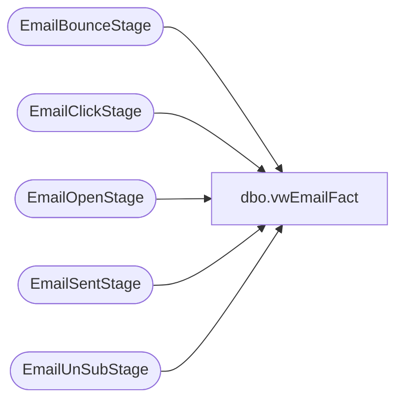

# dbo.vwEmailFact

**Database:** DWStaging  
**Server:** papamart  

## Architecture Diagram



## Table Dependencies

| Referenced Table |
|---|
| EmailBounceStage |
| EmailClickStage |
| EmailOpenStage |
| EmailSentStage |
| EmailUnSubStage |

## View Code

```sql
CREATE view [dbo].[vwEmailFact] 

as


with 
EmailSent as 
	(
		select 
			es.ClientID,
			es.SendID,
			--es.SubscriberKey,
			min(es.SendDate) as SendDate,
			es.EmailAddress
		from EmailSentStage es 
		group by 
			es.ClientID,
			es.SendID,
			--es.SubscriberKey,
			es.EmailAddress
	)
select 
	es.ClientID,
	es.SendID,
	--es.SubscriberKey,
	es.SendDate,
	es.EmailAddress,
	eb.BounceDate,
	ec.ClickDate,
	eu.UnSubDate,
	eo.OpenDate
from EmailSent es 
left join EmailBounceStage eb with (nolock)
	on es.ClientID = eb.ClientID
	and es.SendID = eb.SendID
	--and es.SubscriberKey = eb.SubscriberKey
	and es.EmailAddress = eb.EmailAddress
left join EmailClickStage ec with (nolock)
	on es.ClientID = ec.ClientID
	and es.SendID = ec.SendID
	--and es.SubscriberKey = ec.SubscriberKey
	and es.EmailAddress = ec.EmailAddress
left join EmailUnSubStage eu with (nolock)
	on es.ClientID = eu.ClientID
	and es.SendID = eu.SendID
	--and es.SubscriberKey = eu.SubscriberKey
	and es.EmailAddress = eu.EmailAddress
left join EmailOpenStage eo with (nolock)
	on es.ClientID = eo.ClientID
	and es.SendID = eo.SendID
	--and es.SubscriberKey = eo.SubscriberKey
	and es.EmailAddress = eo.EmailAddress
```

