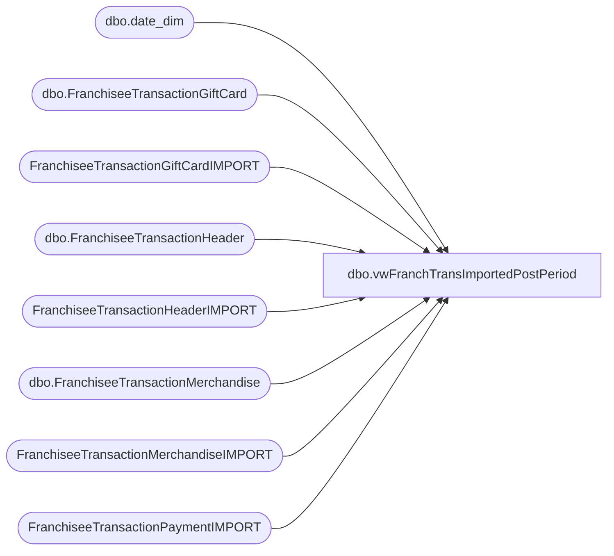

# dbo.vwFranchTransImportedPostPeriod

**Database:** DWStaging  
**Server:** papamart  

## Architecture Diagram



## Table Dependencies

| Referenced Table |
|---|
| dbo.date_dim |
| dbo.FranchiseeTransactionGiftCard |
| FranchiseeTransactionGiftCardIMPORT |
| dbo.FranchiseeTransactionHeader |
| FranchiseeTransactionHeaderIMPORT |
| dbo.FranchiseeTransactionMerchandise |
| FranchiseeTransactionMerchandiseIMPORT |
| FranchiseeTransactionPaymentIMPORT |

## View Code

```sql
CREATE view [dbo].[vwFranchTransImportedPostPeriod]

as

with 
PreviousPeriods as
	(
		select 
			min(cast(dd.actual_date as date)) PeriodStartDate, 
			max(cast(dd.actual_date as date)) PeriodMaxDate,
			dateadd(dd,+3, max(cast(dd.actual_date as date)))  PeriodCutOffDate,
			dd.fiscal_year,
			dd.fiscal_period
		from dw.dbo.date_dim dd
		group by dd.fiscal_year,
			dd.fiscal_period
		having cast(getdate() as date) >= max(cast(dd.actual_date as date))
	),
CutOffDate as
	(
		select 
			max(PeriodCutOffDate) PreviousPeriodCutOffDate
		from PreviousPeriods
	),
Payment as
	(
		select TransactionID, sum(Amount) Amount 
		from FranchiseeTransactionPaymentIMPORT 
		group by TransactionID
	),
Merch as 
	(
		select TransactionID, sum(GrossSales) GrossSales 
		from FranchiseeTransactionMerchandiseIMPORT 
		group by TransactionID
	),
GiftCard as
	(
		select TransactionID, sum(GiftCardAmount) GiftCardAmount 
		from FranchiseeTransactionGiftCardIMPORT 
		group by TransactionID
	),
DataStaged as
	(
		select 
			th.Franchisee, 
			th.StoreID,
			th.TransactionID,
			cast(th.TransactionDateTime as date) TransactionDate,
			cast(th.InsertDate as date) ImportDate,
			pp.PeriodCutOffDate as PreviousPeriodCutOffDate,
			sum(isnull(tp.Amount,0)) as TransactionPayment, 
			sum(isnull(tm.GrossSales,0)) as GrossSales,
			sum(isnull(tg.GiftCardAmount,0)) as GiftCardAmount
		from FranchiseeTransactionHeaderIMPORT th
		left join Payment tp on th.TransactionID = tp.TransactionID 
		left join Merch tm on th.TransactionID = tm.TransactionID 
		left join GiftCard tg on th.TransactionID = tg.TransactionID 
		join dw.dbo.date_dim dd on cast(th.TransactionDateTime as date)  = cast(dd.actual_date as date) 
		join PreviousPeriods pp on dd.fiscal_year = pp.fiscal_year and dd.fiscal_period = pp.fiscal_period  
		where cast(th.TransactionDateTime as date) < pp.PeriodCutOffDate
		and cast(th.InsertDate as date) > pp.PeriodCutOffDate
		group by 
			th.Franchisee, 
			th.StoreID,
			th.TransactionID,
			cast(th.TransactionDateTime as date),
			cast(th.InsertDate as date),
			pp.PeriodCutOffDate
	),
DWTransactions as
	(
		select 
			th.FranchiseeTransactionHeaderID,
			th.StoreID,
			th.TransactionID,
			th.InsertDate
		from dw.dbo.FranchiseeTransactionHeader th with (nolock)
		join DataStaged ds on ds.Franchisee = th.Franchisee and ds.TransactionID = th.TransactionID
	),
MerchSum as
	(
		select tm.FranchiseeTransactionHeaderID, sum(isnull(tm.GrossSales,0)) GrossSales
		from dw.dbo.FranchiseeTransactionMerchandise tm with (nolock)
		join DWTransactions th on th.FranchiseeTransactionHeaderID = tm.FranchiseeTransactionHeaderID
		group by tm.FranchiseeTransactionHeaderID
	),
GCSum as
	(
		select tg.FranchiseeTransactionHeaderID, sum(isnull(tg.GiftCardAmount,0)) GiftCardAmount
		from dw.dbo.FranchiseeTransactionGiftCard tg with (nolock)
		join DWTransactions th on th.FranchiseeTransactionHeaderID = tg.FranchiseeTransactionHeaderID
		group by tg.FranchiseeTransactionHeaderID
	)
select 
	ds.*,
	isnull(tm.GrossSales,0) OriginalGrossSales,
	isnull(tg.GiftCardAmount,0) OriginalGiftCardAmount,
	th.InsertDate OriginalInsertDate
from DataStaged ds
left join DWTransactions th on ds.TransactionID = th.TransactionID
left join MerchSum tm on tm.FranchiseeTransactionHeaderID = th.FranchiseeTransactionHeaderID
left join GCSum tg on tg.FranchiseeTransactionHeaderID = th.FranchiseeTransactionHeaderID
where th.TransactionID is NULL --> Previous period transaction not in DW already...so we want to show that new post period transaction is trying to post
OR ds.GrossSales <> isnull(tm.GrossSales,0) -->>or Transaction is in DW but has different values
OR ds.GiftCardAmount <> isnull(tg.GiftCardAmount,0)
```

