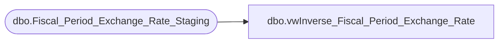

# dbo.vwInverse_Fiscal_Period_Exchange_Rate

**Database:** DWStaging  
**Server:** papamart  

## Architecture Diagram



## Table Dependencies

| Referenced Table |
|---|
| dbo.Fiscal_Period_Exchange_Rate_Staging |

## View Code

```sql
/***********************************************************************************************
Object Name:			dbo.[Inverse_Fiscal_Period_Exchange_Rate]
Description/Purpose:	view used for creating inverse of rates

-- Dependencies: 
--
-- Revision History
--		Name:					Date:			Comments:
--		Brian Byas			2016-03-16		Added WITH (NOLOCK) on all DB references
--		Brian Byas			2016-05-17		Filtered out the Duplicate
**********************************************************************************************/
CREATE VIEW [dbo].[vwInverse_Fiscal_Period_Exchange_Rate]
AS

SELECT [FR_CURR_CODE]
      ,[TO_CURR_CODE]
      ,[FR_CURR_KEY]
      ,[TO_CURR_KEY]
      ,[FISCAL_PERIOD]
      ,[FISCAL_YEAR]
      ,[RATE]
      ,[TRANSL_CODE]
FROM [DWStaging].[dbo].[Fiscal_Period_Exchange_Rate_Staging]  WITH (NOLOCK)
WHERE [FR_CURR_CODE] <> 'CAD' -- FILTER OUT DUPLICATE 

UNION 

SELECT [TO_CURR_CODE] AS FR_CURR_CODE
	  ,[FR_CURR_CODE] AS TO_CURR_CODE
	  ,[TO_CURR_KEY] AS FR_CURR_KEY
	  ,[FR_CURR_KEY] AS TO_CURR_KEY
	  ,[FISCAL_PERIOD]
	  ,[FISCAL_YEAR]
	  , CASE WHEN [RATE] = 0 THEN 0
			ELSE 1.0 / [RATE] END AS [RATE]
	  ,[TRANSL_CODE]
FROM [DWStaging].[dbo].[Fiscal_Period_Exchange_Rate_Staging]
```

