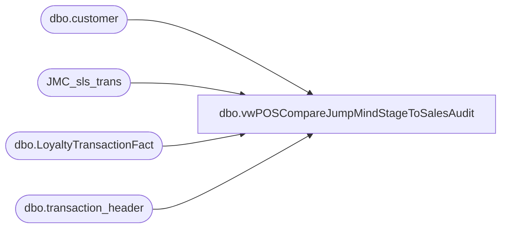

# dbo.vwPOSCompareJumpMindStageToSalesAudit

**Database:** DWStaging  
**Server:** papamart  

## Architecture Diagram



## Table Dependencies

| Referenced Table |
|---|
| dbo.customer |
| JMC_sls_trans |
| dbo.LoyaltyTransactionFact |
| dbo.transaction_header |

## View Code

```sql
CREATE view [dbo].[vwPOSCompareJumpMindStageToSalesAudit]

as

with
JM as 
	(
		select 
			cast(business_date as date) as BusinessDate,
			cast(right(business_unit_id,1) as int) as StoreID,
			cast(right(device_id,2) as int) as RegisterNumber,
			trans_nbr,
			total,
			trans_type,
			trans_status 
		from dw..JMC_sls_trans
		where datediff(dd, business_date, getdate())<=7
	),
SA as
	(
		select 
			th.transaction_id,
			th.store_no,
			th.register_no,
			th.entry_date_time,
			th.transaction_no,
			th.tender_total,
			cast(th.transaction_date as date) TransactionDate,
			cast(entry_date_time as date) EntryDate,
			c.customer_no
		from bedrockdb01.auditworks.dbo.transaction_header th
		left join bedrockdb01.auditworks.dbo.customer c 
			on th.transaction_id=c.transaction_id 
			and c.customer_role in (1,4)
		where datediff(dd, th.transaction_date, getdate())<=30
		and th.store_no not in (13,2013)
	)
select 
	JM.*,
	SA.*,
	ltf.GaapSales as LTFSales,
	ceiling(ltf.GaapSales) LTFPoints
from JM 
left join SA 
	on JM.StoreID=SA.Store_no
	and JM.RegisterNumber=sa.register_no
	and JM.trans_nbr=SA.transaction_no 
left join dw.dbo.LoyaltyTransactionFact ltf on sa.transaction_id=ltf.TransactionID
```

