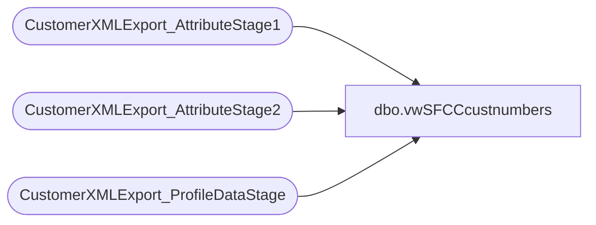

# dbo.vwSFCCcustnumbers

**Database:** DWStaging  
**Server:** papamart  

## Architecture Diagram



## Table Dependencies

| Referenced Table |
|---|
| CustomerXMLExport_AttributeStage1 |
| CustomerXMLExport_AttributeStage2 |
| CustomerXMLExport_ProfileDataStage |

## View Code

```sql
Create view [dbo].[vwSFCCcustnumbers]
AS
select pds.EmailAddress, pds.ProfileID, a2.text from CustomerXMLExport_AttributeStage2 a2
Left Join CustomerXMLExport_AttributeStage1 a1
ON a2.CustomAttributeID = a1.AttributeID
Inner Join CustomerXMLExport_ProfileDataStage pds
ON a1.ProfileID = pds.ProfileID
Where a2.AttributeID = 'crmCustomerNumber'
```

