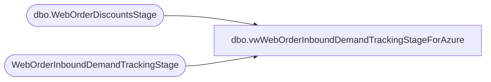

# dbo.vwWebOrderInboundDemandTrackingStageForAzure

**Database:** DWStaging  
**Server:** papamart  

## Architecture Diagram



## Table Dependencies

| Referenced Table |
|---|
| dbo.WebOrderDiscountsStage |
| WebOrderInboundDemandTrackingStage |

## View Code

```sql
CREATE view [dbo].[vwWebOrderInboundDemandTrackingStageForAzure]

as
with 
hasGift as 
	(
		select OrderNumber
		from WebOrderInboundDemandTrackingStage 
		where isGiftBox=1
		or hasGiftMessage=1
		or isBillingVShippingDiff=1 
		group by OrderNumber
	),
PreStage as
	(
		select 
			OrderDate,	
			OrderNumber,	
			DeckSku,	
			ItemDescription,	
			sum(GrossProductSales) GrossProductSales,	
			sum(ProductDiscounts) ProductDiscounts,	
			sum(NetProductSales) NetProductSales,	
			sum(GiftCardValue) GiftCardValue,	
			isGiftCard,	
			isPhysicalGiftCard,	
			isEGiftCard,	
			isPartyEGiftCard,	
			isUpsellEGiftCard,	
			isDonation,	
			isCondo,	
			isGiftBox,	
			hasGiftMessage,	
			isBundleMaster,	
			isStuffed,	
			isUnstuffed,	
			isDressed,	
			isUndressed,	
			KeyStory,
			sum(ChainAverageOnHandCost) ChainAverageOnHandCost,	
			sum(ChainAverageOnHandCostGBP) ChainAverageOnHandCostGBP,	
			isUS,	
			isUK,	
			isShipFromStore,	
			isBillingVShippingDiff,	
			OrderShippingAmount,	
			OrderShippingDiscount,	
			CurrentStatus,	
			PendingStatusDate,	
			WavedStatusDate,	
			ShippedCompletedStatusDate,	
			Channel,	
			OrderItemGrouping
		from WebOrderInboundDemandTrackingStage
		group by 
			OrderDate,	
			OrderNumber,	
			DeckSku,	
			ItemDescription,	
			isGiftCard,	
			isPhysicalGiftCard,	
			isEGiftCard,	
			isPartyEGiftCard,	
			isUpsellEGiftCard,	
			isDonation,	
			isCondo,	
			isGiftBox,	
			hasGiftMessage,	
			isBundleMaster,	
			isStuffed,	
			isUnstuffed,	
			isDressed,	
			isUndressed,	
			KeyStory,	
			isUS,	
			isUK,	
			isShipFromStore,	
			isBillingVShippingDiff,	
			OrderShippingAmount,	
			OrderShippingDiscount,	
			CurrentStatus,	
			PendingStatusDate,	
			WavedStatusDate,	
			ShippedCompletedStatusDate,	
			Channel,	
			OrderItemGrouping
	)
select 
	d.OrderDate,
	d.OrderNumber,
	d.DeckSku,
	d.ItemDescription,
	d.KeyStory,
	isnull(d.GrossProductSales,0) GrossProductSales,
	isnull(od.TotalDiscountAmount,0) as ProductDiscounts,
	--isnull(case 
	--	when (isnull(d.GrossProductSales,0)-isnull(od.TotalDiscountAmount,0)) < 0 then 0
	--	else (isnull(d.GrossProductSales,0)-isnull(od.TotalDiscountAmount,0)) 
	--end,0) as NetProductSales,
	isnull(d.GrossProductSales,0)-isnull(od.TotalDiscountAmount,0) as NetProductSales,
	isnull(d.OrderShippingAmount,0) as GrossShippingRevenue, -- THIS IS ORDER LEVEL, REPEATED ON EACH LINE...
	isnull(d.OrderShippingDiscount,0) as ShippingDiscounts, -- THIS IS ORDER LEVEL, REPEATED ON EACH LINE...
	isnull((d.OrderShippingAmount-OrderShippingDiscount),0) as NetShippingRevenue, -- THIS IS ORDER LEVEL, REPEATED ON EACH LINE...
	case
		when d.isBundleMaster<>1 
		then 1
		else 0
	end as OrderUnits,
	case 
		when d.isPartyEGiftCard=1
		then 1
		else 0
	end as PartyEGiftCardUnits,			
	case 
		when d.isPartyEGiftCard=1
		then d.GiftCardValue
		else 0
	end as PartyEGiftCardValue,
	case 
		when d.isUpsellEGiftCard=1
		then 1
		else 0
	end as UpsellEGiftCardUnits,
	case
		when d.isUpsellEGiftCard=1
		then d.GiftCardValue
		else 0
	end as UpsellEGiftCardValue,
	case 
		when d.isEGiftCard=1
			and d.isPartyEGiftCard=0
			and d.isUpsellEGiftCard=0
		then 1
		else 0
	end as EGiftCardUnits,
	case 
		when d.isEGiftCard=1
			and d.isPartyEGiftCard=0
			and d.isUpsellEGiftCard=0
		then d.GiftCardValue
		else 0
	end as EGiftCardValue,
	case 
		when d.isPhysicalGiftCard=1
		then 1
		else 0
	end as PhysicalGiftCardUnits,
	case
		when d.isPhysicalGiftCard=1
		then d.GiftCardValue
		else 0
	end as PhysicalGiftCardValue,
	case 
		when d.isDonation=1
		then 1
		else 0
	end as DonationUnits,
	case 
		when d.isDonation=1
		then d.GrossProductSales
		else 0
	end as DonationValue,
	case 
		when d.isCondo=1
		then 1
		else 0
	end as CondoUnits,
	case 
		when d.isGiftBox=1
		then 1
		else 0
	end as GiftBoxUnits,
	case 
		when exists (select g.OrderNumber from hasGift g where g.OrderNumber=d.OrderNumber)
		then 1
		else 0
	end as isGiftOrder,
	case 
		when exists (select g.OrderNumber from hasGift g where g.OrderNumber=d.OrderNumber)
		then 1
		else 0
	end as GiftOrderUnits,
	case 
		when exists (select g.OrderNumber from hasGift g where g.OrderNumber=d.OrderNumber)
		then d.GrossProductSales
		else 0
	end as GiftOrderSales,
	case 
		when isnull(d.isUS,0)=1 
			then ChainAverageOnHandCost
		when d.isUK=1 
			then ChainAverageOnHandCostGBP
		else 0
	end as ProductCost,
	d.isGiftCard,	
	d.isPhysicalGiftCard,
	d.isEGiftCard,
	d.isPartyEGiftCard,
	d.isUpsellEGiftCard,
	d.isDonation,
	d.isCondo,
	d.isGiftBox,
	d.hasGiftMessage,	
	d.isBundleMaster,	
	d.isStuffed,	
	d.isUnstuffed,
	d.isDressed,	
	d.isUndressed,		
	d.ChainAverageOnHandCost,	
	d.ChainAverageOnHandCostGBP,	
	d.isUS,	
	d.isUK,	
	d.isShipFromStore,	
	d.isBillingVShippingDiff,
	d.CurrentStatus,
	d.PendingStatusDate,
	d.WavedStatusDate,
	d.ShippedCompletedStatusDate,
	isnull(d.ShippedCompletedStatusDate, isnull(d.WavedStatusDate, d.PendingStatusDate)) as LastStatusDate,
	datediff(dd, d.PendingStatusDate, d.WavedStatusDate) as DaysBetweenPendingAndWaved,
	datediff(dd, d.PendingStatusDate, d.ShippedCompletedStatusDate) as DaysBetweenPendingAndShipped,
	datediff(dd, WavedStatusDate, d.ShippedCompletedStatusDate) as DaysBetweenWavedAndShipped,
	datediff(dd, PendingStatusDate, getdate()) DaysSincePendingStatus,
	datediff(dd, WavedStatusDate, getdate()) DaysSinceWavedStatus,
	datediff(dd, isnull(d.ShippedCompletedStatusDate, isnull(d.WavedStatusDate, d.PendingStatusDate)), getdate()) as DaysSinceLastStatus,
	d.Channel,
	d.OrderItemGrouping,
	getdate() as InsertDate
from PreStage d
left join DWStaging.dbo.WebOrderDiscountsStage od 
	on d.OrderNumber=od.OrderNumber 
	and d.DeckSKU=od.SKU
```

