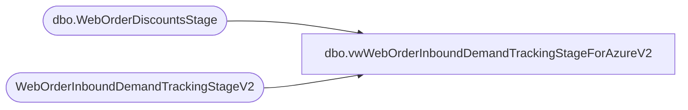

# dbo.vwWebOrderInboundDemandTrackingStageForAzureV2

**Database:** DWStaging  
**Server:** papamart  

## Architecture Diagram



## Table Dependencies

| Referenced Table |
|---|
| dbo.WebOrderDiscountsStage |
| WebOrderInboundDemandTrackingStageV2 |

## View Code

```sql
CREATE view [dbo].[vwWebOrderInboundDemandTrackingStageForAzureV2]

as

with 
--MaxChannelForNullChannelWorkAround as 
--	(
--		select 
--			f.OrderNumber,
--			max(f.Channel) Channel
--		from dw.dbo.WebOrderInboundDemandTrackingFacts f
--		where f.Channel is not null
--		and exists (select OrderNumber from WebOrderInboundDemandTrackingStageV2 s where s.OrderNumber=f.OrderNumber and s.Channel is NULL)
--		group by 
--			f.OrderNumber
--	),
hasGift as 
	(
		select OrderNumber
		from WebOrderInboundDemandTrackingStageV2 
		where isGiftBox=1
		or hasGiftMessage=1
		or isBillingVShippingDiff=1 
		group by OrderNumber
	),
PreStage1 as
	(
		select 
			d.OrderDate,
			d.OrderNumber,
			d.DeckSku,
			d.ItemDescription,
			d.KeyStory,
			isnull(d.GrossProductSales,0) as GrossProductSales,
			---NEED TO SUM THE D DATA, THEN DO THE JOIN TO OD ...
			--isnull(od.TotalDiscountAmount,0) as ProductDiscounts,
			--case 
			--	when (isnull(d.GrossProductSales,0)-isnull(od.TotalDiscountAmount,0)) < 0 then 0
			--	else (isnull(d.GrossProductSales,0)-isnull(od.TotalDiscountAmount,0)) 
			--end as NetProductSales,
			isnull(d.OrderShippingAmount,0) as GrossShippingRevenue, -- THIS IS ORDER LEVEL, REPEATED ON EACH LINE...
			isnull(d.OrderShippingDiscount,0) as ShippingDiscounts, -- THIS IS ORDER LEVEL, REPEATED ON EACH LINE...
			isnull((d.OrderShippingAmount-OrderShippingDiscount),0) as NetShippingRevenue, -- THIS IS ORDER LEVEL, REPEATED ON EACH LINE...
			case
				when d.isBundleMaster<>1 
				then 1
				else 0
			end as OrderUnits,
			case 
				when d.isPartyEGiftCard=1
				then 1
				else 0
			end as PartyEGiftCardUnits,			
			case 
				when d.isPartyEGiftCard=1
				then d.GiftCardValue
				else 0
			end as PartyEGiftCardValue,
			case 
				when d.isUpsellEGiftCard=1
				then 1
				else 0
			end as UpsellEGiftCardUnits,
			case
				when d.isUpsellEGiftCard=1
				then d.GiftCardValue
				else 0
			end as UpsellEGiftCardValue,
			case 
				when d.isEGiftCard=1
					and d.isPartyEGiftCard=0
					and d.isUpsellEGiftCard=0
				then 1
				else 0
			end as EGiftCardUnits,
			case 
				when d.isEGiftCard=1
					and d.isPartyEGiftCard=0
					and d.isUpsellEGiftCard=0
				then d.GiftCardValue
				else 0
			end as EGiftCardValue,
			case 
				when d.isPhysicalGiftCard=1
				then 1
				else 0
			end as PhysicalGiftCardUnits,
			case
				when d.isPhysicalGiftCard=1
				then d.GiftCardValue
				else 0
			end as PhysicalGiftCardValue,
			case 
				when d.isDonation=1
				then 1
				else 0
			end as DonationUnits,
			case 
				when d.isDonation=1
				then d.GrossProductSales
				else 0
			end as DonationValue,
			case 
				when d.isCondo=1
				then 1
				else 0
			end as CondoUnits,
			case 
				when d.isGiftBox=1
				then 1
				else 0
			end as GiftBoxUnits,
			case 
				when exists (select g.OrderNumber from hasGift g where g.OrderNumber=d.OrderNumber)
				then 1
				else 0
			end as isGiftOrder,
			case 
				when exists (select g.OrderNumber from hasGift g where g.OrderNumber=d.OrderNumber)
				then 1
				else 0
			end as GiftOrderUnits,
			case 
				when exists (select g.OrderNumber from hasGift g where g.OrderNumber=d.OrderNumber)
				then d.GrossProductSales
				else 0
			end as GiftOrderSales,
			case 
				when isnull(d.isUS,0)=1 
					then isnull(ChainAverageOnHandCost,0)
				when d.isUK=1 
					then isnull(ChainAverageOnHandCostGBP,0)
				else 0
			end as ProductCost,
			d.isGiftCard,	
			d.isPhysicalGiftCard,
			d.isEGiftCard,
			d.isPartyEGiftCard,
			d.isUpsellEGiftCard,
			d.isDonation,
			d.isCondo,
			d.isGiftBox,
			d.hasGiftMessage,	
			d.isBundleMaster,	
			d.isStuffed,	
			d.isUnstuffed,
			d.isDressed,	
			d.isUndressed,		
			d.ChainAverageOnHandCost,	
			d.ChainAverageOnHandCostGBP,	
			d.isUS,	
			d.isUK,	
			d.isShipFromStore,	
			d.isBillingVShippingDiff,
			d.CurrentStatus,
			d.PendingStatusDate,
			d.WavedStatusDate,
			d.ShippedCompletedStatusDate,
			isnull(d.ShippedCompletedStatusDate, isnull(d.WavedStatusDate, d.PendingStatusDate)) as LastStatusDate,
			datediff(dd, d.PendingStatusDate, d.WavedStatusDate) as DaysBetweenPendingAndWaved,
			datediff(dd, d.PendingStatusDate, d.ShippedCompletedStatusDate) as DaysBetweenPendingAndShipped,
			datediff(dd, WavedStatusDate, d.ShippedCompletedStatusDate) as DaysBetweenWavedAndShipped,
			datediff(dd, PendingStatusDate, getdate()) DaysSincePendingStatus,
			datediff(dd, WavedStatusDate, getdate()) DaysSinceWavedStatus,
			datediff(dd, isnull(d.ShippedCompletedStatusDate, isnull(d.WavedStatusDate, d.PendingStatusDate)), getdate()) as DaysSinceLastStatus,
			d.Channel,
			d.OrderItemGrouping,
			getdate() as InsertDate
		from WebOrderInboundDemandTrackingStageV2 d
		--left join DWStaging.dbo.WebOrderDiscountsStage od 
		--	on d.OrderNumber=od.OrderNumber 
		--	and d.DeckSKU=od.SKU
--		where d.OrderNumber='W4002767'
	),
PreStage2 as
	(
		select 
				OrderDate,	
				OrderNumber,	
				DeckSku,	
				ItemDescription,	
				KeyStory,	
				sum(GrossProductSales) as GrossProductSales,
				sum(GrossShippingRevenue) as GrossShippingRevenue,
				sum(ShippingDiscounts) as ShippingDiscounts,
				sum(NetShippingRevenue) as NetShippingRevenue,
				sum(OrderUnits) as OrderUnits,	
				sum(PartyEGiftCardUnits) as PartyEGiftCardUnits,
				sum(PartyEGiftCardValue) as PartyEGiftCardValue, 
				sum(UpsellEGiftCardUnits) as UpsellEGiftCardUnits,
				sum(UpsellEGiftCardValue) as UpsellEGiftCardValue,
				sum(EGiftCardUnits) as EGiftCardUnits,
				sum(EGiftCardValue) as EGiftCardValue,
				sum(PhysicalGiftCardUnits) as PhysicalGiftCardUnits,
				sum(PhysicalGiftCardValue) as PhysicalGiftCardValue,
				sum(DonationUnits) as DonationUnits,
				sum(DonationValue) as DonationValue,
				sum(CondoUnits) as 	CondoUnits, 	
				sum(GiftBoxUnits) as GiftBoxUnits,
				isGiftOrder,	
				sum(GiftOrderUnits) as 	GiftOrderUnits,
				sum(GiftOrderSales) as 	GiftOrderSales,
				ProductCost,	
				isGiftCard,	
				isPhysicalGiftCard,	
				isEGiftCard,	
				isPartyEGiftCard,	
				isUpsellEGiftCard,	
				isDonation,	
				isCondo,	
				isGiftBox,	
				hasGiftMessage,	
				isBundleMaster,	
				isStuffed,	
				isUnstuffed,	
				isDressed,	
				isUndressed,	
				ChainAverageOnHandCost,	
				ChainAverageOnHandCostGBP,	
				isUS,	
				isUK,	
				isShipFromStore,	
				isBillingVShippingDiff,	
				CurrentStatus,	
				PendingStatusDate,	
				WavedStatusDate,	
				ShippedCompletedStatusDate,	
				LastStatusDate,	
				DaysBetweenPendingAndWaved,	
				DaysBetweenPendingAndShipped,	
				DaysBetweenWavedAndShipped,	
				DaysSincePendingStatus,	
				DaysSinceWavedStatus,	
				DaysSinceLastStatus,	
				Channel,	
				OrderItemGrouping,	
				InsertDate
		from PreStage1
		group by 
			OrderDate,	
			OrderNumber,	
			DeckSku,	
			ItemDescription,	
			KeyStory,
			isGiftOrder,
			ProductCost,	
			isGiftCard,	
			isPhysicalGiftCard,	
			isEGiftCard,	
			isPartyEGiftCard,	
			isUpsellEGiftCard,	
			isDonation,	
			isCondo,	
			isGiftBox,	
			hasGiftMessage,	
			isBundleMaster,	
			isStuffed,	
			isUnstuffed,	
			isDressed,	
			isUndressed,	
			ChainAverageOnHandCost,	
			ChainAverageOnHandCostGBP,	
			isUS,	
			isUK,	
			isShipFromStore,	
			isBillingVShippingDiff,	
			CurrentStatus,	
			PendingStatusDate,	
			WavedStatusDate,	
			ShippedCompletedStatusDate,	
			LastStatusDate,	
			DaysBetweenPendingAndWaved,	
			DaysBetweenPendingAndShipped,	
			DaysBetweenWavedAndShipped,	
			DaysSincePendingStatus,	
			DaysSinceWavedStatus,	
			DaysSinceLastStatus,	
			Channel,	
			OrderItemGrouping,	
			InsertDate
	)
select 
	d.OrderDate,	
	d.OrderNumber,	
	d.DeckSku,	
	d.ItemDescription,	
	d.KeyStory,
	d.GrossProductSales,
	isnull(od.TotalDiscountAmount,0) as ProductDiscounts,
	case 
		when (isnull(d.GrossProductSales,0)-isnull(od.TotalDiscountAmount,0)) < 0 then 0
		else (isnull(d.GrossProductSales,0)-isnull(od.TotalDiscountAmount,0)) 
	end as NetProductSales,
	d.GrossShippingRevenue,	
	d.ShippingDiscounts,	
	d.NetShippingRevenue,	
	d.OrderUnits,	
	d.PartyEGiftCardUnits,	
	d.PartyEGiftCardValue,	
	d.UpsellEGiftCardUnits,	
	d.UpsellEGiftCardValue,	
	d.EGiftCardUnits,	
	d.EGiftCardValue,	
	d.PhysicalGiftCardUnits,	
	d.PhysicalGiftCardValue,	
	d.DonationUnits,	
	d.DonationValue,	
	d.CondoUnits,	
	d.GiftBoxUnits,	
	d.isGiftOrder,	
	d.GiftOrderUnits,	
	d.GiftOrderSales,	
	d.ProductCost,	
	d.isGiftCard,	
	d.isPhysicalGiftCard,	
	d.isEGiftCard,	
	d.isPartyEGiftCard,	
	d.isUpsellEGiftCard,	
	d.isDonation,	
	d.isCondo,	
	d.isGiftBox,	
	d.hasGiftMessage,	
	d.isBundleMaster,	
	d.isStuffed,	
	d.isUnstuffed,	
	d.isDressed,	
	d.isUndressed,	
	d.ChainAverageOnHandCost,	
	d.ChainAverageOnHandCostGBP,	
	d.isUS,	
	d.isUK,	
	d.isShipFromStore,	
	d.isBillingVShippingDiff,	
	d.CurrentStatus,	
	d.PendingStatusDate,	
	d.WavedStatusDate,	
	d.ShippedCompletedStatusDate,	
	d.LastStatusDate,	
	d.DaysBetweenPendingAndWaved,	
	d.DaysBetweenPendingAndShipped,	
	d.DaysBetweenWavedAndShipped,	
	d.DaysSincePendingStatus,	
	d.DaysSinceWavedStatus,	
	d.DaysSinceLastStatus,	
	--isnull(d.Channel,mc.Channel) Channel,
	d.Channel as Channel,
	d.OrderItemGrouping,	
	d.InsertDate
from PreStage2 d
left join DWStaging.dbo.WebOrderDiscountsStage od 
	on d.OrderNumber=od.OrderNumber 
	and d.DeckSKU=od.SKU
--left join MaxChannelForNullChannelWorkAround mc on d.OrderNumber=mc.OrderNumber


--with 
--hasGift as 
--	(
--		select OrderNumber
--		from WebOrderInboundDemandTrackingStageV2 
--		where isGiftBox=1
--		or hasGiftMessage=1
--		or isBillingVShippingDiff=1 
--		group by OrderNumber
--	)
--select 
--	d.OrderDate,
--	d.OrderNumber,
--	d.DeckSku,
--	d.ItemDescription,
--	d.KeyStory,
--	isnull(d.GrossProductSales,0) as GrossProductSales,
--	--d.ProductDiscounts,
--	--d.NetProductSales,
--	isnull(od.TotalDiscountAmount,0) as ProductDiscounts,
--	case 
--		when (isnull(d.GrossProductSales,0)-isnull(od.TotalDiscountAmount,0)) < 0 then 0
--		else (isnull(d.GrossProductSales,0)-isnull(od.TotalDiscountAmount,0)) 
--	end as NetProductSales,
--	isnull(d.OrderShippingAmount,0) as GrossShippingRevenue, -- THIS IS ORDER LEVEL, REPEATED ON EACH LINE...
--	isnull(d.OrderShippingDiscount,0) as ShippingDiscounts, -- THIS IS ORDER LEVEL, REPEATED ON EACH LINE...
--	isnull((d.OrderShippingAmount-OrderShippingDiscount),0) as NetShippingRevenue, -- THIS IS ORDER LEVEL, REPEATED ON EACH LINE...
--	case
--		when d.isBundleMaster<>1 
--		then 1
--		else 0
--	end as OrderUnits,
--	case 
--		when d.isPartyEGiftCard=1
--		then 1
--		else 0
--	end as PartyEGiftCardUnits,			
--	case 
--		when d.isPartyEGiftCard=1
--		then d.GiftCardValue
--		else 0
--	end as PartyEGiftCardValue,
--	case 
--		when d.isUpsellEGiftCard=1
--		then 1
--		else 0
--	end as UpsellEGiftCardUnits,
--	case
--		when d.isUpsellEGiftCard=1
--		then d.GiftCardValue
--		else 0
--	end as UpsellEGiftCardValue,
--	case 
--		when d.isEGiftCard=1
--			and d.isPartyEGiftCard=0
--			and d.isUpsellEGiftCard=0
--		then 1
--		else 0
--	end as EGiftCardUnits,
--	case 
--		when d.isEGiftCard=1
--			and d.isPartyEGiftCard=0
--			and d.isUpsellEGiftCard=0
--		then d.GiftCardValue
--		else 0
--	end as EGiftCardValue,
--	case 
--		when d.isPhysicalGiftCard=1
--		then 1
--		else 0
--	end as PhysicalGiftCardUnits,
--	case
--		when d.isPhysicalGiftCard=1
--		then d.GiftCardValue
--		else 0
--	end as PhysicalGiftCardValue,
--	case 
--		when d.isDonation=1
--		then 1
--		else 0
--	end as DonationUnits,
--	case 
--		when d.isDonation=1
--		then d.GrossProductSales
--		else 0
--	end as DonationValue,
--	case 
--		when d.isCondo=1
--		then 1
--		else 0
--	end as CondoUnits,
--	case 
--		when d.isGiftBox=1
--		then 1
--		else 0
--	end as GiftBoxUnits,
--	case 
--		when exists (select g.OrderNumber from hasGift g where g.OrderNumber=d.OrderNumber)
--		then 1
--		else 0
--	end as isGiftOrder,
--	case 
--		when exists (select g.OrderNumber from hasGift g where g.OrderNumber=d.OrderNumber)
--		then 1
--		else 0
--	end as GiftOrderUnits,
--	case 
--		when exists (select g.OrderNumber from hasGift g where g.OrderNumber=d.OrderNumber)
--		then d.GrossProductSales
--		else 0
--	end as GiftOrderSales,
--	case 
--		when isnull(d.isUS,0)=1 
--			then isnull(ChainAverageOnHandCost,0)
--		when d.isUK=1 
--			then isnull(ChainAverageOnHandCostGBP,0)
--		else 0
--	end as ProductCost,
--	d.isGiftCard,	
--	d.isPhysicalGiftCard,
--	d.isEGiftCard,
--	d.isPartyEGiftCard,
--	d.isUpsellEGiftCard,
--	d.isDonation,
--	d.isCondo,
--	d.isGiftBox,
--	d.hasGiftMessage,	
--	d.isBundleMaster,	
--	d.isStuffed,	
--	d.isUnstuffed,
--	d.isDressed,	
--	d.isUndressed,		
--	d.ChainAverageOnHandCost,	
--	d.ChainAverageOnHandCostGBP,	
--	d.isUS,	
--	d.isUK,	
--	d.isShipFromStore,	
--	d.isBillingVShippingDiff,
--	d.CurrentStatus,
--	d.PendingStatusDate,
--	d.WavedStatusDate,
--	d.ShippedCompletedStatusDate,
--	isnull(d.ShippedCompletedStatusDate, isnull(d.WavedStatusDate, d.PendingStatusDate)) as LastStatusDate,
--	datediff(dd, d.PendingStatusDate, d.WavedStatusDate) as DaysBetweenPendingAndWaved,
--	datediff(dd, d.PendingStatusDate, d.ShippedCompletedStatusDate) as DaysBetweenPendingAndShipped,
--	datediff(dd, WavedStatusDate, d.ShippedCompletedStatusDate) as DaysBetweenWavedAndShipped,
--	datediff(dd, PendingStatusDate, getdate()) DaysSincePendingStatus,
--	datediff(dd, WavedStatusDate, getdate()) DaysSinceWavedStatus,
--	datediff(dd, isnull(d.ShippedCompletedStatusDate, isnull(d.WavedStatusDate, d.PendingStatusDate)), getdate()) as DaysSinceLastStatus,
--	d.Channel,
--	d.OrderItemGrouping,
--	getdate() as InsertDate
--from WebOrderInboundDemandTrackingStageV2 d
--left join DWStaging.dbo.WebOrderDiscountsStage od 
--	on d.OrderNumber=od.OrderNumber 
--	and d.DeckSKU=od.SKU
```

