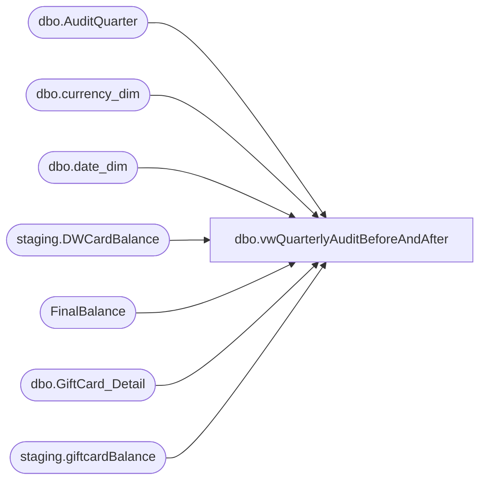

# dbo.vwQuarterlyAuditBeforeAndAfter

**Database:** SOX  
**Server:** papamart  

## Architecture Diagram



## Table Dependencies

| Referenced Table |
|---|
| dbo.AuditQuarter |
| dbo.currency_dim |
| dbo.date_dim |
| staging.DWCardBalance |
| FinalBalance |
| dbo.GiftCard_Detail |
| staging.giftcardBalance |

## View Code

```sql
CREATE view vwQuarterlyAuditBeforeAndAfter as

--use papamart.SOX.

with 
DWPreLoad as
	(
		select 
			pre.GiftCardNumber, 
			pre.Balance,
			pre.ActivationAmount,
			pre.RedemptionAmount,
			pre.ActivationDiscountAmount,
			cd.Currency_Code,
			pre.MID,
			cast(dd.actual_date as date) PreBalanceDate
		from staging.DWCardBalance pre with (nolock)
		join dw.dbo.date_dim dd with (nolock) on pre.date_key=dd.date_key
		join dw.dbo.currency_dim cd with (nolock) on pre.CurrencyKey=cd.currency_key
	),
MaxQtr as
	(
		select max(AuditQuarterKey) AuditQuarterKey
		from staging.giftcardBalance with (nolock)
		where AuditQuarterKey <> 217 --stub from fiscal calendar change..
	),
CDData as
	(
		select 
			cd.CardNumber,
			cd.OutstandingBalance,
			cd.ReloadAmount,
			cd.ActivationMID,
			cd.ActivationDate,
			cd.LastFinancialDate,
			cd.LastCardActivityDate,
			aq.StartDate AuditStartDate,
			aq.EndDate AuditEndDate
		from staging.GiftCardBalance cd with (nolock)
		join SOX.dbo.AuditQuarter aq with (nolock) on cd.AuditQuarterKey=aq.AuditQuarterKey
		join MaxQtr mq on cd.AuditQuarterKey=mq.AuditQuarterKey
	),
MaxBalDate as
	(
		select max(date_key) date_key
		from FinalBalance with (nolock)
	),
FinBalance as
	(
		select 
			fb.giftcard_no,
			fb.Balance,
			fb.activation_amount,
			fb.redemption_amount,
			fb.activation_discount_amount,
			fb.activation_discount_redeemed,
			fb.activation_discount_balance,
			fb.MID,
			cast(dd.actual_date as date) as FinalBalanceDate,
			cd.currency_code
		from FinalBalance fb with (nolock)
		join dw.dbo.currency_dim cd with (nolock) on fb.currency_key=cd.currency_key
		join dw.dbo.date_dim dd with (nolock) on fb.date_key=dd.date_key
		join MaxBalDate mbd with (nolock) on dd.date_key=fb.date_key
		
	)
select
	pre.GiftCardNumber as PreLoadCardNumber, 
	gd.promotion_code as PromotionCode,
	pre.Balance as PreLoadBalance,
	pre.ActivationAmount as PreLoadActivationAmount,
	pre.RedemptionAmount as PreLoadRedemptionAmount,
	pre.ActivationDiscountAmount as PreLoadActivationDiscountAmount,
	pre.Currency_Code as PreLoadCurrencyCode,
	pre.MID as PreLoadMID, 
	pre.PreBalanceDate as PreLoadPreBalanceDate, 
	cd.CardNumber as CDCardNumber,
	cd.OutstandingBalance as CDOutstandingBalance,
	cd.ReloadAmount as CDReloadAmount,
	cd.ActivationMID as CDActivationMID,
	cd.ActivationDate as CDActivationDate,
	cd.LastFinancialDate as CDLastFinancialDate,
	cd.LastCardActivityDate as CDLastCardActivityDate,
	cd.AuditStartDate as CDAuditStartDate,
	cd.AuditEndDate as CDAuditEndDate,
	fb.giftcard_no as FinBalCardNumber,
	fb.Balance as FinBalBalance,
	fb.activation_amount as FinBalActivationAmount,
	fb.redemption_amount as FinBalRedemptionAmount,
	fb.activation_discount_amount as FinBalActivationDiscountAmount,
	fb.activation_discount_redeemed as FinBalActivationDiscountRedeemed,
	fb.activation_discount_balance as FinBalActivationDiscountBalance,
	fb.MID as FinBalMID,
	fb.FinalBalanceDate as FinBalFinalBalanceDate,
	fb.currency_code as FinBalCurrencyCode
from DWPreLoad pre
left join CDData cd on pre.GiftCardNumber=cd.CardNumber
left join FinBalance fb on pre.GiftCardNumber=fb.giftcard_no
left join dw.dbo.GiftCard_Detail gd with (nolock) on pre.GiftCardNumber=gd.account_number
```

