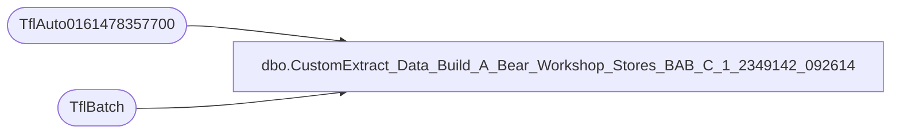

# dbo.CustomExtract_Data_Build_A_Bear_Workshop_Stores_BAB_C_1_2349142_092614

**Database:** SurveyResults  
**Server:** papamart  

## Architecture Diagram



## Table Dependencies

| Referenced Table |
|---|
| TflAuto0161478357700 |
| TflBatch |

## View Code

```sql
CREATE VIEW [CustomExtract_Data_Build_A_Bear_Workshop_Stores_BAB_C_1_2349142_092614] AS
SELECT
    d.TflKey,
    d.TflBatchId,
    b.TflUpdate,
    [d].[A],
    [d].[B],
    [d].[C],
    [d].[D],
    [d].[E],
    [d].[F],
    [d].[G],
    [d].[H],
    [d].[I],
    [d].[J],
    [d].[K],
    [d].[L],
    [d].[M],
    [d].[N],
    [d].[O],
    [d].[P],
    [d].[Q],
    [d].[R],
    [d].[S],
    [d].[T],
    [d].[U],
    [d].[V],
    [d].[W],
    [d].[X],
    [d].[Y],
    [d].[Z],
    [d].[AA],
    [d].[AB],
    [d].[AC],
    [d].[AD],
    [d].[AE],
    [d].[AF],
    [d].[AG],
    [d].[AH],
    [d].[AI],
    [d].[AJ],
    [d].[AK],
    [d].[AL],
    [d].[AM],
    [d].[AN],
    [d].[AO],
    [d].[AP],
    [d].[AQ],
    [d].[AR],
    [d].[AS],
    [d].[AT],
    [d].[AU],
    [d].[AV],
    [d].[AW],
    [d].[AX],
    [d].[AY],
    [d].[AZ],
    [d].[BA],
    [d].[BB],
    [d].[BC],
    [d].[BD],
    [d].[BE],
    [d].[BF],
    [d].[BG],
    [d].[BH],
    [d].[BI],
    [d].[BJ],
    [d].[BK],
    [d].[BL],
    [d].[BM],
    [d].[BN],
    [d].[BO],
    [d].[BP],
    [d].[BQ],
    [d].[BR],
    [d].[BS],
    [d].[BT],
    [d].[BU],
    [d].[BV],
    [d].[BW],
    [d].[BX],
    [d].[BY],
    [d].[BZ],
    [d].[CA],
    [d].[CB],
    [d].[CC],
    [d].[CD],
    [d].[CE],
    [d].[CF],
    [d].[CG],
    [d].[CH],
    [d].[CI],
    [d].[CJ],
    [d].[CK],
    [d].[CL],
    [d].[CM],
    [d].[CN],
    [d].[CO],
    [d].[CP],
    [d].[CQ],
    [d].[CR],
    [d].[CS],
    [d].[CT],
    [d].[CU],
    [d].[CV],
    [d].[CW],
    [d].[CX],
    [d].[CY],
    [d].[CZ],
    [d].[DA],
    [d].[DB],
    [d].[DC],
    [d].[DD],
    [d].[DE],
    [d].[DF],
    [d].[DG],
    [d].[DH],
    [d].[DI],
    [d].[DJ],
    [d].[DK],
    [d].[DL],
    [d].[DM],
    [d].[DN],
    [d].[DO],
    [d].[DP],
    [d].[DQ],
    [d].[DR],
    [d].[DS],
    [d].[DT],
    [d].[DU],
    [d].[DV],
    [d].[DW],
    [d].[DX],
    [d].[DY],
    [d].[DZ],
    [d].[EA],
    [d].[EB],
    [d].[EC],
    [d].[ED],
    [d].[EE],
    [d].[EF],
    [d].[EG],
    [d].[EH],
    [d].[EI],
    [d].[EJ],
    [d].[EK],
    [d].[EL],
    [d].[EM],
    [d].[EN],
    [d].[EO],
    [d].[EP],
    [d].[EQ],
    [d].[ER],
    [d].[ES],
    [d].[ET],
    [d].[EU],
    [d].[EV],
    [d].[EW],
    [d].[EX],
    [d].[EY],
    [d].[EZ],
    [d].[FA],
    [d].[FB],
    [d].[FC],
    [d].[FD],
    [d].[FE],
    [d].[FF],
    [d].[FG],
    [d].[FH],
    [d].[FI],
    [d].[FJ],
    [d].[FK],
    [d].[FL],
    [d].[FM],
    [d].[FN],
    [d].[FO],
    [d].[FP],
    [d].[FQ],
    [d].[FR],
    [d].[FS],
    [d].[FT],
    [d].[FU],
    [d].[FV],
    [d].[FW],
    [d].[FX],
    [d].[FY],
    [d].[FZ],
    [d].[GA],
    [d].[GB],
    [d].[GC],
    [d].[GD],
    [d].[GE],
    [d].[GF],
    [d].[GG],
    [d].[GH],
    [d].[GI],
    [d].[GJ],
    [d].[GK],
    [d].[GL],
    [d].[GM],
    [d].[GN],
    [d].[GO],
    [d].[GP],
    [d].[GQ],
    [d].[GR],
    [d].[GS],
    [d].[GT],
    [d].[GU],
    [d].[GV],
    [d].[GW],
    [d].[GX],
    [d].[GY],
    [d].[GZ],
    [d].[HA],
    [d].[HB],
    [d].[HC],
    [d].[HD],
    [d].[HE],
    [d].[HF],
    [d].[HG],
    [d].[HH],
    [d].[HI],
    [d].[HJ],
    [d].[HK],
    [d].[HL],
    [d].[HM],
    [d].[HN],
    [d].[HO],
    [d].[HP],
    [d].[HQ],
    [d].[HR],
    [d].[HS],
    [d].[HT],
    [d].[HU],
    [d].[HV],
    [d].[HW],
    [d].[HX],
    [d].[HY],
    [d].[HZ],
    [d].[IA],
    [d].[IB],
    [d].[IC],
    [d].[ID],
    [d].[IE],
    [d].[TflHashCode]
FROM [TflAuto0161478357700] d
INNER JOIN TflBatch b ON (d.TflBatchId = b.TflBatchId AND b.ProcessName = 'TflAuto0161478357700')
;
```

