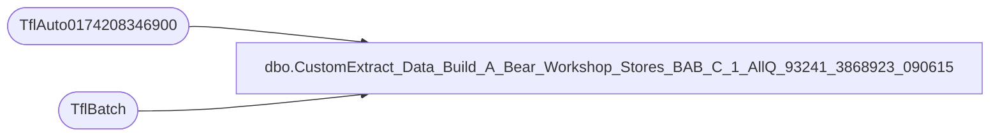

# dbo.CustomExtract_Data_Build_A_Bear_Workshop_Stores_BAB_C_1_AllQ_93241_3868923_090615

**Database:** SurveyResults  
**Server:** papamart  

## Architecture Diagram



## Table Dependencies

| Referenced Table |
|---|
| TflAuto0174208346900 |
| TflBatch |

## View Code

```sql
CREATE VIEW [CustomExtract_Data_Build_A_Bear_Workshop_Stores_BAB_C_1_AllQ_93241_3868923_090615] AS
SELECT
    d.TflKey,
    d.TflBatchId,
    b.TflUpdate,
    [d].[RespondentId],
    [d].[Date],
    [d].[Time],
    [d].[STORE-ID],
    [d].[STORE-NAME],
    [d].[DISTRICT-ID],
    [d].[DISTRICT-NAME],
    [d].[REGION-ID],
    [d].[REGION-NAME],
    [d].[ZONE-ID],
    [d].[ZONE-NAME],
    [d].[CHAIN-ID],
    [d].[CHAIN-NAME],
    [d].[STORE_TYPE],
    [d].[STORE_AGE],
    [d].[STORE_SIZE],
    [d].[STORE_SUB_TYPE],
    [d].[ENM004591L0002],
    [d].[ENM004591L0006],
    [d].[ENM004591L0003],
    [d].[ENM004591L0004],
    [d].[ENM004591L0005],
    [d].[ENM004591L0001],
    [d].[ENM004591L0007],
    [d].[ENM004591L0008],
    [d].[ENM004591L0009],
    [d].[ENM004591L0010],
    [d].[ENM004591L0011],
    [d].[ENM004591Q00120],
    [d].[ENM004591Q00100],
    [d].[ENM004591Q00110],
    [d].[ENM004591Q00030],
    [d].[ENM004591Q00010],
    [d].[ENM004591Q00020],
    [d].[ENM004591Q00220],
    [d].[ENM004591Q00230],
    [d].[ENM004591Q00240],
    [d].[ENM004591Q00050],
    [d].[ENM004591Q00040],
    [d].[ENM004591Q00060],
    [d].[ENM004591Q00160],
    [d].[ENM004591Q00180],
    [d].[ENM004591Q00170],
    [d].[ENM004591Q00080],
    [d].[ENM004591Q00070],
    [d].[ENM004591Q00090],
    [d].[ENM004591Q00250],
    [d].[ENM004591Q00200],
    [d].[ENM004591Q00210],
    [d].[ENM004591Q00190],
    [d].[ENM004591Q00130],
    [d].[ENM004591Q00150],
    [d].[ENM004591Q00140],
    [d].[AML005342],
    [d].[AML005365],
    [d].[AML005331],
    [d].[AML005332],
    [d].[AML005330],
    [d].[AML005350],
    [d].[AML005357],
    [d].[AML005369],
    [d].[MAD0062831],
    [d].[AML005345],
    [d].[AML005360],
    [d].[AML005358],
    [d].[AML005373],
    [d].[AML005352],
    [d].[AML005341],
    [d].[AML005375],
    [d].[MAD0049372],
    [d].[LON0039352],
    [d].[MAD0041023],
    [d].[AML005306],
    [d].[AML005351],
    [d].[MAD0049371],
    [d].[MAD0062868],
    [d].[MAD0062866],
    [d].[AML005377],
    [d].[AML005376],
    [d].[STE0051371],
    [d].[AML005347],
    [d].[AML005337],
    [d].[AML005344],
    [d].[AML005339],
    [d].[AML005359],
    [d].[AML005361],
    [d].[AML005334],
    [d].[AML005362],
    [d].[AML005349],
    [d].[AML005308],
    [d].[LON0039364],
    [d].[LON0039351],
    [d].[AML005333],
    [d].[AML005340],
    [d].[AML005355],
    [d].[AML005343],
    [d].[AML005364],
    [d].[AML005346],
    [d].[MAD0041022],
    [d].[LON0036351],
    [d].[AML005353],
    [d].[MAD0062865],
    [d].[AML005314],
    [d].[MAD0041048],
    [d].[AML005321],
    [d].[AML005316],
    [d].[AML005326],
    [d].[MAD0041051],
    [d].[CAS0034092],
    [d].[CAS0034093],
    [d].[AML005325],
    [d].[MAD0041042],
    [d].[AML005319],
    [d].[AML005324],
    [d].[AML005323],
    [d].[AML005320],
    [d].[AML005317],
    [d].[AML005318],
    [d].[MAD0041053],
    [d].[AML005328],
    [d].[AML005315],
    [d].[MAD0041043],
    [d].[MAD0041052],
    [d].[AML005327],
    [d].[AML005329],
    [d].[MAD0061243],
    [d].[MAD0041045],
    [d].[MAD0041046],
    [d].[MAD0044510],
    [d].[MAD0044511],
    [d].[MAD0049411],
    [d].[MAD0062828],
    [d].[AML005372],
    [d].[AML005370],
    [d].[MAD0062825],
    [d].[MAD0040940],
    [d].[AML005313],
    [d].[MAD0044533],
    [d].[AML005371],
    [d].[AML005367],
    [d].[AML005309],
    [d].[AML005356],
    [d].[AML005368],
    [d].[AML005366],
    [d].[MAD0040939],
    [d].[LON0036337],
    [d].[AML005305],
    [d].[AML005335],
    [d].[AML005348],
    [d].[AML005336],
    [d].[AML005338],
    [d].[AML005354],
    [d].[MAD0062827],
    [d].[AML005363],
    [d].[MAD0062862],
    [d].[AML005307],
    [d].[MAD0062826],
    [d].[MAD0062870],
    [d].[LON0039353],
    [d].[MAD0041024],
    [d].[MAD0062871],
    [d].[AML005312],
    [d].[AML005311],
    [d].[AML005374],
    [d].[MAD0044532],
    [d].[MAD0062830],
    [d].[LON0039354],
    [d].[AML005310],
    [d].[MAD0040941],
    [d].[MAD0062872],
    [d].[LON0036338],
    [d].[MAD0041050],
    [d].[AML005322],
    [d].[MAD0061270],
    [d].[MAD0041044],
    [d].[MAD0041049],
    [d].[MAD0041047],
    [d].[CPPAUTOB2590841],
    [d].[CPPAUTOB2614841],
    [d].[CPPAUTOB2638141],
    [d].[CPPAUTOB2591241],
    [d].[CPPAUTOB2590941],
    [d].[CPPAUTOB2591541],
    [d].[CPPAUTOB3206941],
    [d].[CPPAUTOB3206841],
    [d].[CPPAUTOB3180141],
    [d].[CPPAUTOC2637541],
    [d].[CPPAUTOB2613741],
    [d].[CPPAUTOC2637542],
    [d].[CPPAUTOB2637741],
    [d].[CPPAUTOB2637541],
    [d].[CPPAUTOB2638441],
    [d].[CPPJWR2002],
    [d].[CPPAUTOB2637241],
    [d].[CPPAUTOB2614441],
    [d].[CPPAUTOB2686841],
    [d].[CPPAUTOB2614941],
    [d].[CPPAUTOB2637341],
    [d].[CPPAUTOB2638541],
    [d].[CPPAUTOB2638241],
    [d].[CPPAUTOB2614141],
    [d].[CPPAUTOB2614041],
    [d].[CPPAUTOB2638341],
    [d].[CPPAUTOB2637841],
    [d].[CPPAUTOB2638041],
    [d].[CPPAUTOB2591041],
    [d].[CPPAUTOB2591741],
    [d].[CPPAUTOB2637641],
    [d].[CPPAUTOB2637441],
    [d].[CPPAUTOB2637941],
    [d].[CPPAUTOB2615041],
    [d].[CPPAUTOB2614741],
    [d].[CPPAUTOB2614642],
    [d].[CPPAUTOB2613941],
    [d].[CPPAUTOB2614241],
    [d].[CPPAUTOB2613841],
    [d].[CPPAUTOB2615141],
    [d].[CPPAUTOB2591641],
    [d].[CPPAUTOB2614641],
    [d].[CPPAUTOB2614541],
    [d].[CPPAUTOB2614341],
    [d].[CPPAUTOB3619041],
    [d].[CPPAUTOB3617341],
    [d].[CPPAUTOB2591441],
    [d].[CPPAUTOB2643441],
    [d].[LON0031566],
    [d].[LON0031567],
    [d].[LON0031558],
    [d].[LON0031562],
    [d].[LON0031553],
    [d].[LON0031560],
    [d].[LON0031564],
    [d].[LON0031569],
    [d].[LON0031561],
    [d].[LON0031559],
    [d].[LON0031568],
    [d].[LON0031554],
    [d].[ROB0031963],
    [d].[LON0031571],
    [d].[LON0031555],
    [d].[LON0031557],
    [d].[LON0031570],
    [d].[LON0031563],
    [d].[LON0031552],
    [d].[LON0031551],
    [d].[LON0031556],
    [d].[LON0031565],
    [d].[CPPAUTOB5730741],
    [d].[MAD0066404],
    [d].[MAD0066410],
    [d].[MAD0066402],
    [d].[MAD0066406],
    [d].[MAD0066403],
    [d].[CPPAUTOB5829041],
    [d].[MAD0069414],
    [d].[MAD0069412],
    [d].[MAD0069413],
    [d].[MAD0071422],
    [d].[MAD0069433],
    [d].[MAD0069409],
    [d].[MAD0069436],
    [d].[MAD0069408],
    [d].[MAD0069407],
    [d].[MAD0069427],
    [d].[MAD0069431],
    [d].[MAD0069429],
    [d].[MAD0069434],
    [d].[MAD0069411],
    [d].[MAD0069432],
    [d].[MAD0069410],
    [d].[MAD0069435],
    [d].[MAD0071423],
    [d].[STE0073568],
    [d].[STE0073566],
    [d].[STE0073567],
    [d].[STE0073569],
    [d].[STE0073570],
    [d].[LIV0079022],
    [d].[LIV0079027],
    [d].[LIV0079024],
    [d].[LIV0079026],
    [d].[LIV0079025],
    [d].[LIV0079023],
    [d].[LIV0080049],
    [d].[LIV0080042],
    [d].[LIV0080043],
    [d].[LIV0080048],
    [d].[LIV0080050],
    [d].[LIV0080044],
    [d].[LIV0080045],
    [d].[LIV0080046],
    [d].[LIV0080047],
    [d].[MAD0082545],
    [d].[JAC0084685],
    [d].[JAC0084684],
    [d].[JAC0084663],
    [d].[JAC0084668],
    [d].[JAC0084660],
    [d].[JAC0084667],
    [d].[TflHashCode]
FROM [TflAuto0174208346900] d
INNER JOIN TflBatch b ON (d.TflBatchId = b.TflBatchId AND b.ProcessName = 'TflAuto0174208346900')
;
```

