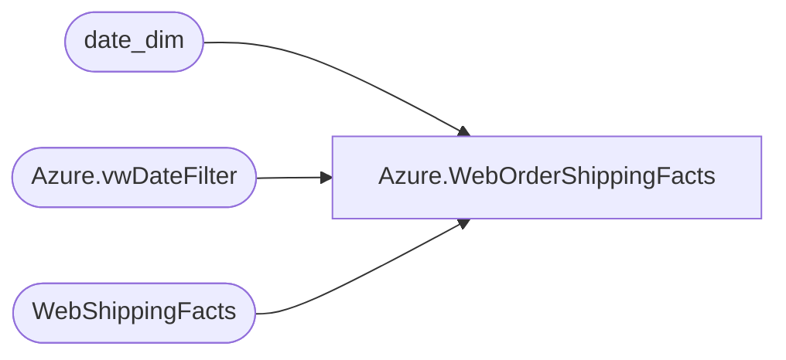

# Azure.WebOrderShippingFacts

**Database:** dw  
**Server:** papamart  

## Architecture Diagram



## Table Dependencies

| Referenced Table |
|---|
| date_dim |
| Azure.vwDateFilter |
| WebShippingFacts |

## View Code

```sql
CREATE view [Azure].[WebOrderShippingFacts]

AS

select 
	right(w.SiteCode,2) as SiteCode,
	w.CreateDate,
	w.ShipDate,
	w.OrderNumber,
	w.ShipToState,
	w.ShipToCountry,
	w.TrackingNumber,
	w.Shipping,
	w.ShipmentTrackingNumber,
	w.ServiceType,
	w.ShipmentDeliveryDate,
	w.NetChargeAmountUSD,
	w.InvoiceDate,
	w.MasterTrackingNumber,
	min(w.transaction_id) transaction_id, ---8 orders had multiple transaction_ids...
	Case right(w.SiteCode,2) when 'US' then 13 else 2013 end as StoreKey
from WebShippingFacts w 
join date_dim dd on w.CreateDate = cast(dd.actual_date as date)
join Azure.vwDateFilter df WITH(NOLOCK)
			ON dd.date_key = df.date_key  
where isnull(w.TrackingNumber,'x') <> 'NoShippableContent'
group by 
	right(w.SiteCode,2),
	w.CreateDate,
	w.ShipDate,
	w.Ordernumber,
	w.ShipToState,
	w.ShipToCountry,
	w.TrackingNumber,
	w.Shipping,
	w.ShipmentTrackingNumber,
	w.ServiceType,
	w.ShipmentDeliveryDate,
	w.NetChargeAmountUSD,
	w.InvoiceDate,
	w.MasterTrackingNumber,
	Case right(w.SiteCode,2) when 'US' then 13 else 2013 end
```

