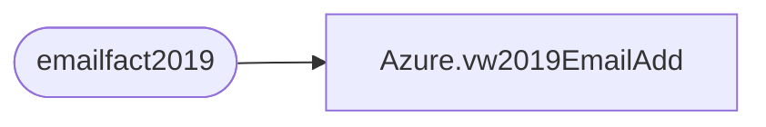

# Azure.vw2019EmailAdd

**Database:** dw  
**Server:** papamart  

## Architecture Diagram



## Table Dependencies

| Referenced Table |
|---|
| emailfact2019 |

## View Code

```sql
CREATE view [Azure].[vw2019EmailAdd]

AS
-- =============================================================================================================
-- Name: [Azure].[vw2019EmailAdd]
--
-- Description: Transaction data at the header level.
--
--
-- Dependencies: 
--
-- Revision History
--		Name:				Date:			Comments:
--		Tim Bytnar			4/2/2018		Initial creation
--		John Eck			9/25/2018		Alterations for including Franchisee TransactionFact data

--
-- =============================================================================================================
With e as (select SubscriberKey,Max(Cast(clientID as varchar(20)) + Cast(sendID as varchar(20))) as lastSend
from emailfact2019
group by SubscriberKey)
Select e.SubscriberKey,emailAddress
from e inner join Emailfact2019 e2 on (e.subscriberkey = e2.SubscriberKey and lastSend =(Cast(clientID as varchar(20)) + Cast(sendID as varchar(20))))
```

