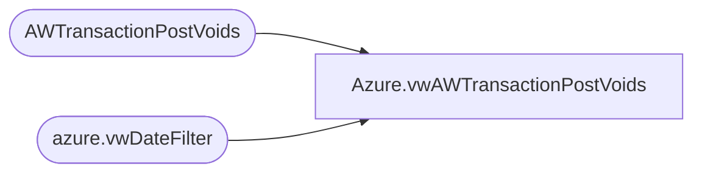

# Azure.vwAWTransactionPostVoids

**Database:** dw  
**Server:** papamart  

## Architecture Diagram



## Table Dependencies

| Referenced Table |
|---|
| AWTransactionPostVoids |
| azure.vwDateFilter |

## View Code

```sql
CREATE view [Azure].[vwAWTransactionPostVoids]

as 

select 
	pv.TransactionDate, 
	pv.StoreNo as StoreNumber, 
	pv.PostVoidUGA, 
	pv.PostVoidUnits 
from AWTransactionPostVoids pv
join azure.vwDateFilter df on cast(pv.TransactionDate as date)=cast(df.actual_date as date)
```

