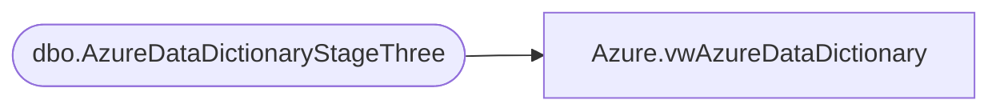

# Azure.vwAzureDataDictionary

**Database:** dw  
**Server:** papamart  

## Architecture Diagram



## Table Dependencies

| Referenced Table |
|---|
| dbo.AzureDataDictionaryStageThree |

## View Code

```sql
CREATE view [Azure].[vwAzureDataDictionary]

as


with
Objectz as
	(
		SELECT  
			OBJECT_NAME (referencing_id) AS SourceView, 
			concat(isnull(referenced_database_name,'dw'), '.', referenced_schema_name, '.', referenced_entity_name, ' ') as ReferencedTables,
			referenced_database_name,referenced_schema_name,referenced_entity_name
		FROM sys.sql_expression_dependencies
		WHERE 1=1
			--and referenced_database_name IS NOT NULL
			--AND is_ambiguous = 0
			and isnull(referenced_schema_name,'domo') <>'domo'
			--and OBJECT_NAME (referencing_id)='vwCRMTransactionFact'
	)
select 
	dd.TableName,
	dd.DisplayFolder,
	dd.ColumnName,
	dd.ColumnOrMeasure,
	dd.Expression,
	dd.SourceView,
	substring((select concat(',', o.ReferencedTables) from Objectz o where dd.SourceView=o.SourceView for xml path('')),2,99999) as SourceTables
	--ViewDefinition
from DWStaging.dbo.AzureDataDictionaryStageThree dd
where dd.TableName not in ('CRM_Data_Dictionary','AzureDataDictionary')
```

