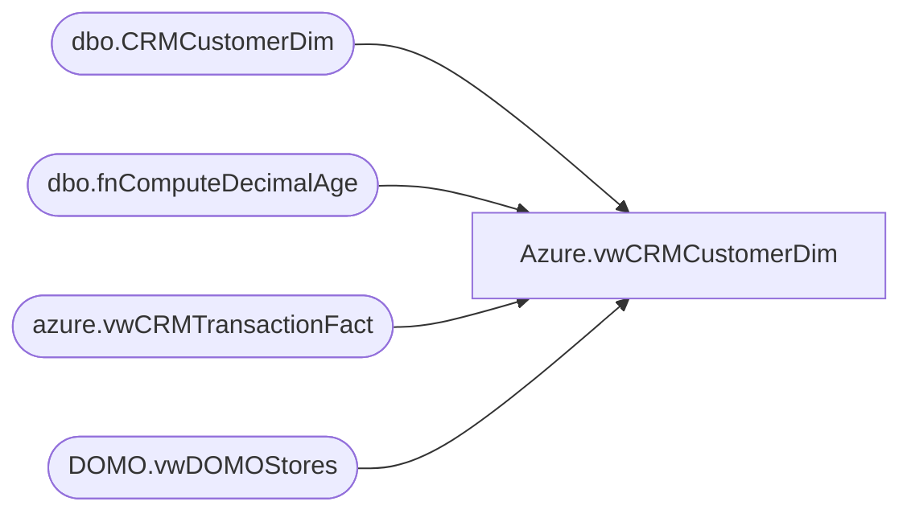

# Azure.vwCRMCustomerDim

**Database:** dw  
**Server:** papamart  

## Architecture Diagram



## Table Dependencies

| Referenced Table |
|---|
| dbo.CRMCustomerDim |
| dbo.fnComputeDecimalAge |
| azure.vwCRMTransactionFact |
| DOMO.vwDOMOStores |

## View Code

```sql
CREATE view [Azure].[vwCRMCustomerDim]

AS

WITH Customers (CustomerNumber) AS (
	SELECT DISTINCT CustomerNumber
	FROM dw.azure.vwCRMTransactionFact
	)
SELECT cd.[CustomerID]
	  ,cd.[CustomerNumber]
      ,cd.[MembershipDate]
      ,cd.[Gender]
      ,dw.dbo.fnComputeDecimalAge(cd.[BirthDate],GETDATE()) AS Age
      ,d.[StoreID] AS StoreID
      ,CASE WHEN cd.[CountryCode] IN ('CAN','CAF') THEN 'CAN'
	        WHEN cd.[CountryCode]='GBR' THEN 'GBR'
			ELSE 'USA'
		END AS ProgramCountryCode
      ,cd.[PostalCode]
      ,cd.[PointsEligible]
      ,cd.[MembershipType]
      ,CASE WHEN cd.[Emailable]=1 THEN 'Yes' ELSE 'No' END AS Emailable
	  ,cd.[InsertedDate]
	  ,d.StoreKey
	  ,cd.SubscriberKey
FROM [dw].[dbo].[CRMCustomerDim] cd
INNER JOIN Customers c
	ON c.CustomerNumber=cd.CustomerNumber
INNER JOIN dw.DOMO.vwDOMOStores d
	ON d.StoreKey=cd.StoreKey
```

