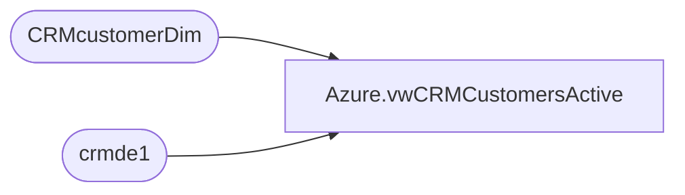

# Azure.vwCRMCustomersActive

**Database:** dw  
**Server:** papamart  

## Architecture Diagram



## Table Dependencies

| Referenced Table |
|---|
| CRMcustomerDim |
| crmde1 |

## View Code

```sql
CREATE view [Azure].[vwCRMCustomersActive]

AS

select de.customerNumber 
from crmde1 de with (nolock)
join CRMcustomerDim cDim with (nolock) on de.customerNumber = cDim.customerNumber
where 1=1
and (
		cast(cDim.MembershipDate as date)  >= '2018-01-01' 
		or (cast(cDim.EmailOptInDate as date) >= '2018-01-01' and de.status = 'active') 
	
		or cast(de.LastTransactionDate as date)  >= '2018-01-01' 
		or cast(de.LastOpenDate as date) >= '2018-01-01'
		)
	
	and de.EmailAddress <> '' 
	and de.EmailAddress  is not null
```

