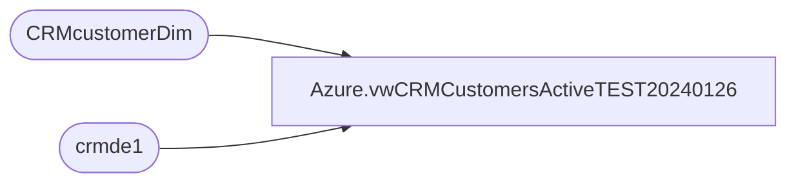

# Azure.vwCRMCustomersActiveTEST20240126

**Database:** dw  
**Server:** papamart  

## Architecture Diagram



## Table Dependencies

| Referenced Table |
|---|
| CRMcustomerDim |
| crmde1 |

## View Code

```sql
CREATE view [Azure].[vwCRMCustomersActiveTEST20240126]

AS


select de.customerNumber 
from crmde1 de with (nolock)
join CRMcustomerDim cDim with (nolock) on de.customerNumber = cDim.customerNumber
where 1=1
and 
	(
		cast(cDim.MembershipDate as date)  >= '2020-01-01' 
		or (cast(cDim.EmailOptInDate as date) >= '2020-01-01' and de.status = 'active') 
	)
	AND
	( 
		cast(de.LastTransactionDate as date)  >= '2020-01-01' 
		or cast(de.LastOpenDate as date) >= '2020-01-01'
	)
	
	and de.EmailAddress <> '' 
	and de.EmailAddress  is not null


dbo,vwCLNSD_ADDR_DIM,/***********************************************************************************************
Object Name:			dbo.vwCLNSD_ADDR_DIM
Description/Purpose:	View used for reporting.  Primarily used by BO universes to 
						conveniently access all relevant pieces of Address data sourced from Kiosk and CRM .
						Joins CLNSD_ADDR_DIM to NRST_PSTL_CD_STR_DIM, DMA_MSA vwRawAddrDim_DrvdCntry and MAPINFO_PSYTE_CLUSTER

-- Dependencies: 
--
-- Revision History
--		Name:					Date:			Comments:
--		Funmi Agbebi			1/12/2010		Added Cluster Information
--		Funmi Agbebi			3/6/2009		Original Creation

**********************************************************************************************/


CREATE VIEW [dbo].[vwCLNSD_ADDR_DIM] 
AS
SELECT 
r.DRVD_CNTRY_ABBRV
, a.*
/*  Cluster Information addition starts (FA 1/12/2010) */
,m.CLUS_CD, m.CLUS_GRP, M.CLUS_NM
/*  Cluster Information addition ends */

,dma.DMA, dma.DMA_NM, dma.MSA, dma.MSA_NM,
n.PSTL_CD NrstStrDim_PstlCd,
n.STR_ID NearestStoreID,
s.store_name NearestStore,
n.FUTR_STR_ID FutureNearestStoreID, 
f.store_name FutureNearestStore
FROM dbo.CLNSD_ADDR_DIM a WITH (NOLOCK) 
LEFT JOIN dbo.[vwRawAddrDim_DrvdCntry] r WITH (NOLOCK) ON
a.CLNSD_ADDR_ID = r.CLNSD_ADDR_ID 
LEFT JOIN  dbo.NRST_PSTL_CD_STR_DIM n WITH (NOLOCK) ON 
a.CNTRY_ABBRV = n.CNTRY_ABBRV 
and a.NRST_STR_PSTL_CD = n.PSTL_CD 
LEFT JOIN dbo.DMA_MSA dma WITH (NOLOCK) ON 
a.cntry_abbrv = dma.cntry_abbrv 
and a.pstl_cd = dma.pstl_cd 
LEFT JOIN dbo.MAPINFO_PSYTE_CLUSTER m ON 
a.clus_id = m.clus_id
LEFT JOIN dbo.store_dim s WITH (NOLOCK) ON 
n.str_id = s.store_key 
LEFT JOIN dbo.store_dim f ON 
n.futr_str_id = f.store_key
```

