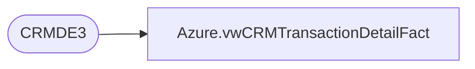

# Azure.vwCRMTransactionDetailFact

**Database:** dw  
**Server:** papamart  

## Architecture Diagram



## Table Dependencies

| Referenced Table |
|---|
| CRMDE3 |

## View Code

```sql
create view azure.vwCRMTransactionDetailFact

as

select 
	Country,
	PurchaseChannel,	
	PurchaseStoreNumber,
	CustomerNumber,	
	TransactionID,	
	PurchaseDate,	
	stuffed,
	unstuffed,
	licensedORNot,	
	consumerGroup,	
	keyStory,	
	department,	
	sku,	
	PurchaseRevenue,	
	PurchaseUnitCount
from CRMDE3 with (nolock)
```

