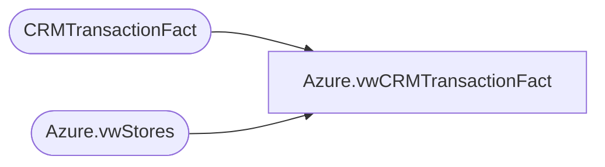

# Azure.vwCRMTransactionFact

**Database:** dw  
**Server:** papamart  

## Architecture Diagram



## Table Dependencies

| Referenced Table |
|---|
| CRMTransactionFact |
| Azure.vwStores |

## View Code

```sql
CREATE view [Azure].[vwCRMTransactionFact]

AS

SELECT 
	c.TransactionID AS POSTransactionID,
	c.CRMTransactionID,
	d.StoreKey AS StoreKey,
	c.TransactionDate,
	c.CRMTransactionType,
	c.CustomerNumber,
	c.InsertedDate,
	d.StoreID AS StoreID,
	cast(case when c.CRMTransactionType='New' then 1 else 0 end as int) as isNewCustomer,
	cast(case when c.CRMTransactionType='Repeat' then 1 else 0 end as int) as isRepeatCustomer,
	LifetimeVisitNumber,
	LifetimeVisitNumber * numTransToday as LifetimeTransactionNumber,
	GaapSales,
	GaapUnits,
	cast(case 
		when TransactionDate >= dateadd(mm,-1, getdate()) 
			then 1
		else 0
	end as int) as inMonth1,
	cast(case 
		when TransactionDate >= dateadd(mm,-3, getdate())  
			then 1
		else 0
	end as int) as inMonth3,
	cast(case 
		when TransactionDate >= dateadd(mm,-6, getdate()) 
			then 1
		else 0
	end as int) as inMonth6,
	
	cast(case 
		when TransactionDate >= dateadd(mm,-12, getdate()) 
			then 1 
		else 0 
	end as int) as inMonth12,
	
	cast(case 
		when TransactionDate >= dateadd(mm,-18, getdate())  
			then 1
		else 0
	end as int) as inMonth18,
	cast(case 
		when TransactionDate >= dateadd(mm,-24, getdate())  
			then 1
		else 0
	end as int) as inMonth24,
	cast(case 
		when TransactionDate >= dateadd(mm,-36, getdate()) 
			then 1
		else 0
	end as int) as inMonth36
FROM CRMTransactionFact c
JOIN Azure.vwStores d ON d.StoreKey=c.StoreKey 
WHERE TransactionDate>=DATEADD(year, -2, DATEADD(yy, DATEDIFF(yy, 0, GETDATE()), 0))
AND TransactionDate<CONVERT(DATE,GETDATE())
```

