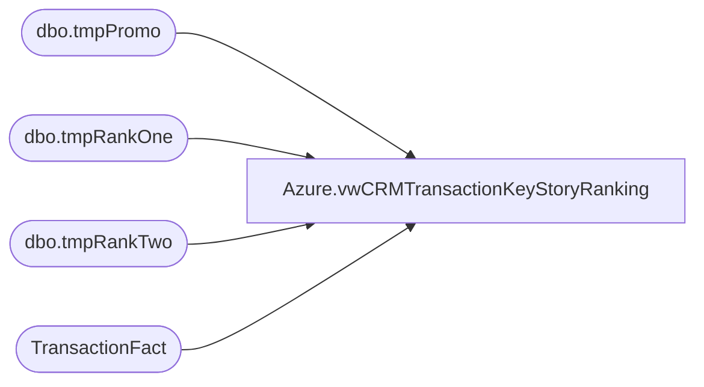

# Azure.vwCRMTransactionKeyStoryRanking

**Database:** dw  
**Server:** papamart  

## Architecture Diagram



## Table Dependencies

| Referenced Table |
|---|
| dbo.tmpPromo |
| dbo.tmpRankOne |
| dbo.tmpRankTwo |
| TransactionFact |

## View Code

```sql
CREATE view [Azure].[vwCRMTransactionKeyStoryRanking]

as 


select 
	t1.Country,
	t1.PurchaseChannel,
	t1.customerNumber,
	t1.transactionID,
	t1.TransactionDate,
	t1.keyStory,
	t1.KeyRankPerTransaction, --ranked per transaction
	t2.KeyRankPerSequenceNewVOldCustomers,
	t2.KeyRankPerSequenceGlobal,
	t1.sales KeyStorySales,
	t1.Units KeyStoryUnits,
	t1.CustomerFirstTransactionDate,
	t1.isFreshCustomer,
	t1.isFirstPurchaseChannel,
	t1.isFirstPurchase,
	t1.isNewCustomer,
	t1.isRepeatCustomer,
	t1.isWeb,
	t1.isRetail,
	t1.GaapSalesTranTotal,
	cast(cast(abs(100* (t1.sales / nullif(t1.GaapSalesTranTotal,0) )) as int) as varchar) + '%' as KeyStoryPctToTotal,
	t1.LifetimeTransactionSequence,
	t1.LifetimeVisitSequence,
	t1.ParentTransactionID,
	t1.ChildTransactionID,
	cast(case when t1.KeyRankPerTransaction=1 then 1 else 0 end as int) as isTopKeyStoryPerTransaction,
	cast(case when t2.KeyRankPerSequenceNewVOldCustomers=1 then 1 else 0 end as int) as isTopKeyStoryNewOrOldGlobal,
	cast(case when t2.KeyRankPerSequenceGlobal=1 then 1 else 0 end as int) as isTopKeyStoryGlobal,
	p.hasCountYourCandles,
	p.hasBirthdayGift,
	p.hasHalfBirthday,
	p.hasWinback,
	p.hasOther,
	--t1.bonusClubMember, -- new case statement below added on 11/15 to render new non-bc bucket on New/Repeat PBI report
	Cast(tf.transaction_id as Varchar(20)) + cast(Store_Key as Varchar(10)) as TransactionKey,
	--case when t1.isFirstPurchase=1 then 'First buy (New BC + NonBC)' else 'Repeat buy (BC 2+ tracked)' end as firstPurchaseFlag
	--case when t1.bonusClubMember = 0 then 'Non BC Member' when  t1.bonusClubMember = 1 and t1.isFirstPurchase= 1 then 'New BC Member' else 'Repeat BC Member' end as firstPurchaseFlag
	case when t1.nonCrmTransFlag = 1 then 'Non BC Member' when  t1.nonCrmTransFlag = 0 and t1.isFirstPurchase= 1 then 'New BC Member' else 'Repeat BC Member' end as firstPurchaseFlag
from dwstaging.dbo.tmpRankOne t1
join dwstaging.dbo.tmpRankTwo t2 
	on t1.KeyStory=t2.KeyStory
	and t1.LifetimeVisitSequence=t2.LifetimeVisitSequence
	and t1.isFreshCustomer=t2.isFreshCustomer
left join dwstaging.dbo.tmpPromo p on t1.TransactionID=p.TransactionID
join TransactionFact tf with (nolock) on t1.transactionID=tf.transaction_id
```

