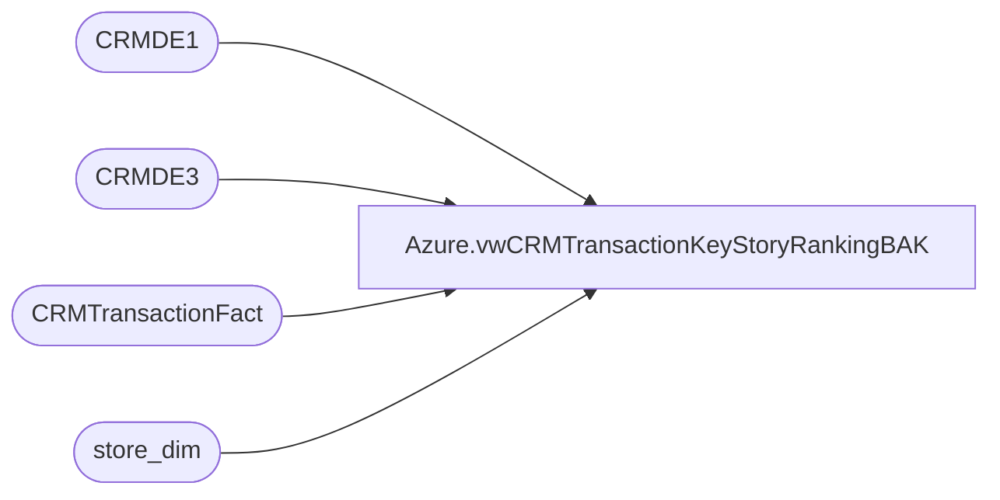

# Azure.vwCRMTransactionKeyStoryRankingBAK

**Database:** dw  
**Server:** papamart  

## Architecture Diagram



## Table Dependencies

| Referenced Table |
|---|
| CRMDE1 |
| CRMDE3 |
| CRMTransactionFact |
| store_dim |

## View Code

```sql
CREATE view [Azure].[vwCRMTransactionKeyStoryRankingBAK]

as 


with
KeySales as
	(
		select 
			case c3.country 
				when 'United Kingdom' then 'UK' 
				when 'United States' then 'US'
				when 'Canada' then 'CA'
				else c3.country
			end as country,
			c3.PurchaseChannel,
			c3.customerNumber,
			c3.transactionID,
			cast(c3.purchaseDate as date) as TransactionDate,
			case 
				when isnull(c3.keyStory,'')='' 
					then 'NoKeyStory' 
				else c3.keyStory 
			end as KeyStory,
			sum(c3.purchaseRevenue) Sales,
			sum(c3.purchaseUnitCount) Units,
			c1.FirstTransactionDate as CustomerFirstTransactionDate,
			cast(case when isnull(c1.FirstTransactionDate,'2000-01-01') >= '2017-01-01' then 1 else 0 end as int) as isFreshCustomer, --globally speaking, this is a 'fresh customer' from 2017 to present
			cast(case when ctf.LifetimeTransactionSequence=1 then 1 else 0 end as int) as isFirstPurchaseChannel,
			cast(case when ctf.LifetimeTransactionSequence=1 then 1 else 0 end as int) as isFirstPurchase,
			cast(case when ctf.LifetimeTransactionSequence=1 then 1 else 0 end as int) as isNewCustomer, -- per this transaction, this is a new customer
			cast(case when ctf.LifetimeTransactionSequence>1 then 1 else 0 end as int) as isRepeatCustomer, --this is not customer's first transaction
			cast(case when sd.store_id in (13,2013) then 1 else 0 end as int) as isWeb,
			cast(case when sd.store_id in (13,2013) then 0 else 1 end as int) as isRetail,
			ctf.LifetimeTransactionSequence,
			ctf.LifetimeVisitSequence,
			ctf.GaapSales GaapSalesTranTotal
		from CRMDE3 c3 with (nolock) 
		join CRMDE1 c1 on c3.CustomerNumber=c1.CustomerNumber
		join CRMTransactionFact ctf on c3.TransactionID=ctf.TransactionID
		join store_dim sd with (nolock) on ctf.StoreKey=sd.store_key
		where 1=1
		and c3.purchaseRevenue <> 0
		--and isnull(c3.keyStory,'')<>''
		group by 
			case c3.country 
				when 'United Kingdom' then 'UK' 
				when 'United States' then 'US'
				when 'Canada' then 'CA'
				else c3.country
			end,
			c3.PurchaseChannel,
			c3.customerNumber,
			c3.transactionID,
			cast(c3.purchaseDate as date),
			case 
				when isnull(c3.keyStory,'')='' 
					then 'NoKeyStory' 
				else c3.keyStory 
			end,
			c1.FirstTransactionDate,
			cast(case when isnull(c1.FirstTransactionDate,'2000-01-01') >= '2017-01-01' then 1 else 0 end as int),
			cast(case when ctf.LifetimeTransactionSequence=1 then 1 else 0 end as int),
			cast(case when ctf.LifetimeTransactionSequence=1 then 1 else 0 end as int),
			cast(case when ctf.LifetimeTransactionSequence=1 then 1 else 0 end as int),
			cast(case when ctf.LifetimeTransactionSequence>1 then 1 else 0 end as int),
			cast(case when sd.store_id in (13,2013) then 1 else 0 end as int),
			cast(case when sd.store_id in (13,2013) then 0 else 1 end as int),
			ctf.LifetimeTransactionSequence,
			ctf.LifetimeVisitSequence,
			ctf.GaapSales
	),
ParentChild as
	(
		select
			t1.transactionID,
			t1.LifetimeTransactionSequence,
			t1.LifetimeVisitSequence,
			t2.transactionID as ChildTransactionID,
			t3.transactionID as ParentTransactionID
		from KeySales t1
		left join KeySales t2 
			on t1.CustomerNumber=t2.CustomerNumber
			and t1.LifetimeTransactionSequence+1=t2.LifetimeTransactionSequence
		left join KeySales t3
			on t1.CustomerNumber=t3.CustomerNumber
			and t1.LifetimeTransactionSequence-1=t3.LifetimeTransactionSequence
	),
KeyRank as
	(--RANKING NEW CUSTOMERS (FROM 2017+) SEPARATELY SINCE WE'LL BE FOCUSING ON THESE IN THE REPORTING
		select 
			k.Country,
			k.PurchaseChannel,
			k.customerNumber,
			k.transactionID,
			k.TransactionDate,
			k.keyStory,
			DENSE_RANK() OVER (partition by k.TransactionID ORDER BY k.Sales desc) as KeyRankPerTransaction, --ranked per transaction
			DENSE_RANK() OVER (partition by k.LifetimeVisitSequence ORDER BY k.Sales desc) as KeyRankPerSequenceNewVOldCustomers, --ranked per transaction sequence - all first purchases, second purchase, etc
			k.sales,
			k.Units,
			k.CustomerFirstTransactionDate,
			k.isFreshCustomer,
			k.isFirstPurchaseChannel,
			k.isFirstPurchase,
			k.isNewCustomer,
			k.isRepeatCustomer,
			k.isWeb,
			k.isRetail,
			k.GaapSalesTranTotal,
			k.LifetimeTransactionSequence,
			k.LifetimeVisitSequence,
			pc.ParentTransactionID,
			pc.ChildTransactionID
		from KeySales k
		join ParentChild pc on k.TransactionID=pc.TransactionID
		where k.isFreshCustomer=1
		UNION
		select 
			k.Country,
			k.PurchaseChannel,
			k.customerNumber,
			k.transactionID,
			k.TransactionDate,
			k.keyStory,
			DENSE_RANK() OVER (partition by k.TransactionID ORDER BY k.Sales desc) as KeyRankPerTransaction, --ranked per transaction
			DENSE_RANK() OVER (partition by k.LifetimeVisitSequence ORDER BY k.Sales desc) as KeyRankPerSequenceNewVOldCustomers, --ranked per transaction sequence - all first purchases, second purchase, etc
			k.sales,
			k.Units,
			k.CustomerFirstTransactionDate,
			k.isFreshCustomer,
			k.isFirstPurchaseChannel,
			k.isFirstPurchase,
			k.isNewCustomer,
			k.isRepeatCustomer,
			k.isWeb,
			k.isRetail,
			k.GaapSalesTranTotal,
			k.LifetimeTransactionSequence,
			k.LifetimeVisitSequence,
			pc.ParentTransactionID,
			pc.ChildTransactionID
		from KeySales k
		join ParentChild pc on k.TransactionID=pc.TransactionID
		where k.isFreshCustomer=0
	)
select 
	CustomerNumber,
	TransactionDate,
	TransactionID,
	ParentTransactionID,
	ChildTransactionID,
	LifetimeTransactionSequence,
	LifetimeVisitSequence,KeyStory,
	sales as KeyStorySales,
	units as KeyStoryUnits,
	GaapSalesTranTotal,
	cast(cast(abs(100* (sales / nullif(GaapSalesTranTotal,0) )) as int) as varchar) + '%' as KeyStoryPctToTotal,
	KeyRankPerTransaction, --ranked per transaction
	KeyRankPerSequenceNewVOldCustomers, --Fresh customers' transactions' keystories are ranked and unioned with older customers transactions ranks -- so we can focus on new customers only...
	DENSE_RANK() OVER (partition by LifetimeVisitSequence ORDER BY Sales desc) as KeyRankPerSequenceGlobal, --global key story ranking, regardless of new or old customer
	cast(case when KeyRankPerTransaction=1 then 1 else 0 end as int) as isTopKeyStoryPerTransaction,
	cast(case when KeyRankPerSequenceNewVOldCustomers=1 then 1 else 0 end as int) as isTopKeyStoryNewOrOldGlobal,
	cast(case when DENSE_RANK() OVER (partition by LifetimeVisitSequence ORDER BY Sales desc)=1 then 1 else 0 end as int) as isTopKeyStoryGlobal,
	CustomerFirstTransactionDate,
	isFreshCustomer,
	isFirstPurchaseChannel,
	isFirstPurchase,
	isNewCustomer,
	isRepeatCustomer,
	isWeb,
	isRetail,
	Country,
	PurchaseChannel
from KeyRank
```

