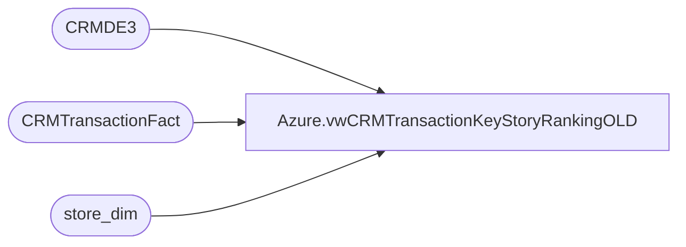

# Azure.vwCRMTransactionKeyStoryRankingOLD

**Database:** dw  
**Server:** papamart  

## Architecture Diagram



## Table Dependencies

| Referenced Table |
|---|
| CRMDE3 |
| CRMTransactionFact |
| store_dim |

## View Code

```sql
CREATE view [Azure].[vwCRMTransactionKeyStoryRankingOLD]

as 


with 
KeySales as
	(
		select 
			case country 
				when 'United Kingdom' then 'UK' 
				when 'United States' then 'US'
				when 'Canada' then 'CA'
				else country
			end as country,
			PurchaseChannel,
			customerNumber,
			transactionID,
			cast(purchaseDate as date) as TransactionDate,
			keyStory,
			sum(purchaseRevenue) Sales,
			sum(purchaseUnitCount) Units
		from CRMDE3
		where isnull(keyStory,'')<>''
		and purchaseRevenue <> 0
		group by 
			country,
			PurchaseChannel,
			customerNumber,
			transactionID,
			cast(purchaseDate as date),
			keyStory
	),
TransactionSequence as
	(
		select 
			customerNumber,
			transactionID,
			DENSE_RANK() OVER (partition by CustomerNumber ORDER BY cast(TransactionDate as date), TransactionID) as TransactionSequence,
			DENSE_RANK() OVER (partition by CustomerNumber ORDER BY cast(TransactionDate as date)) as TransactionDateSequence
		from KeySales 
		group by 
			customerNumber,
			transactionID,
			cast(TransactionDate as date)
	),
ParentChild as
	(
		select
			t1.transactionID,
			t1.TransactionSequence,
			t1.TransactionDateSequence,
			t2.transactionID as ChildTransactionID,
			t3.transactionID as ParentTransactionID
		from TransactionSequence t1
		left join TransactionSequence t2 
			on t1.CustomerNumber=t2.CustomerNumber
			and t1.TransactionSequence+1=t2.TransactionSequence
		left join TransactionSequence t3
			on t1.CustomerNumber=t3.CustomerNumber
			and t1.TransactionSequence-1=t3.TransactionSequence
	),
TransactionOrder as
	(
		select 
			k.Country,
			k.PurchaseChannel,
			k.customerNumber,
			k.transactionID,
			k.TransactionDate,
			k.keyStory,
			k.sales,
			k.Units,
			pc.TransactionSequence,
			pc.TransactionDateSequence,
			pc.ParentTransactionID,
			pc.ChildTransactionID
		from KeySales k
		join ParentChild pc on k.TransactionID=pc.TransactionID
	),
KeyRank as
	(
		select 
			Country,
			PurchaseChannel,
			CustomerNumber,
			transactionID,
			TransactionDate,
			keyStory,
			sales,
			Units,
			TransactionSequence,
			TransactionDateSequence,
			ParentTransactionID,
			ChildTransactionID,
			DENSE_RANK() OVER (partition by TransactionID ORDER BY Sales desc) as KeyRank,
			DENSE_RANK() OVER (partition by TransactionDateSequence ORDER BY Sales desc) as KeyRankGlobal
		from TransactionOrder 
	)
select 
	kr.Country,
	kr.PurchaseChannel,
	kr.CustomerNumber,
	kr.TransactionDate,
	kr.TransactionID,
	ParentTransactionID,
	ChildTransactionID,
	kr.TransactionSequence,
	kr.TransactionDateSequence,
	ctf.LifetimeVisitNumber*numTransToday as LifetimeTransactionNumber,
	kr.KeyRank,
	kr.KeyRankGlobal,
	kr.KeyStory,
	kr.sales as KeyStorySales,
	kr.units as KeyStoryUnits,
	ctf.GaapSales GaapSalesTranTtotal,
	cast(cast(abs(100* (kr.sales / nullif(ctf.GaapSales,0) )) as int) as varchar) + '%' as KeyStoryPctToTotal,
	cast(case when kr.KeyRank=1 then 1 else 0 end as int) as isTopKeyStory,
	cast(case when ctf.CRMTransactionType='New' then 1 else 0 end as int) as isFirstPurchaseChannel,
	cast(case when ctf.CRMTransactionType='New' then 1 else 0 end as int) as isFirstPurchase,
	cast(case when ctf.CRMTransactionType='New' then 1 else 0 end as int) as isNewCustomer,
	cast(case when ctf.CRMTransactionType='Repeat' then 1 else 0 end as int) as isRepeatCustomer,
	cast(case when sd.store_id in (13,2013) then 1 else 0 end as int) as isWeb,
	cast(case when sd.store_id in (13,2013) then 0 else 1 end as int) as isRetail
from KeyRank kr 
join CRMTransactionFact ctf on kr.TransactionID=ctf.TransactionID
join store_dim sd with (nolock) on ctf.StoreKey=sd.store_key
```

