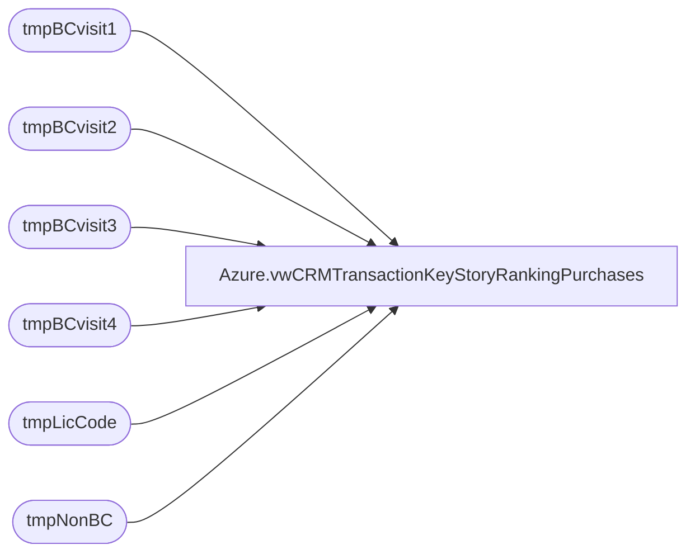

# Azure.vwCRMTransactionKeyStoryRankingPurchases

**Database:** dw  
**Server:** papamart  

## Architecture Diagram



## Table Dependencies

| Referenced Table |
|---|
| tmpBCvisit1 |
| tmpBCvisit2 |
| tmpBCvisit3 |
| tmpBCvisit4 |
| tmpLicCode |
| tmpNonBC |

## View Code

```sql
CREATE view [Azure].[vwCRMTransactionKeyStoryRankingPurchases]

as 


--with 
--Stores as
--	(
--		SELECT right(('0000' + CAST(sd.STR_NUM AS VARCHAR)), 4) AS StoreNumber,CAST(dsd.Store_Key AS VARCHAR) AS StoreKey,cd.NM_FULL AS CountryNameFull,sa.StoreConcept
--		FROM KODIAK.BABWMstrData.dbo.STR_DIM sd
--		INNER JOIN Store_Dim dsd ON dsd.store_id=sd.STR_NUM
--		left join KODIAK.BABWMstrData.dbo.CNTRY_DIM cd ON cd.CNTRY_ID=sd.CNTRY_ID
--		left join [Azure].[vwStoreAttributes] sa on right(('0000' + CAST(sd.STR_NUM AS VARCHAR)), 4) = sa.storenumber
--		WHERE sd.CMPNY_ID=1 AND sd.STR_ID > 0 AND sd.STR_NUM not between 501 and 505 AND sd.STR_NUM NOT BETWEEN 9001 AND 9100 
--	),
--Products as
--	(
--		select ProductKey,Style,KeyStory,Chain,Department,LicenseCode from azure.vwProducts
--		UNION
--		select ProductKey,isnull(Style,('N/A' + cast(ProductKey as varchar))) as Style, KeyStory,isnull(Chain,'N/A') as Chain,isnull(Department,'N/A') as Department, LicenseCode from azure.vwProductsNoStyle
--	),
--license as
--	(
--		select KeyStory, max(LicenseCode) as licenseCode from Products group by keyStory
--	),
--nonBC as
--	(
--		select top 10000 case sd.country when 'United Kingdom' then 'UK' when 'United States' then 'US' when 'Canada' then 'CA' else sd.country end as country,
--		sd2.StoreConcept as PurchaseChannel,tf.transaction_ID,cast(dd.actual_date as date) as TransactionDate, case when isnull(pd.KeyStory,'')='' then 'No Key' else pd.KeyStory end as keyStory,
--       sum(case when (lod.Line_Object IN (100, 102, 103, 104, 200, 202, 203, 204, 206, 210, 250, 290, 291, 293, 295, 296, 623, 640, 690, 691, 1630, 1631, 1199, 115, 215, 1660) 
--		OR (lod.line_object = 106 and lad.line_action in (90,142,99) ))then tdf.Units else 0 end) as GaapUnits,
--		sum(case when (lod.Line_Object IN (100, 102, 103, 104, 200, 202, 203, 204, 206, 210, 250, 290, 291, 293, 295, 296, 623, 640, 690, 691, 1630, 1631, 1199, 115, 215, 1660) 
--		OR (lod.line_object = 106 and lad.line_action in (90,142,99) )) then (tdf.unit_gross_amount-tdf.unit_disc_amount) else 0 end) as GaapSales,
--        cast(case when sd.store_id in (13,2013) then 1 else 0 end as int) as isWeb,cast(case when sd.store_id in (13,2013) then 0 else 1 end as int) as isRetail,
--		'' as '2ndPurchase', '' as '3rdPurchase', '' as '4thPurchase'
--		from papamart.dw.dbo.TransactionFact tf
--		join papamart.dw.dbo.date_dim dd on tf.date_key = dd.date_key
--		join TransactionDetailFact tdf with (nolock) on tf.Transaction_id=tdf.Transaction_ID
--		join line_object_dim lod on tdf.line_object_key=lod.line_object_key 
--		join line_action_dim lad on tdf.line_action_key=lad.line_action_key
--		join Products pd with (nolock) on tdf.product_key=pd.ProductKey
--		join Stores sd2 with (nolock) on tf.store_key=sd2.StoreKey
--		join dw.dbo.store_dim sd with (nolock) on tf.store_key=sd.store_key
--		where tf.[transaction_id] not in 
--		(
--		select transactionID from dw.dbo.CRMTransactionFact
--		)
--		group by country,sd2.StoreConcept,tf.transaction_ID,dd.actual_date,pd.KeyStory,sd.store_id
--	),
--keyStoryVisit1 as
--	(
--		select top 10000 [Country],[PurchaseChannel],[customerNumber],[transactionID],[TransactionDate],[keyStory],[KeyRankPerTransaction],[KeyRankPerSequenceNewVOldCustomers]
--		,[KeyRankPerSequenceGlobal],[KeyStorySales],[KeyStoryUnits],[CustomerFirstTransactionDate],[isFreshCustomer],[isFirstPurchaseChannel],[isFirstPurchase]
--		,[isNewCustomer],[isRepeatCustomer],[isWeb],[isRetail],[GaapSalesTranTotal],[KeyStoryPctToTotal],[LifetimeTransactionSequence],[LifetimeVisitSequence]
--		,[ParentTransactionID],[ChildTransactionID],[isTopKeyStoryPerTransaction],[isTopKeyStoryNewOrOldGlobal],[isTopKeyStoryGlobal],[hasCountYourCandles],[hasBirthdayGift]
--		,[hasHalfBirthday],[hasWinback],[hasOther],[TransactionKey],[firstPurchaseFlag] from [Azure].[vwCRMTransactionKeyStoryRanking]
--		where 1=1
--		and LifetimeTransactionSequence  = 1 and KeyRankPerTransaction = 1
--	),
--keyStoryVisit2 as
--	(
--		select  top 10000 [Country],[PurchaseChannel],[customerNumber],[transactionID],[TransactionDate],[keyStory],[KeyRankPerTransaction],[KeyRankPerSequenceNewVOldCustomers]
--		,[KeyRankPerSequenceGlobal],[KeyStorySales],[KeyStoryUnits],[CustomerFirstTransactionDate],[isFreshCustomer],[isFirstPurchaseChannel],[isFirstPurchase]
--		,[isNewCustomer],[isRepeatCustomer],[isWeb],[isRetail],[GaapSalesTranTotal],[KeyStoryPctToTotal],[LifetimeTransactionSequence],[LifetimeVisitSequence]
--		,[ParentTransactionID],[ChildTransactionID],[isTopKeyStoryPerTransaction],[isTopKeyStoryNewOrOldGlobal],[isTopKeyStoryGlobal],[hasCountYourCandles],[hasBirthdayGift]
--		,[hasHalfBirthday],[hasWinback],[hasOther],[TransactionKey],[firstPurchaseFlag] from [Azure].[vwCRMTransactionKeyStoryRanking]
--		where 1=1
--		and LifetimeTransactionSequence  = 2 and KeyRankPerTransaction = 1 
--	),
--keyStoryVisit3 as
--(
--		select  top 10000 [Country],[PurchaseChannel],[customerNumber],[transactionID],[TransactionDate],[keyStory],[KeyRankPerTransaction],[KeyRankPerSequenceNewVOldCustomers]
--		,[KeyRankPerSequenceGlobal],[KeyStorySales],[KeyStoryUnits],[CustomerFirstTransactionDate],[isFreshCustomer],[isFirstPurchaseChannel],[isFirstPurchase]
--		,[isNewCustomer],[isRepeatCustomer],[isWeb],[isRetail],[GaapSalesTranTotal],[KeyStoryPctToTotal],[LifetimeTransactionSequence],[LifetimeVisitSequence]
--		,[ParentTransactionID],[ChildTransactionID],[isTopKeyStoryPerTransaction],[isTopKeyStoryNewOrOldGlobal],[isTopKeyStoryGlobal],[hasCountYourCandles],[hasBirthdayGift]
--		,[hasHalfBirthday],[hasWinback],[hasOther],[TransactionKey],[firstPurchaseFlag] from [Azure].[vwCRMTransactionKeyStoryRanking]
--		where 1=1
--		and LifetimeTransactionSequence  = 3 and KeyRankPerTransaction = 1 
--),
--keyStoryVisit4 as
--(
--		select  top 10000 [Country],[PurchaseChannel],[customerNumber],[transactionID],[TransactionDate],[keyStory],[KeyRankPerTransaction],[KeyRankPerSequenceNewVOldCustomers]
--		,[KeyRankPerSequenceGlobal],[KeyStorySales],[KeyStoryUnits],[CustomerFirstTransactionDate],[isFreshCustomer],[isFirstPurchaseChannel],[isFirstPurchase]
--		,[isNewCustomer],[isRepeatCustomer],[isWeb],[isRetail],[GaapSalesTranTotal],[KeyStoryPctToTotal],[LifetimeTransactionSequence],[LifetimeVisitSequence]
--		,[ParentTransactionID],[ChildTransactionID],[isTopKeyStoryPerTransaction],[isTopKeyStoryNewOrOldGlobal],[isTopKeyStoryGlobal],[hasCountYourCandles],[hasBirthdayGift]
--		,[hasHalfBirthday],[hasWinback],[hasOther],[TransactionKey],[firstPurchaseFlag] from [Azure].[vwCRMTransactionKeyStoryRanking]
--		where 1=1
--		and LifetimeTransactionSequence  = 4 and KeyRankPerTransaction = 1 
--)


--select n.Country, n.PurchaseChannel, '' as customerNumber, n.transaction_ID, n.TransactionDate, n.KeyStory, n.GaapUnits, n.GaapSales, n.[isWeb],n.[isRetail], n.[2ndPurchase],
--n.[3rdPurchase], n.[4thPurchase], 0 as [isNewCustomer],0 as [isRepeatCustomer], case when ISNUMERIC(l.licenseCode) = 1 then 0 else 1 end as licenseStatus 
--from nonBC n left join license l on n.KeyStory = l.KeyStory 
--union
--select v1.Country, v1.PurchaseChannel, v1.customerNumber, v1.transactionID, v1.TransactionDate, v1.KeyStory, v1.KeyStoryUnits, v1.KeyStorySales, v1.isWeb, v1.isRetail,
--isnull(v2.KeyStory,'') as '2ndPurchase', isnull(v3.keyStory,'') as '3rdPurchase',isnull(v4.keyStory,'') as '4thPurchase',
--case when v2.[ParentTransactionID] is null then 1 else 0 end as [isNewCustomer], 
--case when v2.[ParentTransactionID] is null then 0 else 1 end as [isRepeatCustomer],case when ISNUMERIC(l.licenseCode) = 1 then 0 else 1 end as licenseStatus 
--from keyStoryVisit1 v1
--left join keyStoryVisit2 v2 on v2.ParentTransactionID = v1.transactionID
--left join keyStoryVisit3 v3 on v3.ParentTransactionID = v2.transactionID
--left join keyStoryVisit3 v4 on v4.ParentTransactionID = v3.transactionID
--left join license l on v1.keyStory = l.KeyStory 


select n.Country, n.PurchaseChannel, '' as customerNumber, n.transaction_ID, n.TransactionDate, n.KeyStory, n.GaapUnits, n.GaapSales, n.[isWeb],n.[isRetail], n.[2ndPurchase],
n.[3rdPurchase], n.[4thPurchase], 0 as [isNewCustomer],0 as [isRepeatCustomer], case when ISNUMERIC(l.licenseCode) = 1 then 'Non-licensed' else 'Licensed' end as licenseStatus 
,case when n.[isWeb] = 1 then 'Web' else 'Retail' end as webOrRetail
from tmpNonBC n left join tmpLicCode l on n.KeyStory = l.KeyStory 
union
select v1.Country, v1.PurchaseChannel, v1.customerNumber, v1.transactionID, v1.TransactionDate, v1.KeyStory, v1.KeyStoryUnits, v1.KeyStorySales, v1.isWeb, v1.isRetail,
isnull(v2.KeyStory,'') as '2ndPurchase', isnull(v3.keyStory,'') as '3rdPurchase',isnull(v4.keyStory,'') as '4thPurchase',
case when v2.[ParentTransactionID] is null then 1 else 0 end as [isNewCustomer], 
case when v2.[ParentTransactionID] is null then 0 else 1 end as [isRepeatCustomer],case when ISNUMERIC(l.licenseCode) = 1 then 'Non-licensed' else 'Licensed' end as licenseStatus 
,case when v1.isWeb = 1 then 'Web' else 'Retail' end as webOrRetail
from tmpBCvisit1 v1
left join tmpBCvisit2 v2 on v2.ParentTransactionID = v1.transactionID
left join tmpBCvisit3 v3 on v3.ParentTransactionID = v2.transactionID
left join tmpBCvisit4 v4 on v4.ParentTransactionID = v3.transactionID
left join tmpLicCode l on v1.keyStory = l.KeyStory
```

