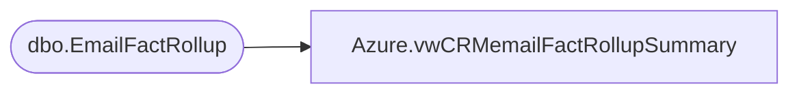

# Azure.vwCRMemailFactRollupSummary

**Database:** dw  
**Server:** papamart  

## Architecture Diagram



## Table Dependencies

| Referenced Table |
|---|
| dbo.EmailFactRollup |

## View Code

```sql
CREATE view [Azure].[vwCRMemailFactRollupSummary]

AS


select 
count(distinct efr.emailaddress) as 'distinctEmailSentLast365'
from dbo.EmailFactRollup efr with (nolock)
where efr.LastSendDate between getdate()-366 and getdate()
```

