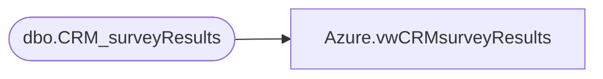

# Azure.vwCRMsurveyResults

**Database:** dw  
**Server:** papamart  

## Architecture Diagram



## Table Dependencies

| Referenced Table |
|---|
| dbo.CRM_surveyResults |

## View Code

```sql
CREATE view [Azure].[vwCRMsurveyResults]

AS

select * from [dbo].[CRM_surveyResults]
```

