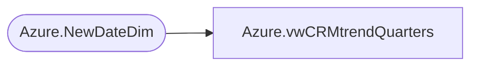

# Azure.vwCRMtrendQuarters

**Database:** dw  
**Server:** papamart  

## Architecture Diagram



## Table Dependencies

| Referenced Table |
|---|
| Azure.NewDateDim |

## View Code

```sql
CREATE view [Azure].[vwCRMtrendQuarters]

AS


WITH 
trendQuarters AS 
	(select top 8 ROW_NUMBER() OVER (ORDER BY Fiscal_Quarter_Key) as 'qSequence', Fiscal_Quarter, Fiscal_Quarter_Key , Fiscal_Year
from [Azure].[NewDateDim] where getdate()-730 < Fiscal_Quarter_Key 
group by Fiscal_Quarter, Fiscal_Quarter_Key, Fiscal_Year

)

select q.qSequence, q.Fiscal_Quarter, q.Fiscal_Quarter_Key, q.Fiscal_Year from trendQuarters q
```

