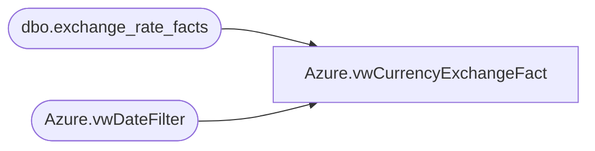

# Azure.vwCurrencyExchangeFact

**Database:** dw  
**Server:** papamart  

## Architecture Diagram



## Table Dependencies

| Referenced Table |
|---|
| dbo.exchange_rate_facts |
| Azure.vwDateFilter |

## View Code

```sql
CREATE view [Azure].[vwCurrencyExchangeFact]

AS


-- Franchise rates are fiscal month end
SELECT  d.fiscal_year AS FiscalYear, d.fiscal_period AS FiscalMonth, e.from_currency_code AS FromCurrencyCode, e.to_currency_code AS ToCurrencyCode, 
Max(e.fiscal_month_end_rate) AS ExchangeRate,min(d.Actual_Date) as Fiscal_Month_key
FROM dw.dbo.exchange_rate_facts e
INNER JOIN Azure.vwDateFilter d
	ON d.date_key=e.date_key
WHERE ((e.from_currency_code IN ('AUD','BHD','OMR','QAR','AED','BRL','KWD','MXN','RUB','SEK','SGD','THB','TRL','INR','TRY','ZAR','ZDK','ZUR','CLP')
OR e.to_currency_code IN ('AUD','BHD','OMR','QAR','AED','BRL','KWD','MXN','RUB','SEK','SGD','THB','TRL','INR','TRY','ZAR','ZDK','ZUR','CLP')))
and e.to_currency_code  = 'USD'
group by d.fiscal_year, d.fiscal_period , e.from_currency_code , e.to_currency_code
UNION ALL
-- Corporate rates are fiscal month average
SELECT  d.fiscal_year AS FiscalYear, d.fiscal_period AS FiscalMonth, e.from_currency_code AS FromCurrencyCode, e.to_currency_code AS ToCurrencyCode, 
Max(e.fiscal_month_ave_rate) AS ExchangeRate,min(d.Actual_Date) as Fiscal_Month_key
FROM dw.dbo.exchange_rate_facts e
INNER JOIN Azure.vwDateFilter d
	ON d.date_key=e.date_key
WHERE (
			(e.from_currency_code IN ('EUR','CNY','DKK','CAD','GBP') AND e.to_currency_code NOT IN ('AUD','BHD','OMR','INR','QAR','AED','BRL','KWD','MXN','RUB','SEK','SGD','THB','TRL','TRY','ZAR','ZDK','ZUR','CLP'))
		OR (e.to_currency_code IN ('EUR','CNY','DKK','CAD','GBP') AND e.from_currency_code NOT IN ('AUD','BHD','OMR','QAR','INR','AED','BRL','KWD','MXN','RUB','SEK','SGD','THB','TRL','TRY','ZAR','ZDK','ZUR','CLP'))
		OR (e.to_currency_code IN ('USD') AND e.from_currency_code IN ('USD'))
	  )and e.to_currency_code  = 'USD'
group by d.fiscal_year, d.fiscal_period , e.from_currency_code , e.to_currency_code
```

