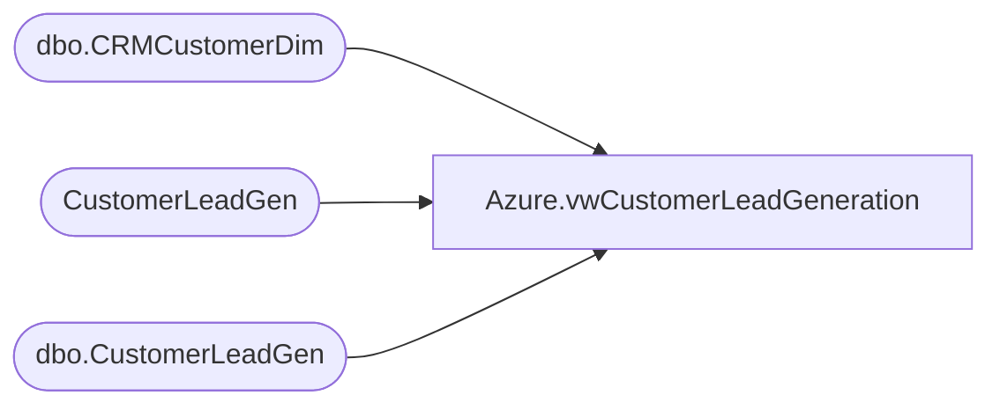

# Azure.vwCustomerLeadGeneration

**Database:** dw  
**Server:** papamart  

## Architecture Diagram



## Table Dependencies

| Referenced Table |
|---|
| dbo.CRMCustomerDim |
| CustomerLeadGen |
| dbo.CustomerLeadGen |

## View Code

```sql
CREATE view [Azure].[vwCustomerLeadGeneration]

as

with 
minDate as
(
select EmailAddress,Min(EntryDate) MinDate
from CustomerLeadGen
group by EmailAddress
)
select l.EntryDate, l.CountryCode, l.Campaign, l.Source, --l.EmailAddress,
l.FileDate, l.FileName, l.InsertDate, l.UpdateDate,
--c.CustomerNumber
case when c.CustomerNumber is null then 'N/A' else c.CustomerNumber end as customerNumber
,c.MembershipDate, c.StoreKey, c.MembershipType , 
case when md.EmailAddress is null then 0 else 1 end as isFirstEmail
from [dbo].[CustomerLeadGen] l 
left join [dbo].[CRMCustomerDim] c on l.EmailAddress = c.EmailAddress
left join MinDate md on l.EmailAddress=md.EmailAddress and l.EntryDate=md.MinDate
where l.EmailAddress <> 'hgfcchfgcfg@gmail.com' 
-- excluding records with this email as it appears to be an invalid record merged in the past due to an issue with the file
```

