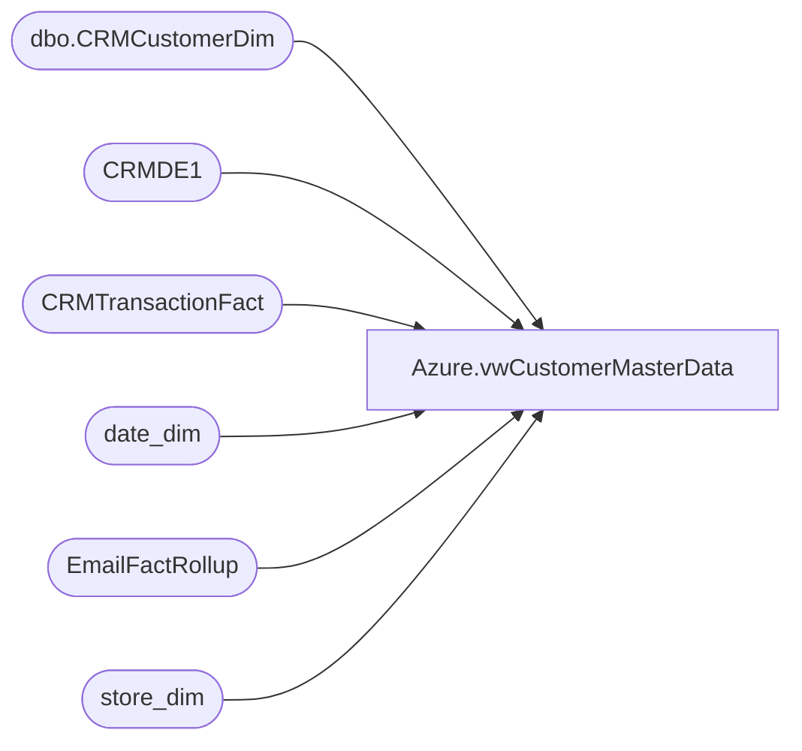

# Azure.vwCustomerMasterData

**Database:** dw  
**Server:** papamart  

## Architecture Diagram



## Table Dependencies

| Referenced Table |
|---|
| dbo.CRMCustomerDim |
| CRMDE1 |
| CRMTransactionFact |
| date_dim |
| EmailFactRollup |
| store_dim |

## View Code

```sql
CREATE view [Azure].[vwCustomerMasterData]

as

---CRM Database Stats
with 
PreSet1 as
	(
	
select  distinct 
	cast(c1.CustomerNumber as varchar) as CustomerNumber,
 
			c1.isBonusClubMember as isBonusClubTY,
			case when c2.bonusClubMember=1 and c2.dateJoined <= getdate()-365 then 1 when c1.isBonusClubMember=1 and c1.MembershipDate <= getdate()-365 then 1 else 0 end as isBonusClubLY, 
			isnull(c2.hasOnlineAccount, 0) as hasOnlineAccount,
			c1.TextOptIn as isOptInText,
			c1.Emailable as isOptInEmail,
			c1.[MembershipType] as bonusClubMembershipType, 
			isnull(c2.bonusClubSignUpSource, null) as bonusClubSignUpSource,
			case when isnull(sd.country,'x') in ('UK', 'IE') then 'UK_IE' else 'US_CA' end as Country,
			c1.isBonusCLubMember as isActive,
			case when c1.isBonusCLubMember = 1 then 0 else 1 end as isNotActive,
			case when c1.isBonusCLubMember = 1 then 'BC Member' else 'Non-BC Member' end as isBonusClubMemberDescr,
			case when c1.ClubStatus  = 'bounced' then 1 else 0 end as isBounced,
			case when c1.ClubStatus = 'unsubscribed' then 1 else 0 end as isUnsubscribed,
			cast(c1.MembershipDate as date) as 'JoinDate',
			
			cast(efr.LastSendDate as date) as LastSentDate,
			cast(efr.LastClickDate as date) as LastClickDate,
			cast(efr.LastOpenDate as date) as LastOpenDate,
			case when c2.LastTransactionDate is null then null else case when datepart(yyyy, c2.LastTransactionDate) = 1900 then NULL else cast(c2.LastTransactionDate as date) end end  as LastTransactionDate,

			(CASE WHEN EXISTS (SELECT 1 FROM CRMTransactionFact where TransactionDate <= cast(dateadd(d,-365,getdate()) as date) AND TransactionDate >= cast(dateadd(d,-730,getdate()) as date) and CustomerNumber = c1.CustomerNumber) 
		THEN CAST(1 AS BIT) ELSE CAST(0 AS BIT) END) AS hasTransPrior12m,

		(CASE WHEN EXISTS (SELECT 1 FROM CRMTransactionFact where TransactionDate <= cast(dateadd(d,-365,getdate()) as date) AND TransactionDate >= cast(dateadd(d,-1095,getdate()) as date) and CustomerNumber = c1.CustomerNumber) 
		THEN CAST(1 AS BIT) ELSE CAST(0 AS BIT) END) AS hasTransPrior12m2,

		(CASE WHEN EXISTS (SELECT 1 FROM CRMTransactionFact where TransactionDate <= cast(dateadd(d,-365,getdate()) as date) AND TransactionDate >= cast(dateadd(d,-1460,getdate()) as date) and CustomerNumber = c1.CustomerNumber) 
		THEN CAST(1 AS BIT) ELSE CAST(0 AS BIT) END) AS hasTransPrior12m3,

		(CASE WHEN EXISTS (SELECT 1 FROM CRMTransactionFact where TransactionDate <= cast(dateadd(d,-365,getdate()) as date) AND TransactionDate >= cast(dateadd(d,-2190,getdate()) as date) and CustomerNumber = c1.CustomerNumber) 
		THEN CAST(1 AS BIT) ELSE CAST(0 AS BIT) END) AS hasTransPrior12m5,

			datediff(dd, efr.LastOpenDate, getdate()) as DaysSinceLastOpen,
			datediff(mm, efr.LastOpenDate, getdate()) as MonthsSinceLastOpen,
			case when efr.LastOpenDate is null then 0 else case when datepart(yyyy, efr.LastOpenDate) = 1900 then 0 else 1 end end  as hasEmailOpen,
			isnull(c2.LastTransactionStore, null) as LastTransactionStore,
			isnull(c2.PreferredStory, null) as PreferredStory,
			isnull(c2.FrequencyCount3m,0) as FrequencyCount3m,	
			isnull(c2.FrequencyCount6m,0) as FrequencyCount6m,
			isnull(c2.FrequencyCount12m,0) as FrequencyCount12m,
			isnull(c2.FrequencyCount18m,0) as FrequencyCount18m,
			isnull(c2.FrequencyCount24m,0) as FrequencyCount24m,
			isnull(c2.FrequencyCount36m,0) as FrequencyCount36m,
			isnull(c2.FrequencyCountTTL,0) as FrequencyCountTTL,
			isnull(c2.RecencyCount3m,0) as RecencyCount3m,
			isnull(c2.RecencyCount6m,0) as RecencyCount6m,
			isnull(c2.RecencyCount12m,0) as RecencyCount12m,
			isnull(c2.RecencyCount18m,0) as RecencyCount18m,
			isnull(c2.RecencyCount24m,0) RecencyCount24m,
			isnull(c2.RecencyCount36m,0) as RecencyCount36m,
			isnull(c2.RecencyCountTTL,0) as RecencyCountTTL,
			isnull(c2.MonetarySum3m,0) as MonetarySum3m,
			isnull(c2.MonetarySum6m,0) as MonetarySum6m,
			isnull(c2.MonetarySum12m,0) as MonetarySum12m,
			isnull(c2.MonetarySum18m,0) as MonetarySum18m,
			isnull(c2.MonetarySum24m,0) as MonetarySum24m,
			isnull(c2.MonetarySum36m,0) as MonetarySum36m,
			isnull(c2.MonetarySumTTL,0) as MonetarySumTTL,
			isnull(c2.FrequencyCount1m,0) as FrequencyCount1m,
			isnull(c2.RecencyCount1m,0) as RecencyCount1m,
			isnull(c2.MonetarySum1m,0) as MonetarySum1m,
			isnull(c1.CurrentRewardPoints,0) as CurrentPointsBalance,
			isnull(c1.LifetimeTotalPointsEarned, 0) as LifetimePoints,
			isnull(c2.FirstTransactionDate, null) as FirstTransactionDate,
			isnull(c2.FirstStoreConcept, null) as FirstStoreConcept,
			getdate() as InsertDate
from [dbo].[CRMCustomerDim] c1
left join CRMDE1  c2 on c1.customerNumber = c2.customerNumber 
left join EmailFactRollup efr with (nolock) on c1.EmailAddress=efr.EmailAddress
left join CRMTransactionFact ctf ON c1.CustomerNumber = ctf.customernumber
join store_dim sd with (nolock) on c1.StoreKey=sd.store_key
	)
select
	CustomerNumber,
	isBonusClubTY,
	isBonusClubLY, 
	case when isBonusClubTY=1 and (datediff(dd, LastClickDate, getdate())<=(365*5) OR datediff(dd, LastTransactionDate, getdate())<=(365*5)) then 1 else 0 end as isBonusClubActive5YearsTY,
	case when isBonusClubTY=1 and (datediff(dd, LastClickDate, getdate())<=(365*3) OR datediff(dd, LastTransactionDate, getdate())<=(365*3)) then 1 else 0 end as isBonusClubActive3YearsTY,
	case when isBonusClubTY=1 and (datediff(dd, LastClickDate, getdate())<=(365*2) OR datediff(dd, LastTransactionDate, getdate())<=(365*2)) then 1 else 0 end as isBonusClubActive2YearsTY,
	case when isBonusClubTY=1 and (datediff(dd, LastClickDate, getdate())<=(365*1) OR datediff(dd, LastTransactionDate, getdate())<=(365*1)) then 1 else 0 end as isBonusClubActive1YearsTY,	
	case when isBonusClubLY=1 and ((LastClickDate >= cast(dateadd(d,-2190,getdate()) as date) and LastOpenDate <= cast(dateadd(d,-365,getdate()) as date)) OR (hasTransPrior12m5 = 1)) then 1 else 0 end as isBonusClubActive5YearsLY,
	case when isBonusClubLY=1 and ((LastClickDate >= cast(dateadd(d,-1460,getdate()) as date) and LastOpenDate <= cast(dateadd(d,-365,getdate()) as date)) OR (hasTransPrior12m3 = 1)) then 1 else 0 end as isBonusClubActive3YearsLY,
	case when isBonusClubLY=1 and ((LastClickDate >= cast(dateadd(d,-1095,getdate()) as date) and LastOpenDate <= cast(dateadd(d,-365,getdate()) as date)) OR (hasTransPrior12m2 = 1)) then 1 else 0 end as isBonusClubActive2YearsLY,
	case when isBonusClubLY=1 and (((LastClickDate >= cast(dateadd(d,-730,getdate()) as date) and LastOpenDate <= cast(dateadd(d,-365,getdate()) as date)) OR (hasTransPrior12m = 1))) then 1 else 0 end as isBonusClubActive1YearsLY,
	hasOnlineAccount,
	DaysSinceLastOpen,
	MonthsSinceLastOpen,
	case when isBonusClubTY=1 and isOptInText=1 then 1 else 0 end as isBonusClubOptInText,
	case when isBonusClubTY=1 and isOptInEmail=1 then 1 else 0 end as isBonusClubOptInEmail,
	hasEmailOpen,

	case 
		when isBonusClubTY=1 
			and MonthsSinceLastOpen <= 12 
		then 1 
		else 0 
	end as isBonusClubEmailorTextOpenLast12Month,
	case 
		when isBonusClubTY=1 
			and DaysSinceLastOpen <= 365 
		then 1 
		else 0 
	end as isBonusClubEmailorTextOpenLast365Day,

	case 
		when isBonusClubTY=1 
			and MonthsSinceLastOpen <= 24 
		then 1 
		else 0 
	end as isBonusClubEmailorTextOpenLast24Month,
	case 
		when isBonusClubTY=1 
			and DaysSinceLastOpen <= 729 --used 729 per David W
		then 1 
		else 0 
	end as isBonusClubEmailorTextOpenLast729Day,
	case 
		when isBonusClubTY=1 and hasEmailOpen=1 then 1 else 0 end as isBonusClubWEmailOpen,
	isOptInText,
	isOptInEmail,
	bonusClubMembershipType,
	bonusClubSignUpSource,
	Country,
	isActive,
	isNotActive,
	isBonusClubMemberDescr,
	isBounced,
	isUnsubscribed,
	JoinDate,
	--dd.Fiscal_Year as joinFiscalYear,
	--dd.Fiscal_Quarter_Of_Year_Key as joinFiscalQtr,
	--right(dd.Fiscal_Year, 4) + '-Q' + Fiscal_Quarter_Of_Year_Key as joinFiscalYearQtr,
	--right(dd.Fiscal_Year, 4) + '-P' + Fiscal_Month_Of_Year_Key as joinFiscaYearPeriod,
	--dd.Fiscal_Month_Of_Year_Key as joinFiscalPeriod,
	--dd.Fiscal_Month_Of_Year as joinFiscalMonth,
	concat('FY ', dd.fiscal_year) as joinFiscalYear,
	dd.fiscal_quarter as joinFiscalQtr,
	concat(cast(right(dd.Fiscal_Year, 4) as varchar), '-Q' , cast(dd.fiscal_quarter as varchar)) as joinFiscalYearQtr,
	concat(cast(right(dd.Fiscal_Year, 4) as varchar), '-P' , cast(dd.fiscal_period as varchar)) as joinFiscaYearPeriod,
	dd.fiscal_period as joinFiscalPeriod,
	dd.month_name as joinFiscalMonth,
	LastSentDate,
	LastClickDate,
	LastOpenDate,
	LastTransactionDate,
	LastTransactionStore,
	PreferredStory,
	FrequencyCount1m,
	FrequencyCount3m,	
	FrequencyCount6m,	
	FrequencyCount12m,	
	FrequencyCount18m,	
	FrequencyCount24m,	
	FrequencyCount36m,
	FrequencyCountTTL,	
	RecencyCount1m,	
	RecencyCount3m,	
	RecencyCount6m,	
	RecencyCount12m,	
	RecencyCount18m,	
	RecencyCount24m,	
	RecencyCount36m,
	RecencyCountTTL,	
	MonetarySum1m,
	MonetarySum3m,	
	MonetarySum6m,	
	MonetarySum12m,	
	MonetarySum18m,	
	MonetarySum24m,
	MonetarySum36m,
	MonetarySumTTL,
	CurrentPointsBalance,
	LifetimePoints,
	FirstTransactionDate,
	FirstStoreConcept
from PreSet1 
--join [Azure].[NewDateDim] dd on JoinDate = dd.date_key
join date_dim dd on JoinDate=cast(dd.actual_date as date)
```

