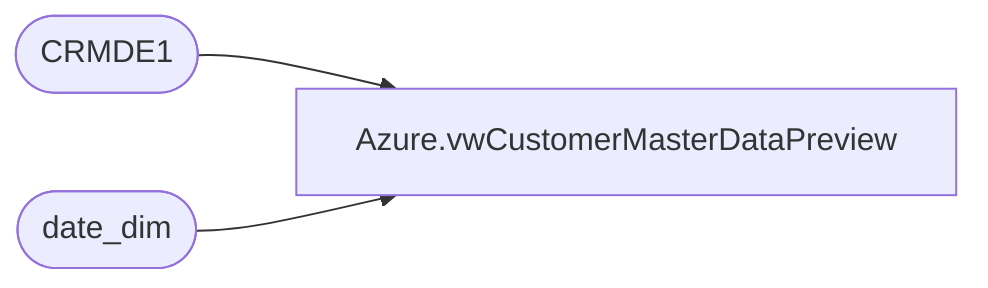

# Azure.vwCustomerMasterDataPreview

**Database:** dw  
**Server:** papamart  

## Architecture Diagram



## Table Dependencies

| Referenced Table |
|---|
| CRMDE1 |
| date_dim |

## View Code

```sql
CREATE view [Azure].[vwCustomerMasterDataPreview]

as

---CRM Database Stats
with 
PreSet1 as
	(
		select 
			CRMDE1.CustomerNumber,
			case when bonusClubMember=1 then 1 else 0 end as isBonusClubTY,
			case when bonusClubMember=1 and dateJoined <= getdate()-365 then 1 else 0 end as isBonusClubLY, 
			hasOnlineAccount,
			text_opt_in as isOptInText,
			Emailable as isOptInEmail,
			bonusClubMembershipType,
			bonusClubSignUpSource,
			case when cast(LastTransactionStore as int) < 2000 then 'US' else 'UK' end as Country,
			case when status = 'active' then 1 else 0 end as isActive,
			case when status = 'active' then 0 else 1 end as isNotActive,
			case when status = 'bounced' then 1 else 0 end as isBounced,
			case when status = 'unsubscribed' then 1 else 0 end as isUnsubscribed,
			cast(case when datepart(yyyy, dateJoined) = 1900 then NULL else dateJoined end as date) as JoinDate,
			cast(case when datepart(yyyy, LastSentDate) = 1900 then NULL else LastSentDate end as date) as LastSentDate,
			cast(case when datepart(yyyy, LastClickDate) = 1900 then NULL else LastClickDate end as date) as LastClickDate,
			cast(case when datepart(yyyy, LastOpenDate) = 1900 then NULL else LastOpenDate end as date) as LastOpenDate,
			cast(case when datepart(yyyy, LastTransactionDate) = 1900 then NULL else LastTransactionDate end as date) as LastTransactionDate,
			case when datepart(yyyy, LastOpenDate)=1900 then null else datediff(dd, LastOpenDate, getdate()) end as DaysSinceLastOpen,
			case when datepart(yyyy, LastOpenDate)=1900 then null else datediff(mm, LastOpenDate, getdate()) end as  MonthsSinceLastOpen,
			case when datepart(yyyy, LastOpenDate)=1900 then 0 else 1 end as hasEmailOpen,
			LastTransactionStore,
			PreferredStory,
			FrequencyCount3m,	
			FrequencyCount6m,	
			FrequencyCount12m,	
			FrequencyCount18m,	
			FrequencyCount24m,	
			FrequencyCount36m,
			FrequencyCountTTL,	
			RecencyCount3m,	
			RecencyCount6m,	
			RecencyCount12m,	
			RecencyCount18m,	
			RecencyCount24m,
			RecencyCount36m,	
			RecencyCountTTL,	
			MonetarySum3m,	
			MonetarySum6m,	
			MonetarySum12m,	
			MonetarySum18m,	
			MonetarySum24m,	
			MonetarySum36m,
			MonetarySumTTL,	
			FrequencyCount1m,	
			RecencyCount1m,	
			MonetarySum1m,
			bonusClubPointsBalance as CurrentPointsBalance,
			LifetimePoints,
			FirstTransactionDate,
			FirstStoreConcept
		from CRMDE1 
	)
select
	CustomerNumber,
	isBonusClubTY,
	isBonusClubLY,
	case when isBonusClubTY=1 and (datediff(yyyy, LastOpenDate, getdate())<=5 OR datediff(yyyy, LastTransactionDate, getdate())<=5) then 1 else 0 end as isBonusClubActive5YearsTY,
	case when isBonusClubTY=1 and (datediff(yyyy, LastOpenDate, getdate())<=3 OR datediff(yyyy, LastTransactionDate, getdate())<=3) then 1 else 0 end as isBonusClubActive3YearsTY,
	case when isBonusClubTY=1 and (datediff(yyyy, LastOpenDate, getdate())<=2 OR datediff(yyyy, LastTransactionDate, getdate())<=2) then 1 else 0 end as isBonusClubActive2YearsTY,
	case when isBonusClubTY=1 and (datediff(yyyy, LastOpenDate, getdate())<=1 OR datediff(yyyy, LastTransactionDate, getdate())<=1) then 1 else 0 end as isBonusClubActive1YearsTY,	
	case when isBonusClubLY=1 and (datediff(yyyy, LastOpenDate, getdate()-365)<=5 OR datediff(yyyy, LastTransactionDate, getdate()-365)<=5) then 1 else 0 end as isBonusClubActive5YearsLY,
	case when isBonusClubLY=1 and (datediff(yyyy, LastOpenDate, getdate()-365)<=3 OR datediff(yyyy, LastTransactionDate, getdate()-365)<=3) then 1 else 0 end as isBonusClubActive3YearsLY,
	case when isBonusClubLY=1 and (datediff(yyyy, LastOpenDate, getdate()-365)<=2 OR datediff(yyyy, LastTransactionDate, getdate()-365)<=2) then 1 else 0 end as isBonusClubActive2YearsLY,
	case when isBonusClubLY=1 and (datediff(yyyy, LastOpenDate, getdate()-365)<=1 OR datediff(yyyy, LastTransactionDate, getdate()-365)<=1) then 1 else 0 end as isBonusClubActive1YearsLY,
	--TYvsLY = 'CREATE MEASUREs IN MODEL FORE EACH isBonusClubActive',
	--PctToTotalTY = 'CREATE MEASURE IN MODEL FOR EACH isBonusClubActive',
	--PctToTotalLY = 'CREATE MEASURE IN MODEL FOR EACH isBonusClubActive',
	--RevSumBonusClubWEmailOpen = 'CREATE MEASURE IN MODEL FOR EACH isBonusClubActive',
	--AvgLTVofBonusClubWEmailOpen = 'CREATE MEASURE IN MODEL FOR EACH isBonusClubActive',
	hasOnlineAccount,
	DaysSinceLastOpen,
	MonthsSinceLastOpen,
	case when isBonusClubTY=1 and isOptInText=1 then 1 else 0 end as isBonusClubOptInText,
	case when isBonusClubTY=1 and isOptInEmail=1 then 1 else 0 end as isBonusClubOptInEmail,
	hasEmailOpen,
	case when isBonusClubTY=1 and (isOptInText=1 or isOptInEmail=1) and MonthsSinceLastOpen <= 24 then 1 else 0 end as isBonusClubEmailorTextOpenLast24Month,
	case when isBonusClubTY=1 and hasEmailOpen=1 then 1 else 0 end as isBonusClubWEmailOpen,
	isOptInText,
	isOptInEmail,
	bonusClubMembershipType,
	bonusClubSignUpSource,
	Country,
	isActive,
	isNotActive,
	isBounced,
	isUnsubscribed,
	JoinDate,
	--dd.Fiscal_Year as joinFiscalYear,
	--dd.Fiscal_Quarter_Of_Year_Key as joinFiscalQtr,
	--right(dd.Fiscal_Year, 4) + '-Q' + Fiscal_Quarter_Of_Year_Key as joinFiscalYearQtr,
	--right(dd.Fiscal_Year, 4) + '-P' + Fiscal_Month_Of_Year_Key as joinFiscaYearPeriod,
	--dd.Fiscal_Month_Of_Year_Key as joinFiscalPeriod,
	--dd.Fiscal_Month_Of_Year as joinFiscalMonth,
	concat('FY ', dd.fiscal_year) as joinFiscalYear,
	dd.fiscal_quarter as joinFiscalQtr,
	concat(cast(right(dd.Fiscal_Year, 4) as varchar), '-Q' , cast(dd.fiscal_quarter as varchar)) as joinFiscalYearQtr,
	concat(cast(right(dd.Fiscal_Year, 4) as varchar), '-P' , cast(dd.fiscal_period as varchar)) as joinFiscaYearPeriod,
	dd.fiscal_period as joinFiscalPeriod,
	dd.month_name as joinFiscalMonth,
	LastSentDate,
	LastClickDate,
	LastOpenDate,
	LastTransactionDate,
	LastTransactionStore,
	PreferredStory,
	FrequencyCount1m,
	FrequencyCount3m,	
	FrequencyCount6m,	
	FrequencyCount12m,	
	FrequencyCount18m,	
	FrequencyCount24m,	
	FrequencyCount36m,
	FrequencyCountTTL,	
	RecencyCount1m,	
	RecencyCount3m,	
	RecencyCount6m,	
	RecencyCount12m,	
	RecencyCount18m,	
	RecencyCount24m,	
	RecencyCount36m,
	RecencyCountTTL,	
	MonetarySum1m,
	MonetarySum3m,	
	MonetarySum6m,	
	MonetarySum12m,	
	MonetarySum18m,	
	MonetarySum24m,
	MonetarySum36m,
	MonetarySumTTL,
	CurrentPointsBalance,
	LifetimePoints,
	FirstTransactionDate,
	FirstStoreConcept
from PreSet1 
--join [Azure].[NewDateDim] dd on JoinDate = dd.date_key
join date_dim dd on JoinDate=cast(dd.actual_date as date)
```

