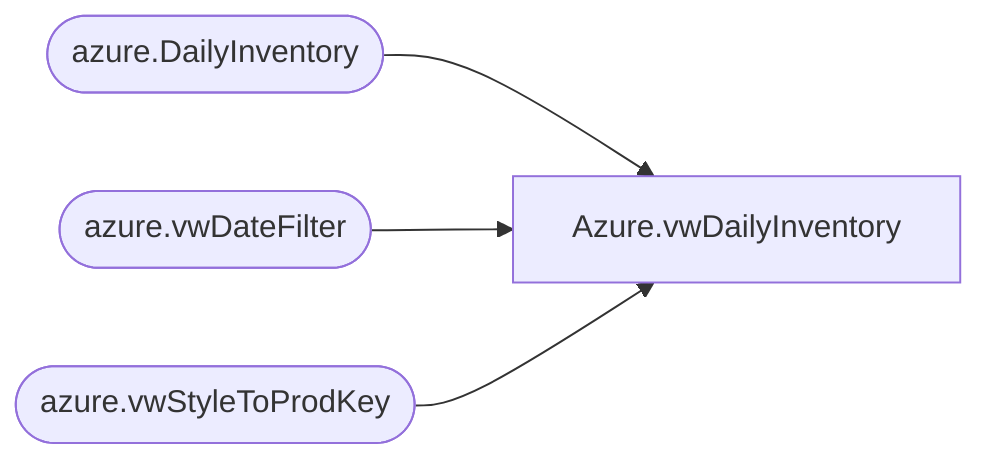

# Azure.vwDailyInventory

**Database:** dw  
**Server:** papamart  

## Architecture Diagram



## Table Dependencies

| Referenced Table |
|---|
| azure.DailyInventory |
| azure.vwDateFilter |
| azure.vwStyleToProdKey |

## View Code

```sql
CREATE view [Azure].[vwDailyInventory] 

as

Select 
	ProductKey,
	D.DateKey,
	D.StyleCode,
	EffectiveInv,
	AvailToDist,
	OnHand,
	Purchased,
	Allocated,
	OrderMultiple,
	InventoryBuffer,
	InTransit
from azure.DailyInventory d 
Left join azure.vwStyleToProdKey K on d.StyleCode = K.style
join azure.vwDateFilter df on d.DateKey=cast(df.actual_date as date)
where productKey is not null
```

