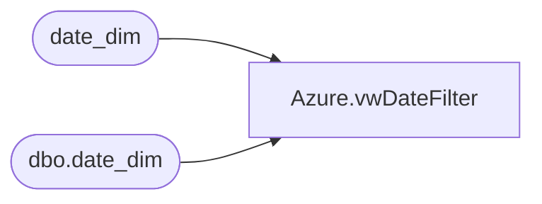

# Azure.vwDateFilter

**Database:** dw  
**Server:** papamart  

## Architecture Diagram



## Table Dependencies

| Referenced Table |
|---|
| date_dim |
| dbo.date_dim |

## View Code

```sql
CREATE view [Azure].[vwDateFilter]

AS


SELECT        date_key, actual_date, fiscal_year, season, fiscal_quarter, fiscal_period, fiscal_week, month, year, month_name, day_of_month, day_of_year, day_name, weekend_y_n, day_of_week, week_of_period, 
                         week_of_quarter, period_of_quarter, day_id, holiday_period_code, week_id, period_id, quarter_id, org_fiscal_quarter, org_fiscal_period, org_fiscal_week, org_week_of_period, org_week_of_quarter, 
                         org_period_of_quarter
FROM            dbo.date_dim
where fiscal_Year Between (Select Fiscal_year - 2 from date_dim where actual_date >= GetDate()-1 and actual_date < GetDate())
and  (Select Fiscal_year from date_dim where actual_date >= GetDate()-1 and actual_date < GetDate())
```

