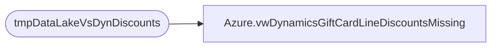

# Azure.vwDynamicsGiftCardLineDiscountsMissing

**Database:** dw  
**Server:** papamart  

## Architecture Diagram



## Table Dependencies

| Referenced Table |
|---|
| tmpDataLakeVsDynDiscounts |

## View Code

```sql
CREATE view [Azure].[vwDynamicsGiftCardLineDiscountsMissing] 

as

select 
d.Entity, 
d.InventLocationId, 
d.TransDate,
sum (d.Amount) as GiftCardLineDiscMissingAmt
from tmpDataLakeVsDynDiscounts d
where 1=1
and d.DataLakeRetailTransactionId is null 
and d.PeriodicDiscountOfferId = 'GiftCardDis'
and d.DiscountOriginType = 'Periodic'
and d.BatchID is not  null -- Never Sent\Ignore\Related to bad inserts 
group by 
d.Entity, 
d.InventLocationId, 
d.TransDate
--order by 1, 3, 2
```

