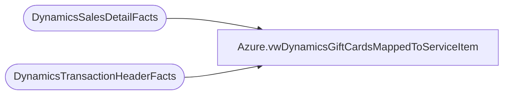

# Azure.vwDynamicsGiftCardsMappedToServiceItem

**Database:** dw  
**Server:** papamart  

## Architecture Diagram



## Table Dependencies

| Referenced Table |
|---|
| DynamicsSalesDetailFacts |
| DynamicsTransactionHeaderFacts |

## View Code

```sql
CREATE view [Azure].[vwDynamicsGiftCardsMappedToServiceItem] 

as

select 
hf.Entity, 
hf.InventLocationId, 
hf.TransDate,
hf.RetailTransactionId, 
sdf.ItemId, 
sdf.GiftCardNumber, 
hf.IsInDynamics, 
hf.IsInDynamicsStaging
from DynamicsSalesDetailFacts sdf (nolock)
join DynamicsTransactionHeaderFacts hf (nolock) on hf.RetailTransactionId = sdf.RetailTransactionId
where 1=1
and sdf.ItemId = 'SV00016' -- GC Investigate Service Item Number 
and (hf.IsCurrent = 1  or hf.IsNegatedCurrent = 1)-- This is the Current Iteration of the Transaction or the Negate Current -- Added 1/26/2024
and hf.IsInDynamics = 1
--order by 1, 3, 2
```

