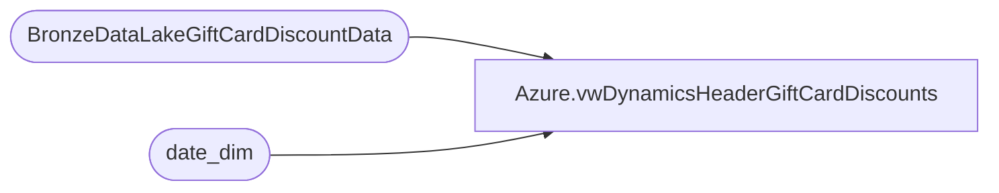

# Azure.vwDynamicsHeaderGiftCardDiscounts

**Database:** dw  
**Server:** papamart  

## Architecture Diagram



## Table Dependencies

| Referenced Table |
|---|
| BronzeDataLakeGiftCardDiscountData |
| date_dim |

## View Code

```sql
CREATE view [Azure].[vwDynamicsHeaderGiftCardDiscounts] 

as
select 
d.ENTITY as Entity, 
d.InventLocationId, 
d.TransactionDate,
sum (d.Amount) as HeaderDiscountAmount,
dd.date_key, 
dd.actual_date
from BronzeDataLakeGiftCardDiscountData d
join date_dim dd on cast (dd.actual_date as date) = d.TransactionDate
where 1=1
group by 
d.ENTITY, 
d.InventLocationId, 
d.TransactionDate, 
dd.date_key, 
dd.actual_date
```

