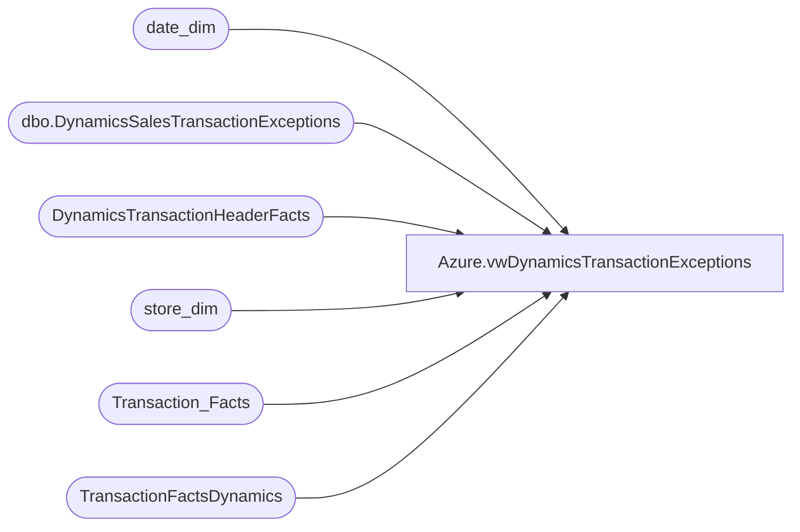

# Azure.vwDynamicsTransactionExceptions

**Database:** dw  
**Server:** papamart  

## Architecture Diagram



## Table Dependencies

| Referenced Table |
|---|
| date_dim |
| dbo.DynamicsSalesTransactionExceptions |
| DynamicsTransactionHeaderFacts |
| store_dim |
| Transaction_Facts |
| TransactionFactsDynamics |

## View Code

```sql
CREATE view [Azure].[vwDynamicsTransactionExceptions] 

as

with Exceptions as (
select e.RetailTransactionId, e.Reason as ReasonForException, e.ItemId, e.Price, e.LineObjectDescription, e.RetailReceiptId as Transaction_Id , e.VarianceValue
from dwstaging.dbo.DynamicsSalesTransactionExceptions e (nolock)
group by e.RetailTransactionId, e.Reason, e.ItemId, e.Price, e.LineObjectDescription, e.RetailReceiptId, e.VarianceValue
) 


select cast (dd.actual_date as date) as TransactionDate, 
sd.store_id as StoreNumber, 
tf.register_no as RegisterNumber,
tf.transaction_no as TransactionNumber,
--tf.transaction_key as TransactionKey,    -- I.D.W. replaced with line below because key in TF view does not have store and date appended 
left(tf.transaction_key, len(tf.transaction_key)-9) as TransactionKey,
e.RetailTransactionId, 
e.ReasonForException, 
e.ItemId, 
e.Price, 
e.LineObjectDescription, 
e.Transaction_Id, 
e.VarianceValue, 
--tfd.receipt_total_amount+abs(tfd.redemption_amount)  as TransactionTotalAmount -- Added On 4/12/2023
case when tfo.GAAP_sales_amount = 0.00
		then tfo.receipt_total_amount
	else tfo.GAAP_sales_amount  end as TransactionTotalAmount -- Replaced Above on 1/31/2024

from Exceptions E
join TransactionFactsDynamics tf  (nolock) on tf.transaction_id=e.transaction_id
join date_dim dd (nolock) on dd.date_key=tf.date_key
join store_dim sd (nolock) on sd.store_key=tf.store_key
left join DynamicsTransactionHeaderFacts thf (nolock) on thf.RetailReceiptId=tf.transaction_id
left join TransactionFactsDynamics tfd on tfd.transaction_id=e.Transaction_Id
left join Transaction_Facts tfo on tfo.transaction_id=e.Transaction_Id
--where DATEDIFF(dd,dd.actual_date,getdate()) <= 60 -- After testing will want to add this back as we only keep last 60 days of data
where  1=1
and thf.RetailTransactionId is null  -- Never Been Merged To Dynamics Fact Tables 
and tfo.transaction_id is not null -- Deleted Transactions Filter 
--and tf.GAAP_transaction_flag = 1
--order by 1, 2, 3, 4
```

