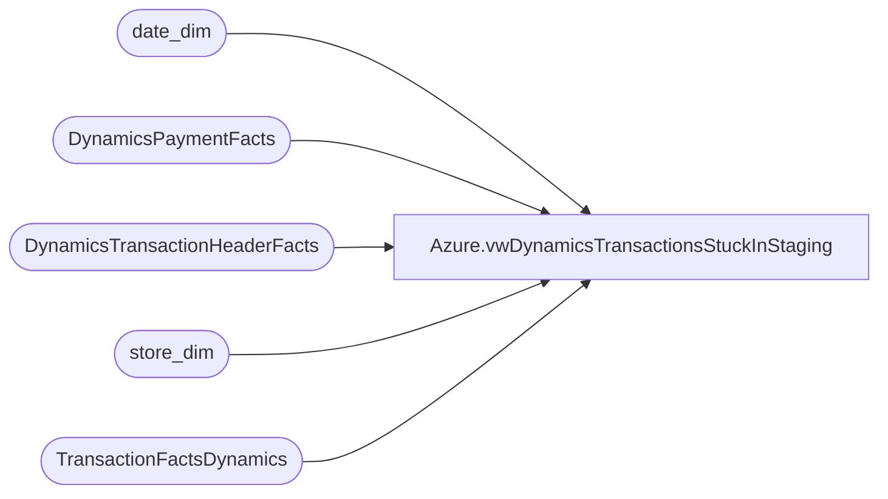

# Azure.vwDynamicsTransactionsStuckInStaging

**Database:** dw  
**Server:** papamart  

## Architecture Diagram



## Table Dependencies

| Referenced Table |
|---|
| date_dim |
| DynamicsPaymentFacts |
| DynamicsTransactionHeaderFacts |
| store_dim |
| TransactionFactsDynamics |

## View Code

```sql
CREATE view [Azure].[vwDynamicsTransactionsStuckInStaging] 
as


with TransactionsStuck as(
select  
RetailTransactionId, 
RetailReceiptId, 
cast(CurrentSentDate as date) as SentDate, 
Entity,
IsCurrent, 
IsNegatedCurrent
from DynamicsTransactionHeaderFacts (nolock) 
where IsInDynamicsStaging = 1 -- Hit Staging Tables
and IsInDynamics is null -- Does not Exist in Dynamics Base Tables 
--and IsCurrent = 1 -- This is the Current Iteration of the Transaction
and (IsCurrent = 1  or IsNegatedCurrent = 1)-- This is the Current Iteration of the Transaction or the Negate Current -- Added 1/26/2024
--and TransDate > '05-18-2022' -- Will Go away at go LIve 
--and RetailReceiptId = '484427062'
group by  
RetailTransactionId, 
RetailReceiptId, 
cast (CurrentSentDate as date), 
Entity ,
IsCurrent, 
IsNegatedCurrent
) , 

Summary1 as (

select 
ts.RetailTransactionId, 
ts.RetailReceiptId, 
ts.SentDate, 
ts.Entity, 
ts.IsCurrent,
ts.IsNegatedCurrent,
sum (dpf.AmountCur) as TransTotal
from  TransactionsStuck TS
--join DynamicsPaymentFacts dpf (nolock) on dpf.RetailReceiptId=ts.RetailReceiptId
join DynamicsPaymentFacts dpf (nolock) on dpf.RetailTransactionId = ts.RetailTransactionId
	
group by 
ts.RetailTransactionId, 
ts.RetailReceiptId, 
ts.SentDate, 
ts.Entity,
ts.IsCurrent,
ts.IsNegatedCurrent
) 

select  cast (dd.actual_date as date) as TransactionDate, 
sd.store_id as StoreNumber, 
tf.register_no as RegisterNumber,
tf.transaction_no as TransactionNumber,
--tf.transaction_key as TransactionKey,    -- I.D.W. replaced with line below because key in TF view does not have store and date appended 
left(tf.transaction_key, len(tf.transaction_key)-9) as TransactionKey,
s.RetailTransactionID , 
s.Entity, 
s.TransTotal
from Summary1 s
join TransactionFactsDynamics tf  (nolock) on tf.transaction_id=s.RetailReceiptId
join date_dim dd (nolock) on dd.date_key=tf.date_key
join store_dim sd (nolock) on sd.store_key=tf.store_key
--where DATEDIFF(dd,dd.actual_date,getdate()) <= 60 -- Removed This filter during TP2 testing as we were using older transactions
--order by s.Entity, 1 , 2
```

