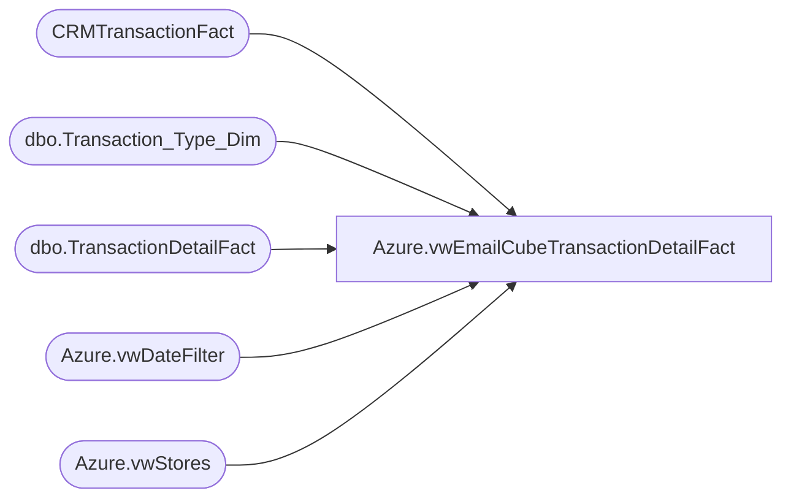

# Azure.vwEmailCubeTransactionDetailFact

**Database:** dw  
**Server:** papamart  

## Architecture Diagram



## Table Dependencies

| Referenced Table |
|---|
| CRMTransactionFact |
| dbo.Transaction_Type_Dim |
| dbo.TransactionDetailFact |
| Azure.vwDateFilter |
| Azure.vwStores |

## View Code

```sql
/* =============================================================================================================
 Name: [Azure].[vwTransactionDetailFacts]

 Description: Transaction detail at line level.


 Dependencies: Inner joins with vwStores, pulling back only those stores in the view.

 Revision History
		Name:				Date:			Comments:
		Tim Bytnar			4/11/2018		Initial creation
		John Eck			9/25/2018		Added Franchisee details
*/
CREATE VIEW [Azure].[vwEmailCubeTransactionDetailFact]

AS
SELECT        tdf.product_key AS ProductKey, 
              CONVERT(DATE, dd.actual_date) AS TransactionDate, 
						tdf.unit_gross_amount AS UnitGrossAmount, tdf.units, tdf.unit_disc_amount AS UnitDiscAmount, 
                         tdf.vat_tax_amount AS VatTaxAmount, 
                         tdf.upsell_disc_allocated AS UpsellDiscAllocated,
						  tdf.ext_cost AS ExtCost, 
						   ds.StoreKey
						 , Cast(tdf.transaction_id as varchar(20))  + Cast( ds.StoreKey AS varchar(10)) as TransactionKey
						 ,CustomerNumber
FROM            dbo.TransactionDetailFact AS tdf INNER JOIN
                        CRMTransactionFact ctf on tdf.transaction_id = ctf.TransactionID inner join
                         Azure.vwStores AS ds ON ds.StoreKey = CONVERT(VARCHAR, tdf.store_key) LEFT OUTER JOIN
                         Azure.vwDateFilter AS dd ON tdf.date_key = dd.date_key LEFT OUTER JOIN
                         dbo.Transaction_Type_Dim AS ttd ON ttd.transaction_key = tdf.transaction_type_key

WHERE        (tdf.product_key >= 0)
and dd.Actual_Date > = '01/01/19'
```

