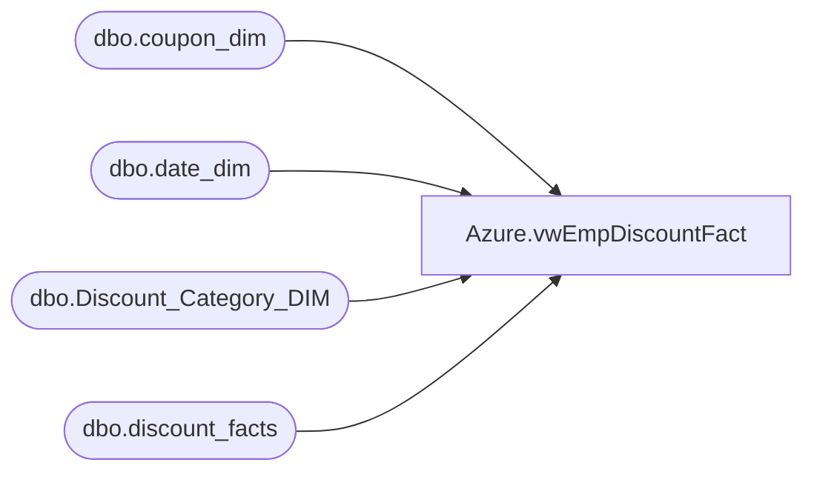

# Azure.vwEmpDiscountFact

**Database:** dw  
**Server:** papamart  

## Architecture Diagram



## Table Dependencies

| Referenced Table |
|---|
| dbo.coupon_dim |
| dbo.date_dim |
| dbo.Discount_Category_DIM |
| dbo.discount_facts |

## View Code

```sql
CREATE VIEW [Azure].[vwEmpDiscountFact] AS


SELECT  
		--'0' AS TransactionID,
		df.Transaction_ID AS TransactionID,
		cast(d.actual_date as date) AS TransactionDate,
		--ds.StoreID ,
		df.reference_no AS ReferenceNumber,
		df.line_object_key AS LineObject, 
		df.units DiscountUnits, 
		df.unit_gross_amount AS DiscountUnitGrossAmount, 
		df.isExpired AS ExpiredFlag,
		cd.CategoryType AS DiscountCategoryType,
		cd.channelType AS DiscountChannelType,
		cd.financialGroup AS DiscountFinancialGroup,
		c.Retail_Pro AS RetailPro, 
		c.coupon_desc AS CouponDesc--,
		--ds.StoreKey,
		--Cast(df.transaction_id as varchar(30)) + Cast(ds.StoreKey as varchar(10)) as TransactionKey
FROM dw.dbo.discount_facts df
INNER JOIN dw.dbo.coupon_dim c ON c.coupon_key=df.coupon_key
LEFT OUTER JOIN dw.dbo.Discount_Category_DIM cd ON cd.categoryTypeID=df.categoryTypeID
--INNER JOIN Azure.vwStores ds ON ds.StoreKey=df.store_key
INNER JOIN dw.dbo.date_dim d ON d.date_key=df.date_key
where 1=1
and df.line_object_key in (57,58,253,805,819,922) 
--and  d.actual_date >= CONVERT(DATE,GETDATE()-14)
and d.date_key > 9461  -- start logic on tranactions starting on 11/30/2022 and later
```

