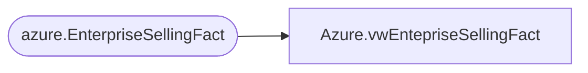

# Azure.vwEntepriseSellingFact

**Database:** dw  
**Server:** papamart  

## Architecture Diagram



## Table Dependencies

| Referenced Table |
|---|
| azure.EnterpriseSellingFact |

## View Code

```sql
CREATE VIEW [Azure].[vwEntepriseSellingFact] AS
-- =============================================================================================================

--
-- Description: Enterprise selling transactions; order, fulfillment, cancel, return
--
--
-- Dependencies: 
--
-- Revision History
--		Name:				Date:			Comments:
--		
--
-- =============================================================================================================

select 
	TransactionID,	
	LineSeq,	
	StoreNumber,	
	StoreKey,	
	cast(TransactionDate as date) as TransactionDate,
	ReferenceNumber,	
	HasNonESitems,	
	ESAction,	
	ProductKey,	
	Units,	
	UnitGrossAmount,	
	UnitNetAmount,	
	UnitDiscountAmount

from azure.EnterpriseSellingFact

/*
WITH 
ESTrans AS
	(
		SELECT DISTINCT transaction_id AS TransactionID,
						cast(d.actual_date as date) AS TransactionDate
		FROM dw.dbo.TransactionDetailFact tdf with (nolock)
		INNER JOIN dw.dbo.date_dim d
			ON d.date_key=tdf.date_key
		join azure.vwDateFilter df on d.actual_date=df.actual_date
		WHERE line_object_key = 954 -- line object 106
		--AND d.actual_date between dateadd(yyyy, -2, getdate()) and CAST(GETDATE()-1 AS DATE)
		--and d.actual_date >=DATEADD(day, -7, DATEADD(year, -2, DATEADD(yy, DATEDIFF(yy, 0, GETDATE()), 0)))
	),
HasNonES AS
	(
		SELECT DISTINCT tdf.transaction_id AS TransactionID
		FROM dw.dbo.TransactionDetailFact tdf with (nolock)
		INNER JOIN ESTrans e 
			ON e.TransactionID=tdf.transaction_id
		WHERE tdf.line_object_key <> 954
	)
SELECT tdf.transaction_id AS TransactionID, 
tdf.transaction_line_seq AS LineSeq,	
--sd.store_Key AS StoreKey,
ds.StoreNumber,
ds.StoreKey as StoreKey,
e.TransactionDate,
tdf.reference_no AS ReferenceNumber,
CASE WHEN HNE.TransactionID IS NULL
		THEN 'NO' 
		ELSE 'YES' 
END AS HasNonESitems,
la.Line_Action_Description AS ESAction,
tdf.product_key AS ProductKey, 
tdf.units AS Units,
ISNULL(tdf.unit_gross_amount, 0) AS UnitGrossAmount,
ISNULL(tdf.unit_gross_amount, 0) - ISNULL(unit_disc_amount, 0) AS UnitNetAmount,
ISNULL(unit_disc_amount, 0) AS UnitDiscountAmount

FROM ESTrans e 
INNER JOIN dw.dbo.TransactionDetailFact tdf with (nolock)
	ON tdf.transaction_id=e.TransactionID
join [dw].[Azure].[vwStores] ds WITH(NOLOCK)
			ON ds.StoreKey= case when CONVERT(VARCHAR,tdf.store_key) = -1 then 13 else CONVERT(VARCHAR,tdf.store_key) end 
INNER JOIN dw.dbo.date_dim dd with (nolock)
	ON tdf.date_key = dd.date_key
--INNER JOIN dw.dbo.store_dim sd 
--	ON tdf.store_key = sd.store_key
INNER JOIN dw.dbo.product_dim p with (nolock)
	ON p.product_key = tdf.product_key
INNER JOIN dw.dbo.line_object_dim lo with (nolock)
	ON lo.line_object_key = tdf.line_object_key
INNER JOIN dw.dbo.line_action_dim la with (nolock)
	ON la.line_action_key = tdf.line_action_key
LEFT OUTER JOIN HasNonES HNE 
	ON HNE.TransactionID = e.TransactionID
join azure.vwDateFilter df on e.TransactionDate=cast(df.actual_date as date)
WHERE la.Line_Action_Description<>'sold'
AND p.product_key>0
GO


*/
```

