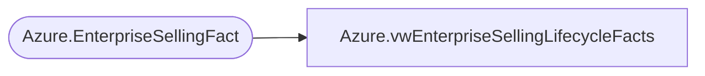

# Azure.vwEnterpriseSellingLifecycleFacts

**Database:** dw  
**Server:** papamart  

## Architecture Diagram



## Table Dependencies

| Referenced Table |
|---|
| Azure.EnterpriseSellingFact |

## View Code

```sql
CREATE view [Azure].[vwEnterpriseSellingLifecycleFacts] as

With
ES as
(
	select *
	--from azure.vwEntepriseSellingFact 
	from Azure.EnterpriseSellingFact --LOADED DAILY VIA STL-SSIS-P-01 SQL AGENT - AzureLoadEnterpriseSellingFact
	
),
Orders as 
(
		select 
			ReferenceNumber, 
		   TransactionID, 
		   LineSeq,
		   StoreKey, 
		   StoreNumber,
		   TransactionDate, 
		   HasNonESItems, 
		   ProductKey, 
		   Units,
		   UnitGrossAmount,
		   UnitNetAmount,
		   UnitDiscountAmount
	from ES
	where ESAction = 'ordered'
),
fulfillments as 
(
	select ReferenceNumber, 
	   TransactionID,  
       StoreKey, 
	   StoreNumber,
       TransactionDate, 
       HasNonESItems, 
       ProductKey, 
       Units,
       UnitGrossAmount,
       UnitNetAmount,
       UnitDiscountAmount
	from ES
	where ESAction in ('order delivered', 'order picked up')
),
cancellations as
(
	select 
		ReferenceNumber, 
	   TransactionID,  
       StoreKey, 
	   StoreNumber,
       TransactionDate, 
       HasNonESItems, 
       ProductKey, 
       Units*-1 AS Units,
       UnitGrossAmount*-1 AS UnitGrossAmount,
       UnitNetAmount*-1 AS UnitNetAmount,
       UnitDiscountAmount*-1 AS UnitDiscountAmount
	FROM ES
	where ESAction = 'order cancelled'
),
returns as
(
	select ReferenceNumber, 
	   TransactionID,  
       StoreKey, 
	   StoreNumber,
       TransactionDate, 
       HasNonESItems, 
       ProductKey, 
       Units*-1 AS Units,
       UnitGrossAmount*-1 AS UnitGrossAmount,
       UnitNetAmount*-1 AS UnitNetAmount,
       UnitDiscountAmount*-1 AS UnitDiscountAmount
	from ES
	where ESAction = 'delivery returned'
)
SELECT DISTINCT 
	   o.ReferenceNumber AS ReferenceNumber, 
	   CASE 
		WHEN sum(COALESCE (f.Units,0)) <> 0 and sum(COALESCE (r.Units,0)) = 0 
			THEN 'Fulfilled'
		WHEN sum(COALESCE (c.Units,0)) <> 0 
			THEN 'Cancelled'
		WHEN sum(COALESCE (r.Units,0)) <> 0 
			THEN 'Fufilled & Returned'
			ELSE 'Pending'
		END as ESOrderStatus,
	   o.TransactionID AS OrderTransactionID,
       o.LineSeq AS LineSeq,
       o.StoreKey AS OrderStoreKey, 
	   o.StoreNumber as OrderStoreNumber,
       cast(o.TransactionDate as date) AS OrderTransactionDate, 
       o.HasNonESItems AS HasNonESItems, 
       o.ProductKey AS ProductKey, 
       sum(COALESCE(o.Units,0)) AS OrderUnits,
       sum(COALESCE (o.UnitNetAmount,0)) AS OrderAmount,
	   f.TransactionID AS FulfillTransactionID, 
       
	   f.StoreKey as FulfillmentStoreKey,
	   f.StoreNumber as FulfillStoreNumber,
       cast(f.TransactionDate as date) AS FulfillTransactionDate, 
       sum(COALESCE (f.Units,0)) AS FulfillUnits, 
       sum(COALESCE (f.UnitNetAmount,0)) AS FulfillAmount,
	   c.TransactionID AS CancelTransactionID, 
       cast(c.TransactionDate as date) AS CancelTransactionDate, 
       sum(COALESCE (c.Units,0)) AS CancelUnits, 
       sum(COALESCE (c.UnitNetAmount,0)) AS CancelAmount,
	   r.TransactionID AS ReturnTransactionID,
       cast(r.TransactionDate as date) AS ReturnTransactionDate, 
       sum(COALESCE (r.Units,0)) AS ReturnUnits, 
       sum(COALESCE (r.UnitNetAmount,0)) AS ReturnAmount,
	   datediff(dd, o.TransactionDate, isnull(isnull(f.TransactionDate,c.TransactionDate), getdate())) * -1 as ESFulfillmentDuration
FROM orders o
LEFT OUTER JOIN fulfillments f
	ON f.ReferenceNumber=o.ReferenceNumber
    AND f.ProductKey=o.ProductKey
LEFT OUTER JOIN cancellations c
	ON c.ReferenceNumber=o.ReferenceNumber
    AND c.ProductKey=o.ProductKey
LEFT OUTER JOIN returns r
	ON r.ReferenceNumber=o.ReferenceNumber
    AND r.ProductKey=o.ProductKey
group by 
	   o.ReferenceNumber, 
	   o.TransactionID,
       o.LineSeq,
       o.StoreKey, 
	   o.StoreNumber,
       o.TransactionDate, 
       o.HasNonESItems, 
       o.ProductKey, 
       f.TransactionID, 
       f.StoreKey,
	   f.StoreNumber,
       f.TransactionDate, 
       c.TransactionID, 
       c.TransactionDate, 
       r.TransactionID,
       r.TransactionDate
```

