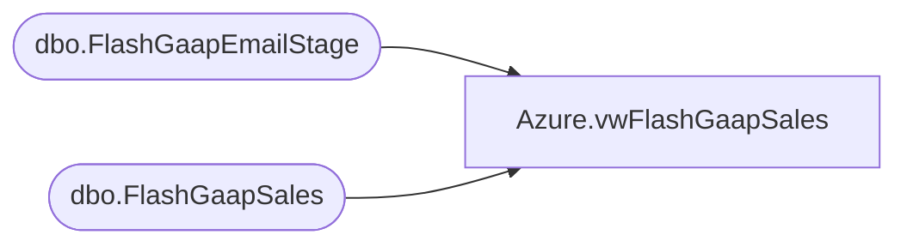

# Azure.vwFlashGaapSales

**Database:** dw  
**Server:** papamart  

## Architecture Diagram



## Table Dependencies

| Referenced Table |
|---|
| dbo.FlashGaapEmailStage |
| dbo.FlashGaapSales |

## View Code

```sql
CREATE VIEW [Azure].[vwFlashGaapSales] AS
-- =============================================================================================================
-- Name: [Azure].[vwFlashGaapSales]
--
-- Description: Azure view of the flaashGaap sales so the data can be pushed to Power BI
--
--
-- Dependencies: 
--
-- Revision History
--		Name:				Date:			Comments:
--		John Eck			8/7/2018		Initial creation
-- =============================================================================================================


select    DISTINCT --used distinct because of cross join to get insert date
                convert(varchar, fgs.ins_dt, 100) CaptureDateTime,
                X.BusinessDate,
                X.StoreKey as StoreNumber,
                X.DaySalesPlan,
                X.Jurisdiction,
                X.TradingGroup,
--             X.TransactionCount,
--             X.CompTransactionCount,
                X.FlashGaapSalesUSD,
                X.FlashGaapSalesLocal,
                X.CompFlashGaapSalesUSD,
                X.CompFlashGaapSalesLocal,
                X.LYGaapSalesDayTotalUSD,
                X.LYGaapSalesDayTotalLocal,
                X.CompLYGaapSalesDayTotalUSD,
                X.CompLYGaapSalesDayTotalLocal,
                X.LYSalesThisHourLocal,
                X.LYSalesThisHourUSD,
                X.CompLYSalesThisHourLocal,
                X.CompLYSalesThisHourUSD
from dwstaging.dbo.FlashGaapEmailStage X
cross join dw.dbo.FlashGaapSales fgs 
where BusinessDate between case when convert(varchar, getdate(), 114) < '07:30:00:000'
                                                                                then cast(getdate()-1 as date)
                                                                                else cast(getdate() as date) end
					 and 
					 case when convert(varchar, getdate(), 114) < '07:30:00:000' 
                                                                                then cast(getdate()-1 as date)
                                                                                else cast(getdate() as date) end
```

