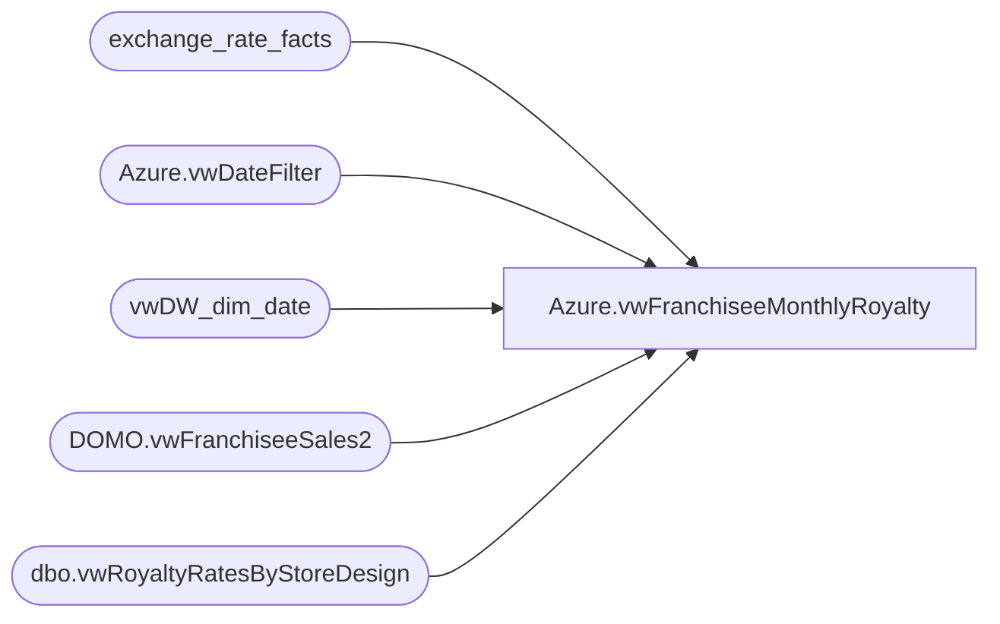

# Azure.vwFranchiseeMonthlyRoyalty

**Database:** dw  
**Server:** papamart  

## Architecture Diagram



## Table Dependencies

| Referenced Table |
|---|
| exchange_rate_facts |
| Azure.vwDateFilter |
| vwDW_dim_date |
| DOMO.vwFranchiseeSales2 |
| dbo.vwRoyaltyRatesByStoreDesign |

## View Code

```sql
CREATE view [Azure].[vwFranchiseeMonthlyRoyalty]

as

SELECT        
	fs.TradingGroup, 
	fs.CountryNameFull, 
	fs.TotalSales, 
	fs.FootwareSales, 
    fs.SoundSales, 
	fs.UnstuffedSales, 
	fs.PartySales, 
	fs.GiftCardSales, 
    fs.AccessoriesSales, 
	fs.ClothesSales, 
	fs.SportsSales, 
	fs.PrestuffedSales, 
    fs.GiftCardsRedeemed, 
	fs.FriendSales, 
	fs.HumanSales, 
	fs.PetSales, 
    fs.StuffersSales, 
	dd.fiscal_period, 
	dd.fiscal_year, 
	xf.fiscal_month_end_rate AS ExchangeRate, 
	isnull(vw.RoyaltyRate,5.5) as RoyltyRate,
	dd.week_of_period, 
	fs.StoreNumber, 
	fs.StoreNameAbbr, 
	CASE 
		WHEN replace(TradingGroup,'Franchise - ', '') = 'BABW-AU' THEN .05 
		WHEN replace(TradingGroup, 'Franchise - ', '') = 'FCI Retail Concepts PTE LTD - Singapore' THEN .1 
		WHEN replace(TradingGroup, 'Franchise - ', '') = 'Central Dept Stores LTD - Thailand' THEN 0.15 
		WHEN replace(TradingGroup, 'Franchise - ', '') = 'Koates X Siempre' THEN 0.1 
		WHEN replace(TradingGroup, 'Franchise - ', '') = 'BBW Brasil Comercio e Representacoes S/A' THEN 0.15 
		WHEN replace(TradingGroup, 'Franchise - ', '') = 'Ansaldo S.A.' THEN 0 ELSE 0 
	END AS TaxRate, 
		fs.GaapSales, 
		dd.actual_date, 
		xf.to_currency_code
FROM DOMO.vwFranchiseeSales2 fs 
join vwDW_dim_date dd on fs.WeekEndingDate = dd.actual_date 
join exchange_rate_facts xf
	on dd.date_key = xf.date_key 
	AND fs.CurrencyCode = xf.from_currency_code 
	and xf.to_currency_code = 'USD'
left join kodiak.franchmstrdata.dbo.vwRoyaltyRatesByStoreDesign vw
	on fs.StoreNumber = vw.StoreNumber 
	AND fs.WeekEndingDate BETWEEN vw.StartDate AND vw.EndDate
	and fs.WeekEndingDate BETWEEN vw.StoreDesignRateStartDate AND vw.StoreDesignRateEndDate
join Azure.vwDateFilter df on dd.actual_date = df.actual_date
--WHERE  (dd.fiscal_period = @Month) AND (dd.fiscal_year = @Year)
```

